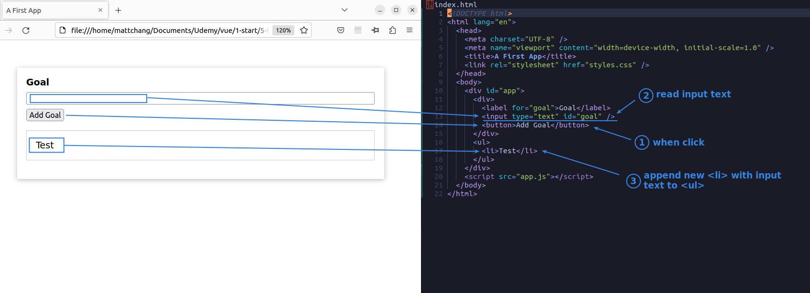
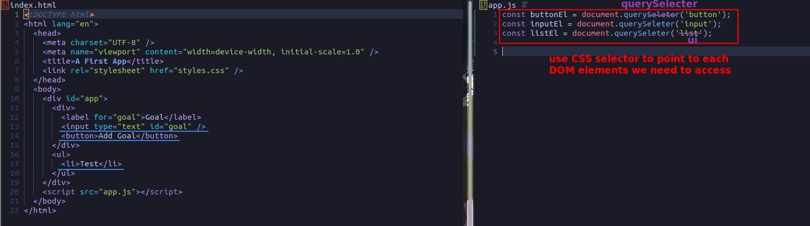
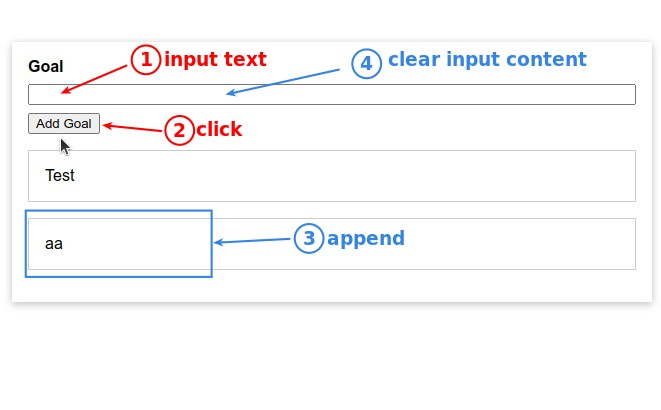

## **Download and Extract**

## **Start Writing Native JS by ourself**

> Basically everything can be done using native JavaScript, and the lecturer let us write native JavaScript once to compare using Vue.

### _Get All elements we need to access_

### _Set listener to button_

### _Write behavior when click_

## **Page operation to see the result**

