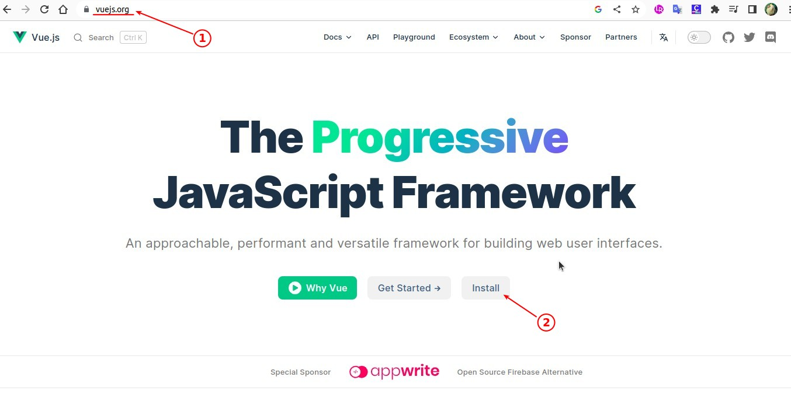
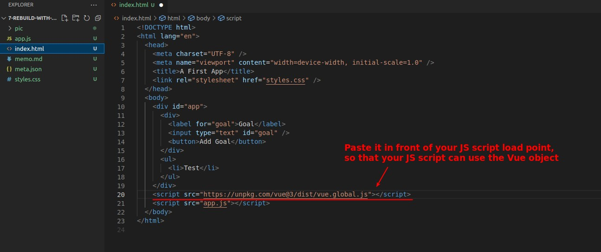
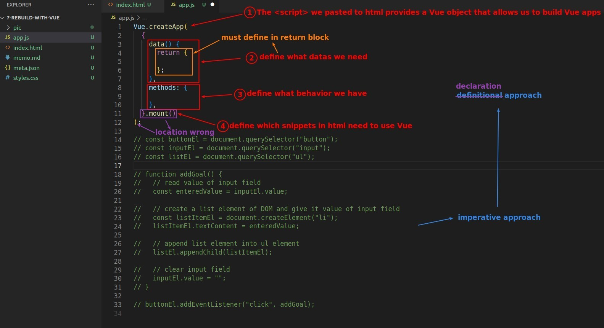

## **Load Vue Library**

> To be more precise, get the Vue object.

## **Imperative approach to Declaration approach**

## **Start defining various parts**

### _data_

> Define any data that we will use in this app, whether input or output.

### _behavior_

- The point here is that we don't need to manipulate the value of the DOM element or textContent or anything like that, but just manipulate the data as we have defined in Vue.
  - This allows us to focus on data processing.

### _app area_

- In other words, Vue can affect only parts of html.

## **Page operation**

