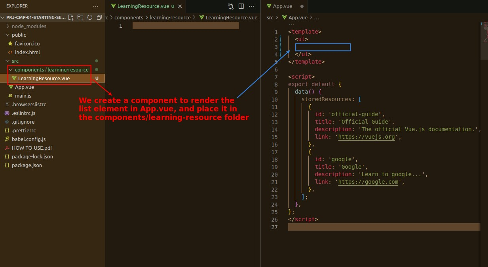
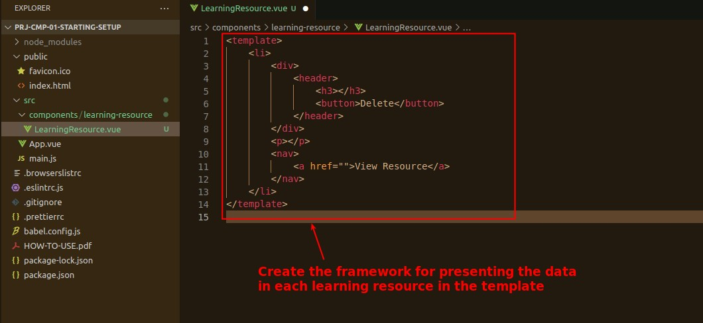
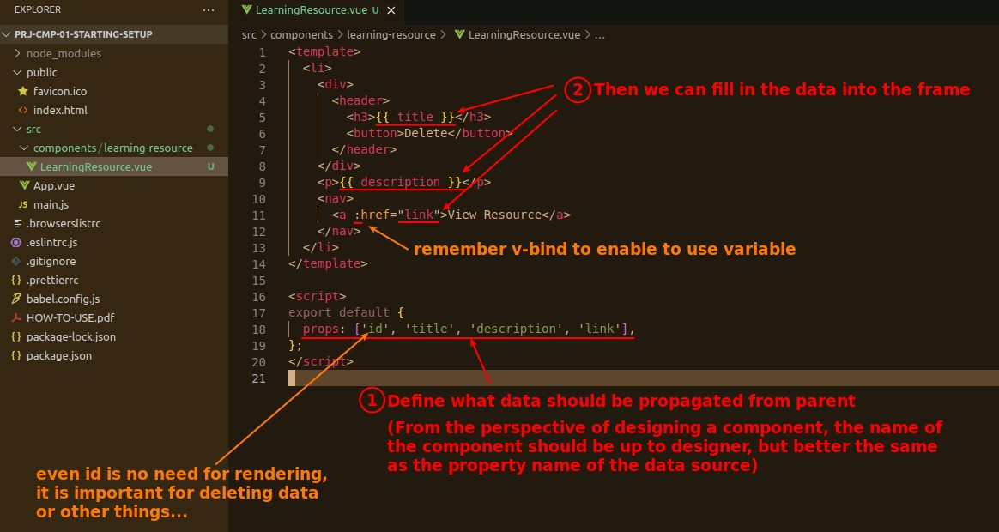
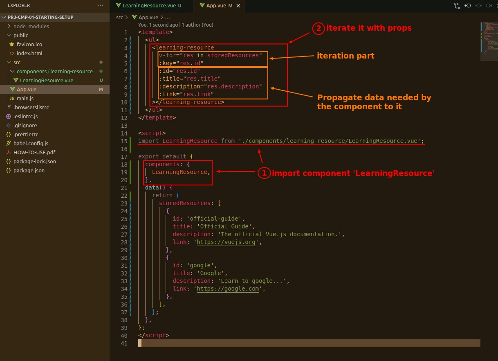
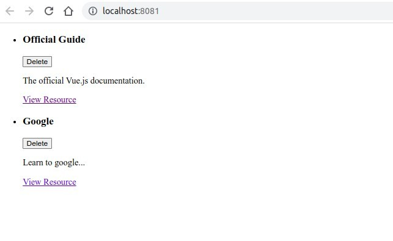

## **Create component folder/file**

- In addition to the components folder, we have created a sub-folder 'learning-resource' for more precise classification of components.

## **Build Frame in template**

> Before we have the data, we can pre-design the HTML framework in the template.

## **Define props and fillin data to template**

## **Interate component and propogate needed data to it**

## **Result on page**

- It must not look good because there is no style, but the point of this stage is that it can work.
