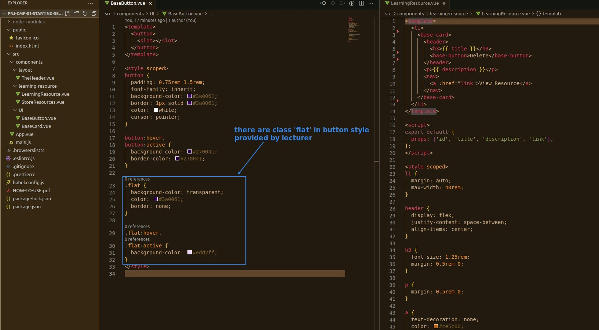
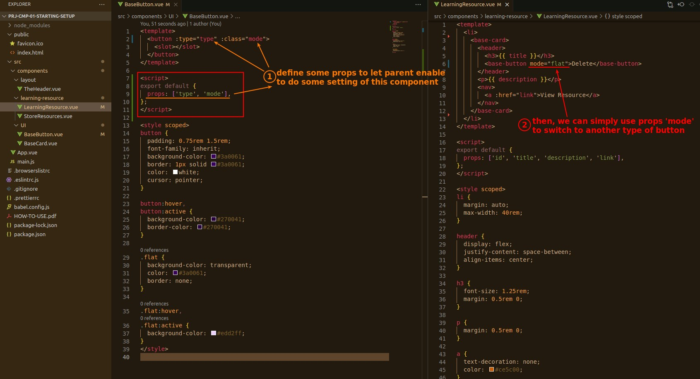
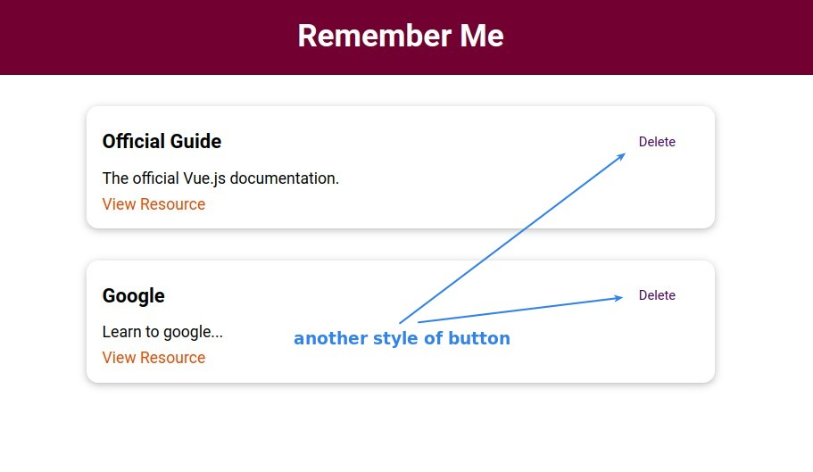

## **CSS styles in the BaseButton.vue**

> There are some styles that specify class, and we didn't use them at all in the last lecture.

## **Let parent can choose different styles of button**

> We use props and class styles to allow the parent to select the child's styles, this is powerful.

- We defined some props of BaseButton to let parent can configure it with these props.

- This is a very powerful feature that requires only one person to design all button styling in one component, but also the ability to switch between different styles, so that it is enough for all team members to use, without the need to make many kinds of button components.
