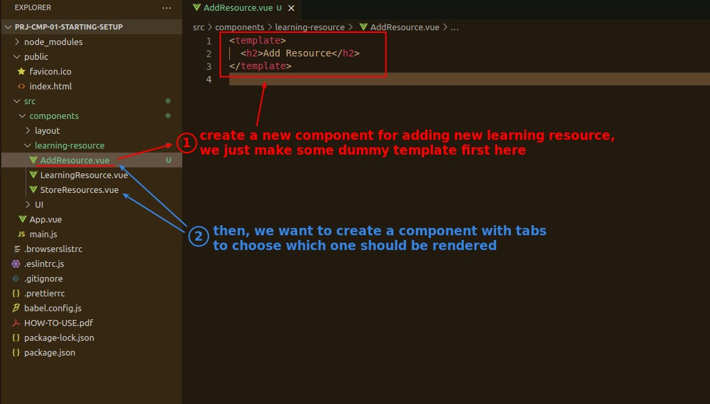
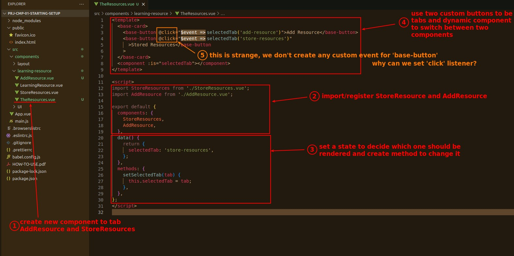
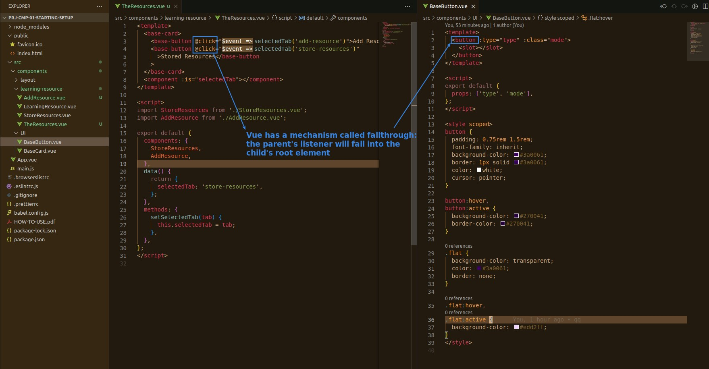
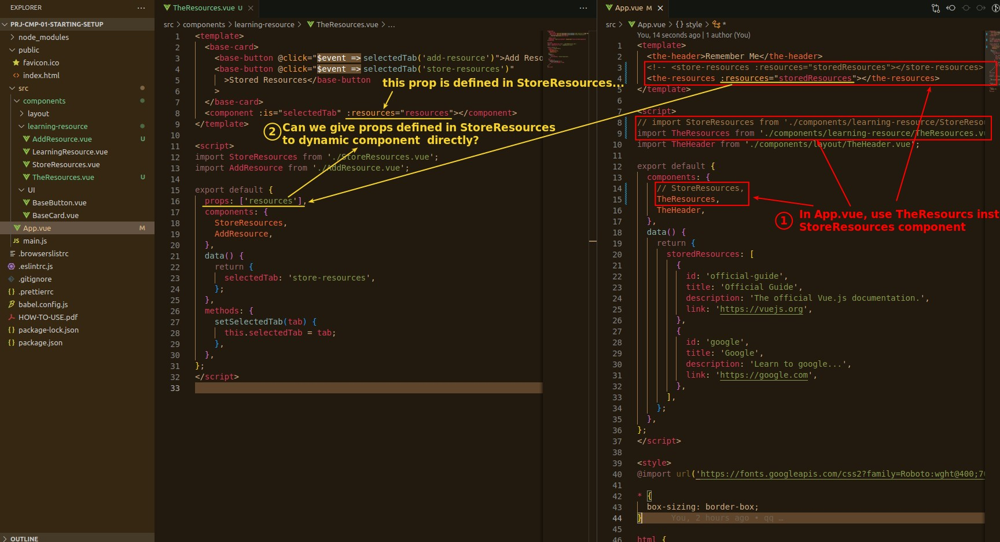
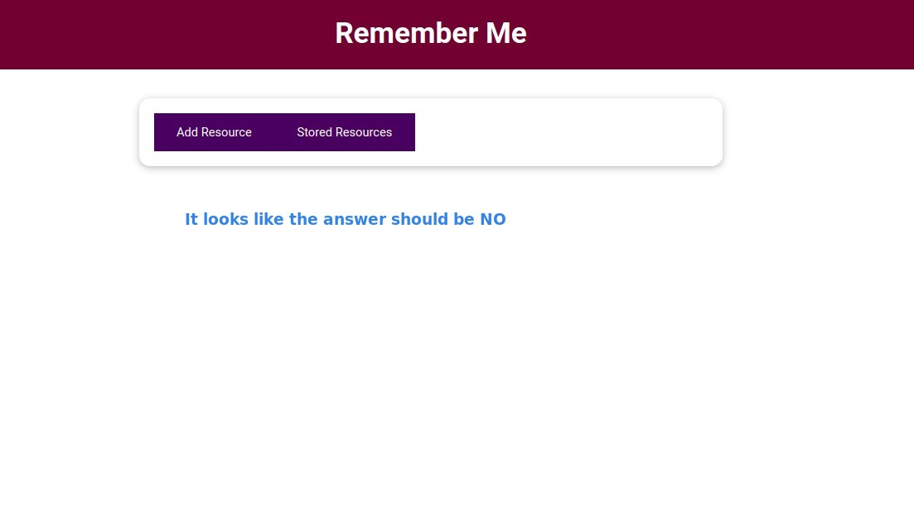

## **New component - AddResource (dummy first)**

> It is not the main character of this lecture, so just make a dummy component to come out first.

## **New component - TheResources**

> This component replaces StoreResources in App.vue and provides tabs that can be switched between AddResource and StoreResources.

### _Fallthrough_

## **Refactor App.vue**

> Here's the problem, how do I propagate the data to the dynamic component?

