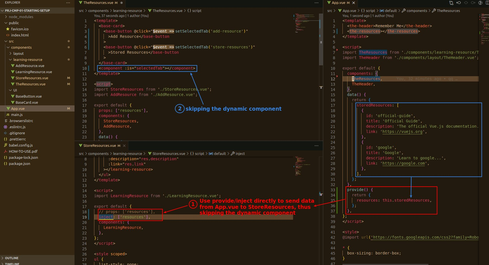
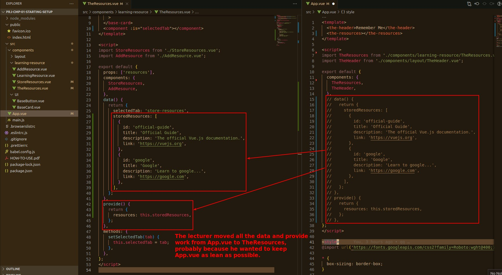
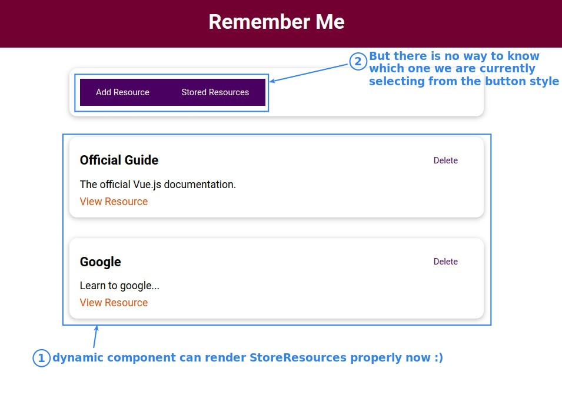
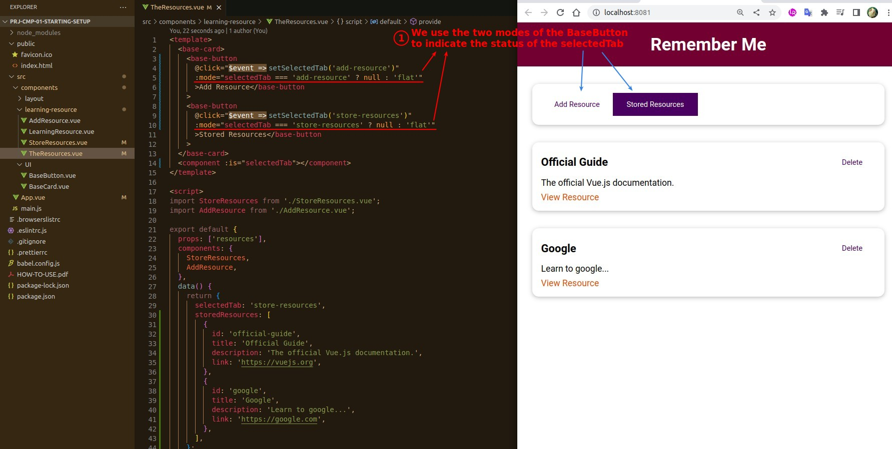
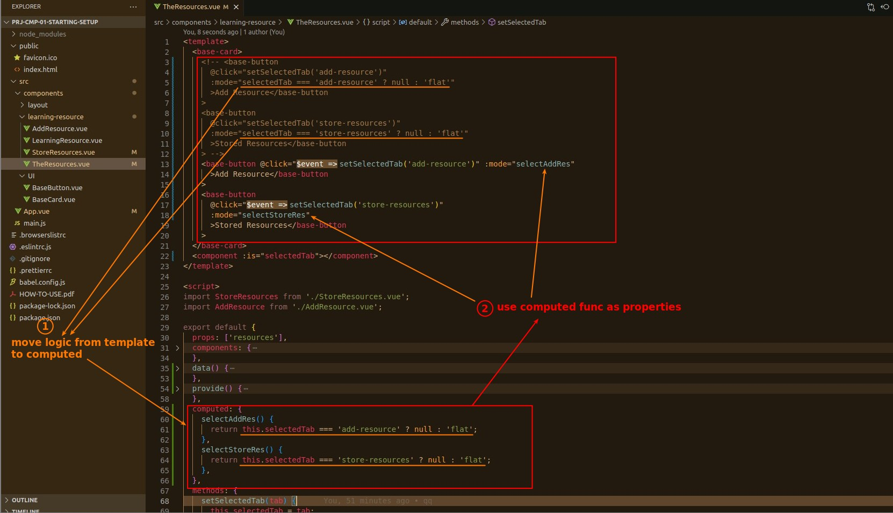

## **Using provide/injec to skip dynamic component**

- In fact, there is a special syntax for propogate data to dynamic component rendered components, but we will not use it here, the related teaching is in Appendix D.

## **Keep App.vue as leaner as possible**

## **Use BaseButton mode to monitor state 'selectedTab'**

