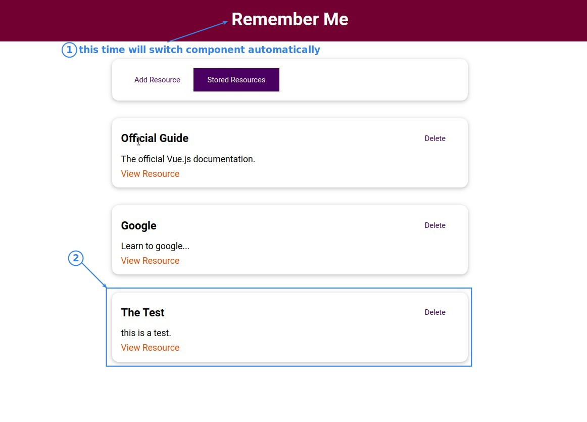

## **Ref Way: Set Ref to Each Input**

> The lecturer uses 'ref' to complete the logical part of the form.

## **No Data but Duo Methods**

- In fact, it is possible to use only one method 'addResource' in @submit, but with the $ref arguments it'll become very ugly codes.

## **Test**

