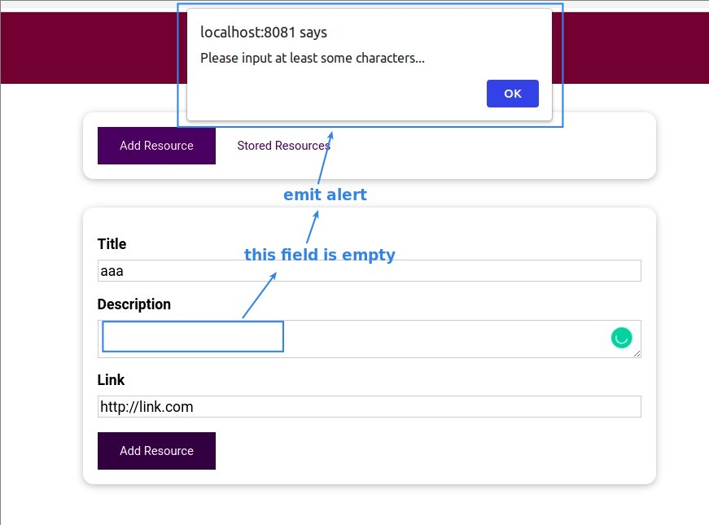
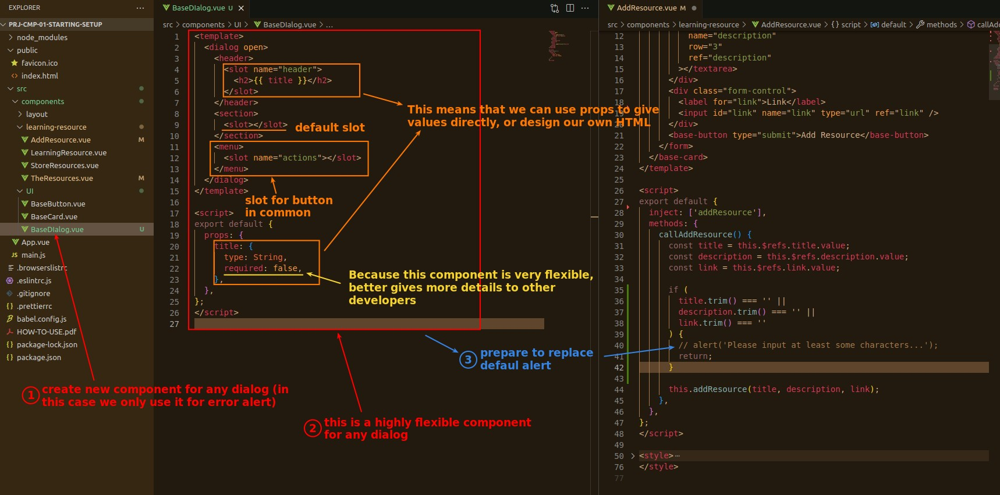
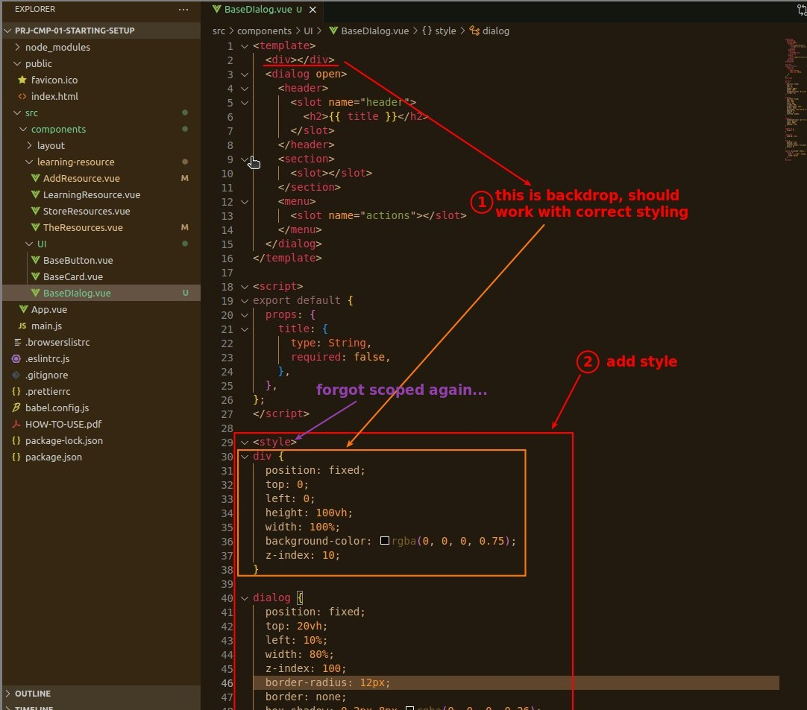
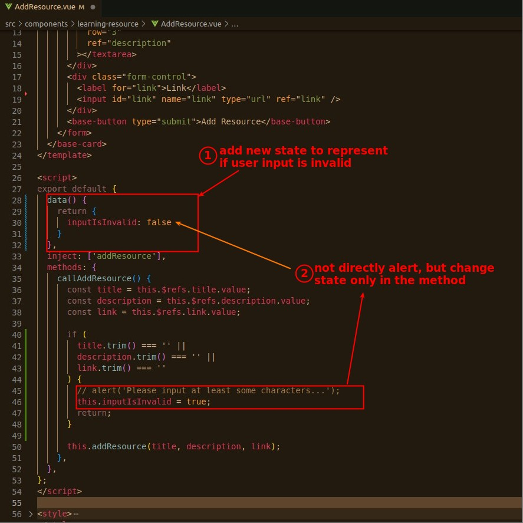
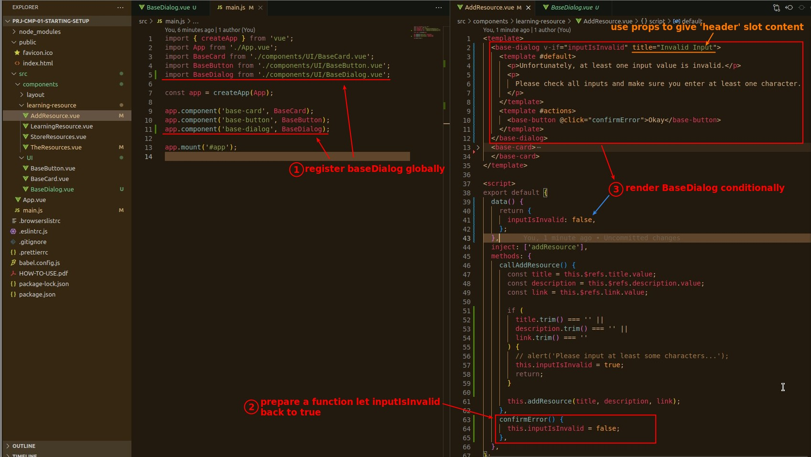
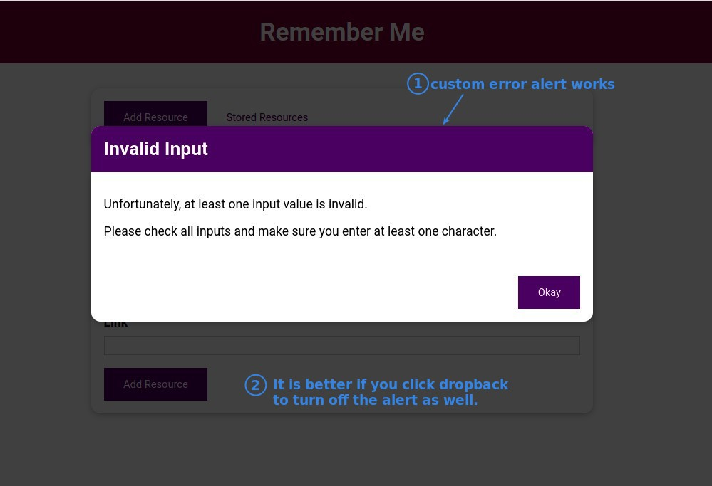
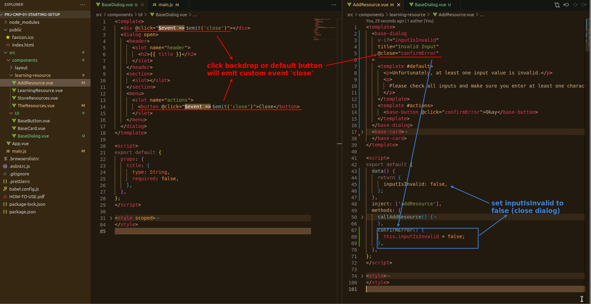

## **Default Alert**

## **New UI Component: BaseDialog**

> Default alert has no styling, so we want to create our custom alert with new component.

- We intentionally built a very flexible UI component, even though in this case it is only used as an Error Alert.
  - It is very suitable to build very flexible, very generic components in large project, it can save lots of manpower.

- The styling of the backdrop part is very important, there is a fixed format to work.
- The backdrop is part of the BaseDialog in this case.
  - You can also split it into another component if you think the codes are already too many.

## **Setup Data aspect**

## **Register BaseDialog Globally & Use It to Alert**

## **More Ways to Close Alert**

- Be careful with the button part, it is very counter intuitive.
