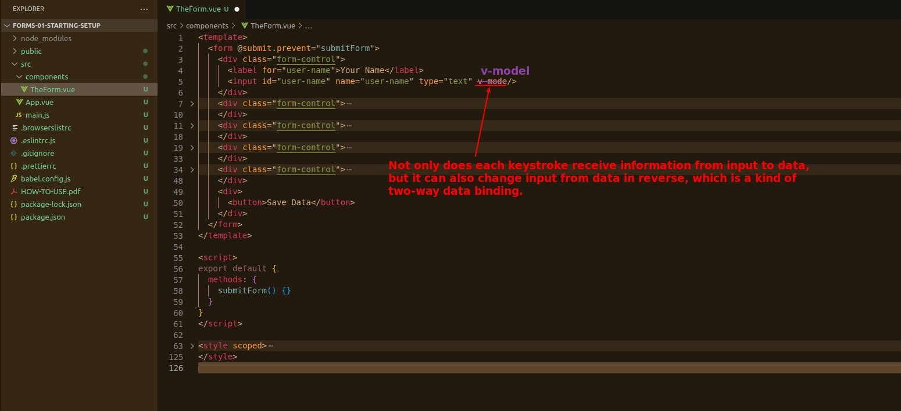

## **Download and Check**

## **Submit**

- Because the button contains only itself, while the form contains all inputs and the button.

## **For Input Element**

### _@input_

### _v-model_

- You can combine @input and v-bind to do the same thing as v-model, but v-model saves codes.

## **Data binding with v-model & submit test**

- The main purpose here is to simply test the effect of v-model two way binding.

