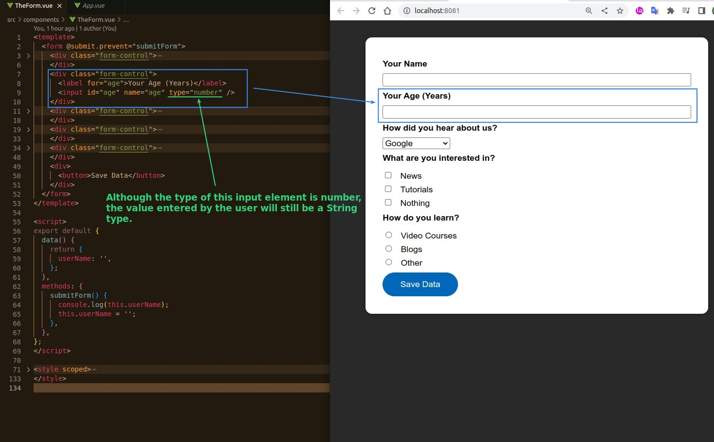
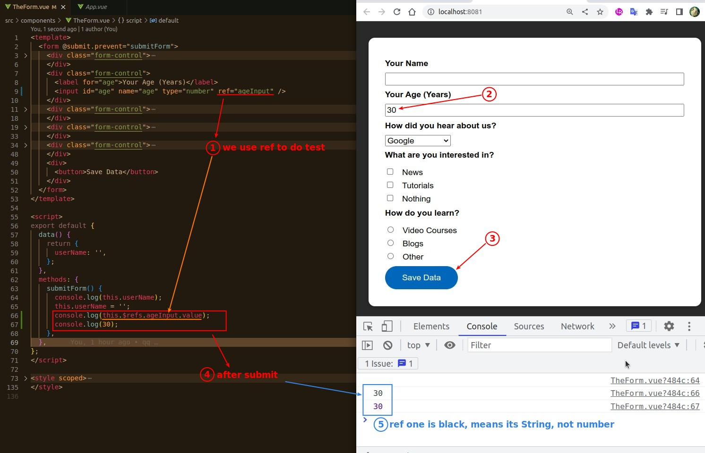
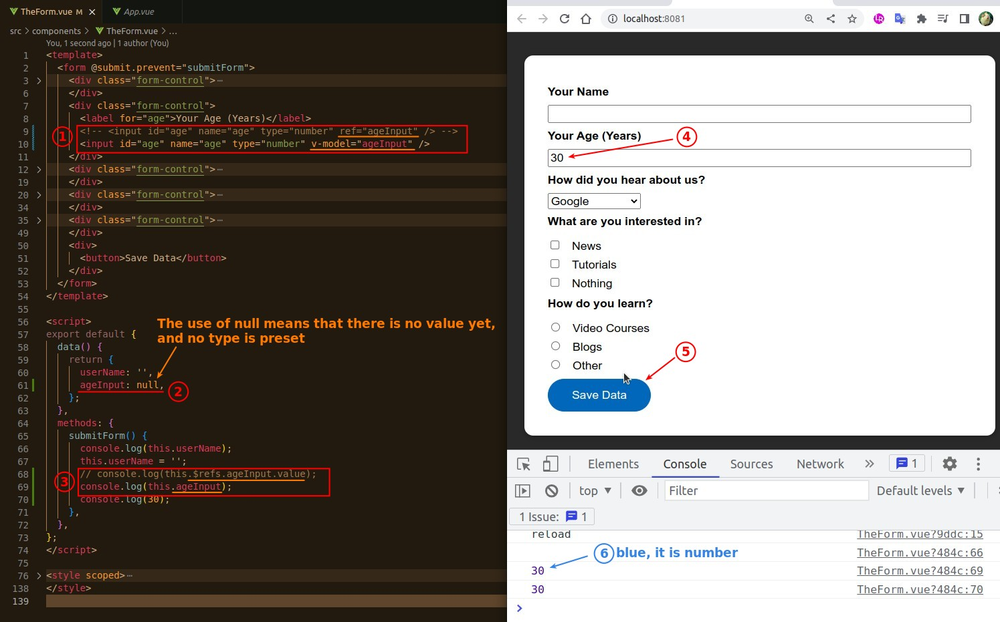
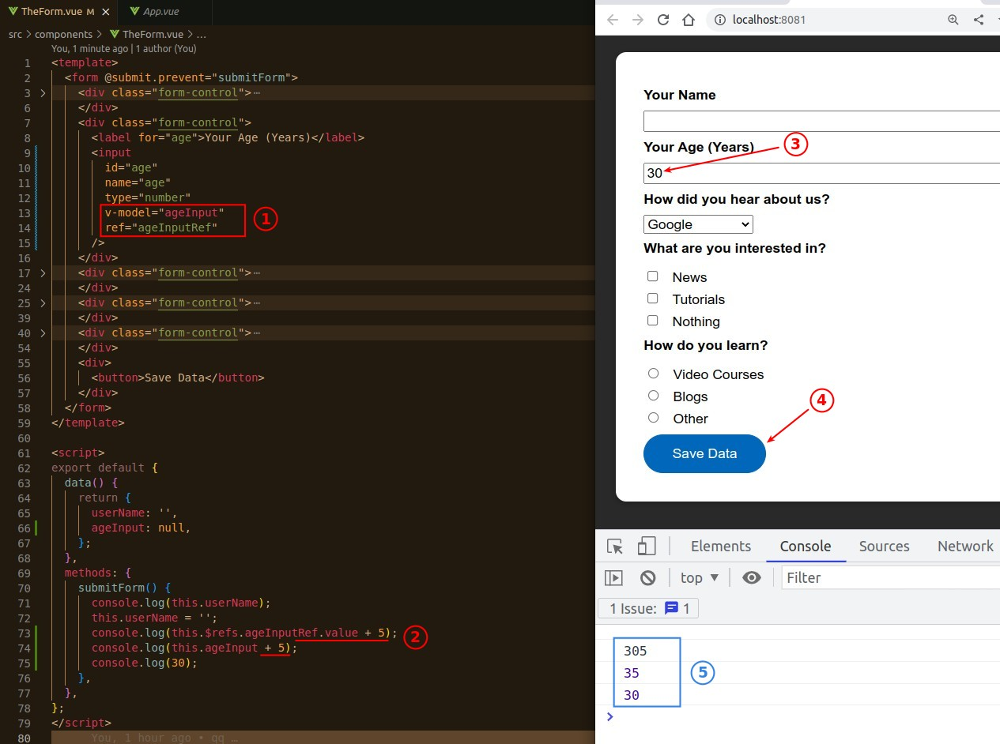
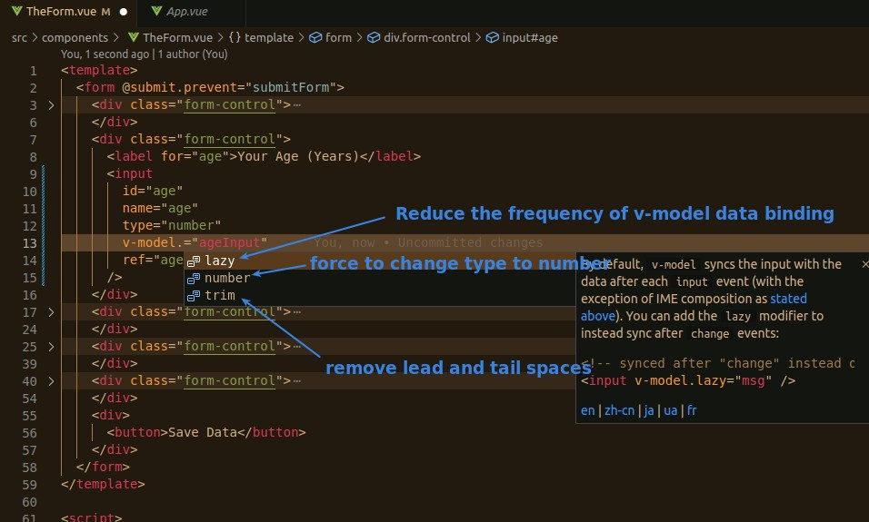

## **By Default, Even Input Type is 'number', value still is String type**

### _Using reft to test it_

## **v-model**

- When we use v-model, we get Number type, because when input type='number', v-model automatically converts the value type from String to Number from the input value.

## **Why we care about input type?**

- As shown above, different types of values will give completely different results, and failure to pay attention will lead to bugs.

## **modifiers of v-model**

> v-model also has several very useful modifiers.

- When the input type is not number, but you need to convert the input value to Number type, you can use the modifier 'number' of v-model directly.
