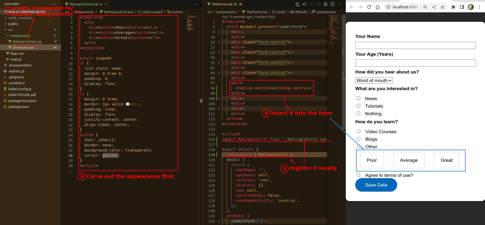
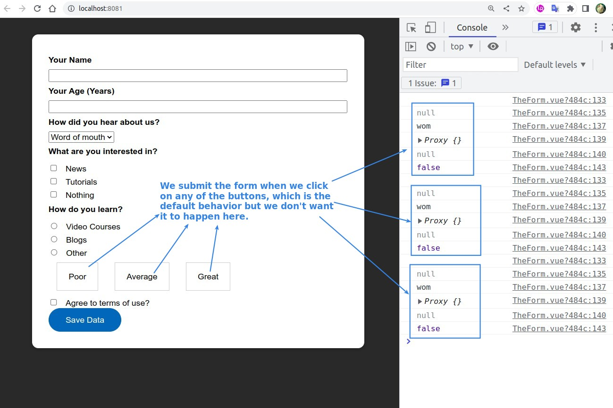
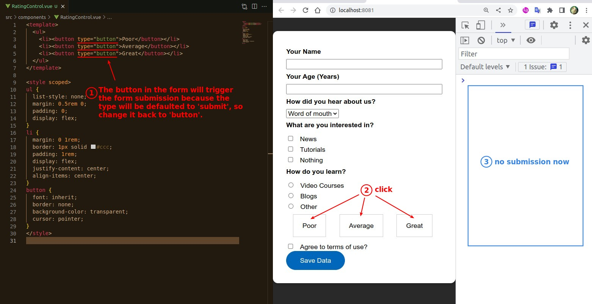
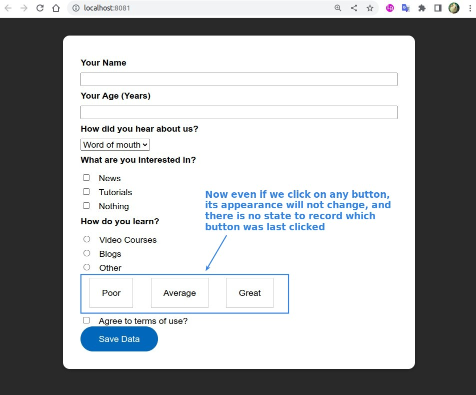
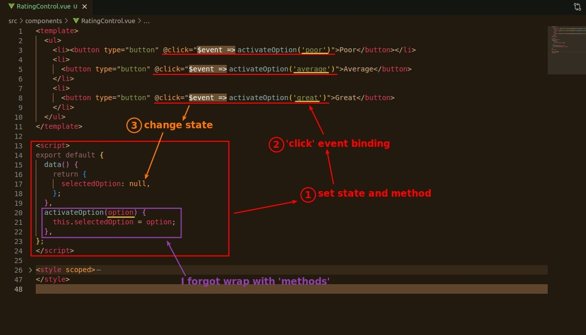
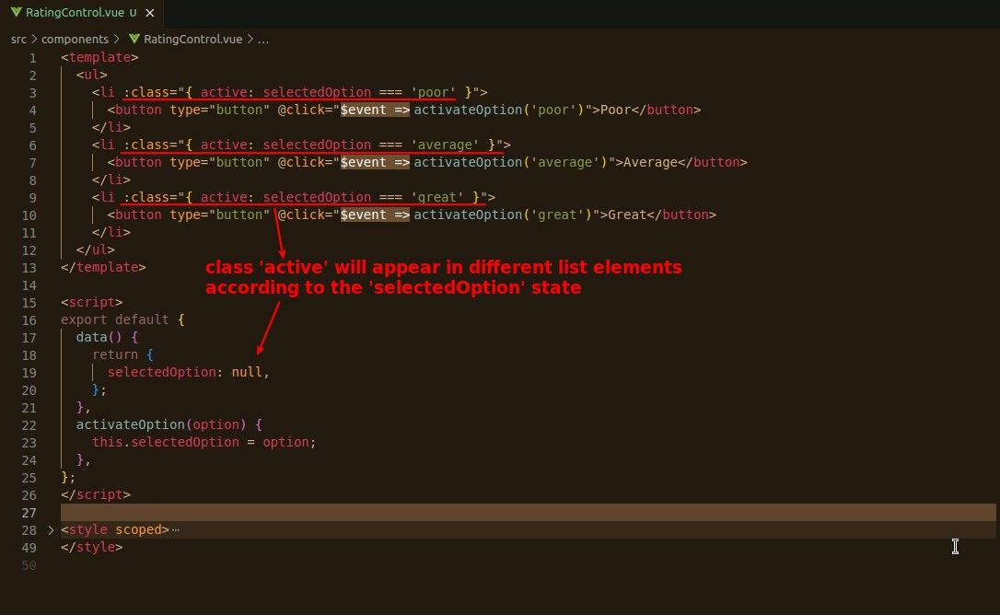
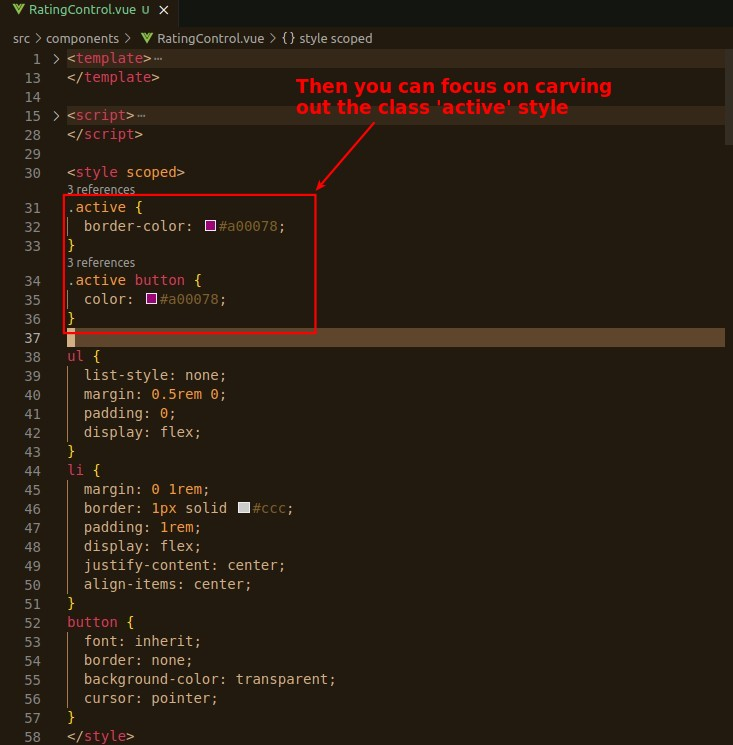
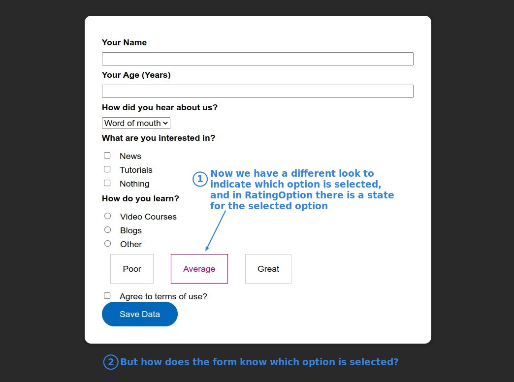

## **Curving Template First**

## **Problem of default button submit**

## **Implement functionalities**

### _state, method, event binding_

### _dynamic/conditional class_

### _focus on curving styles_

### _result and next step_

