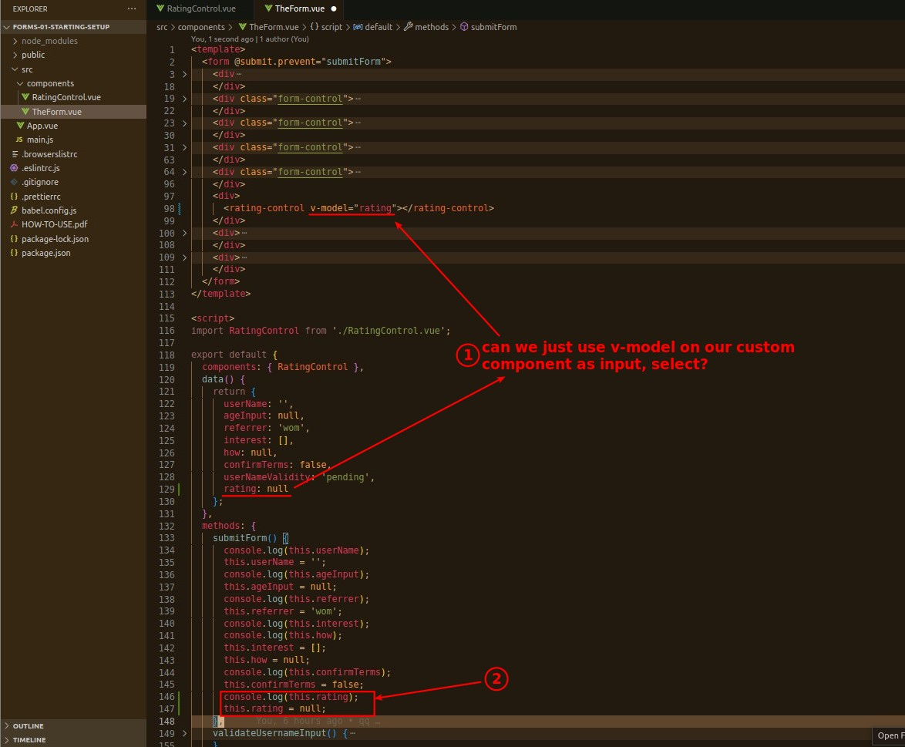
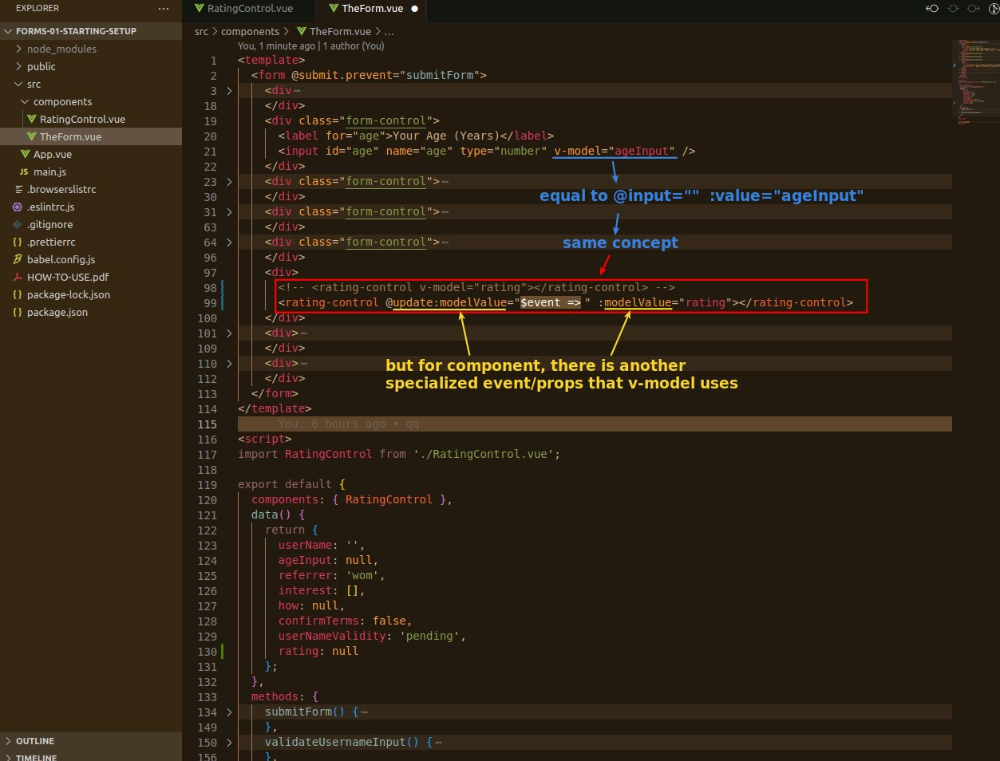
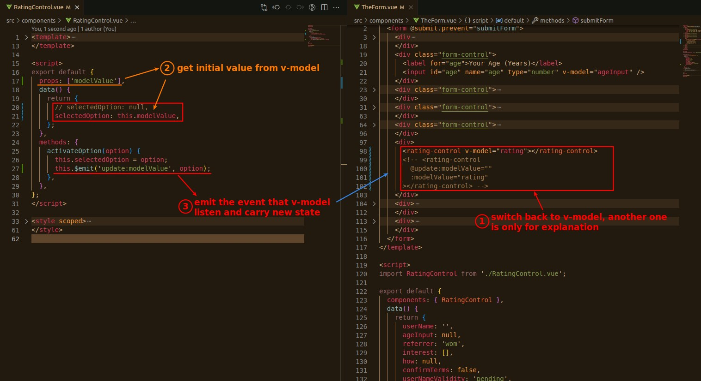
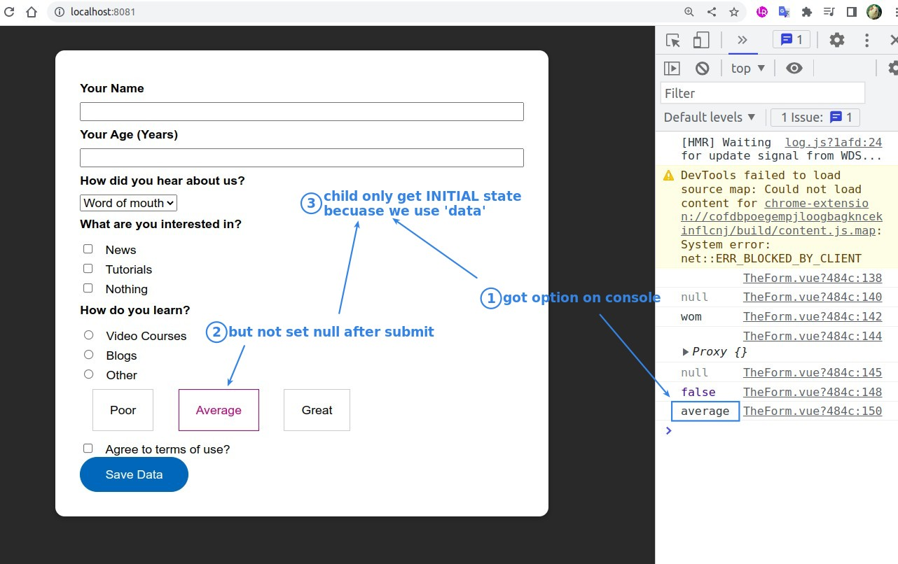
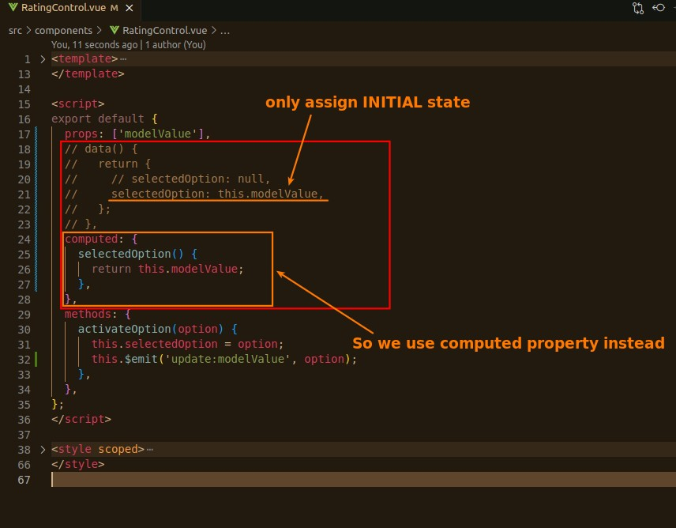
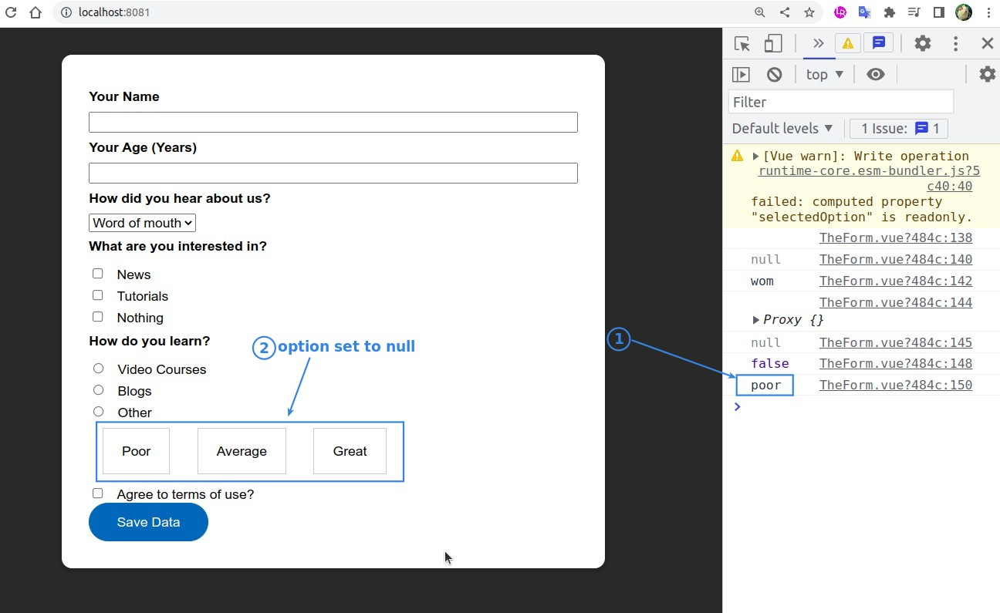
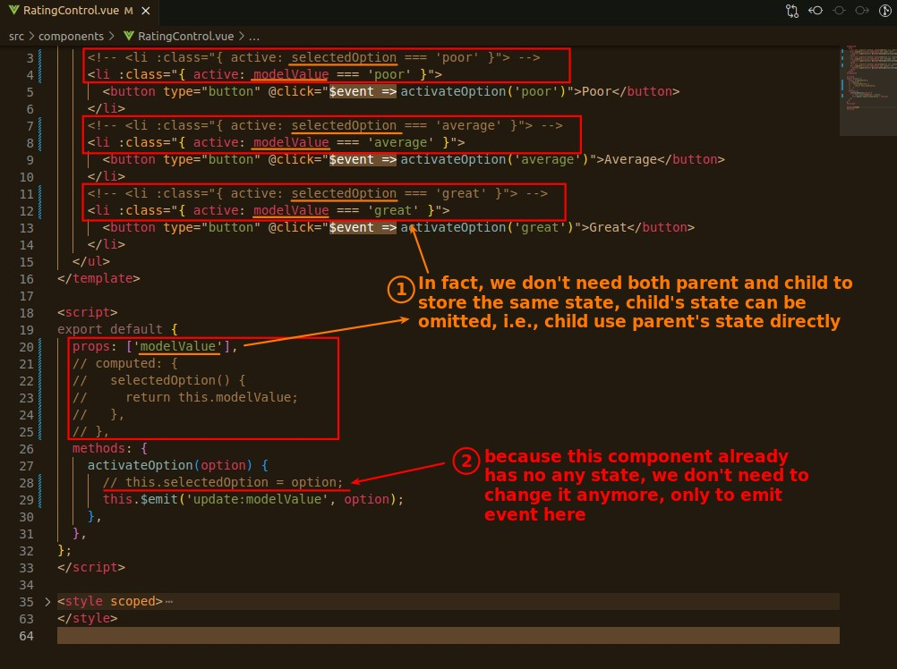
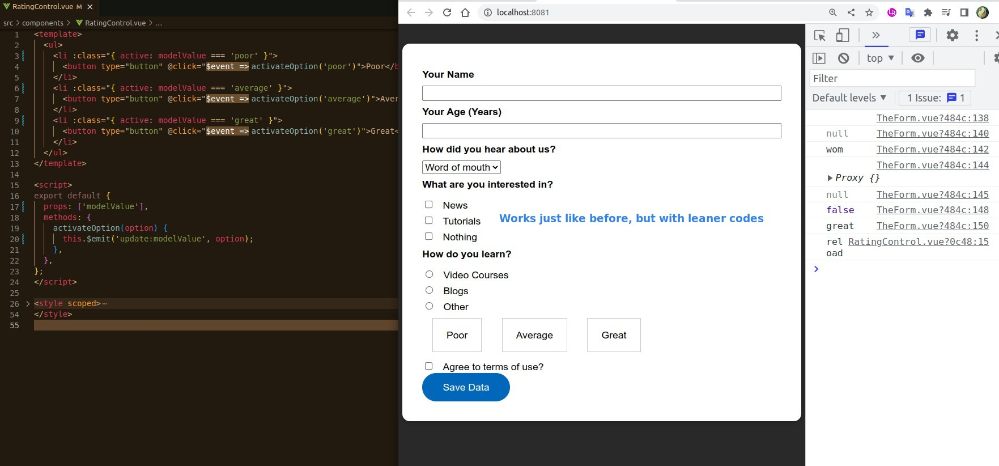

## **Can We Just Use v-model on custom component?**

- So the answer is Yes, but the custom component needs to be adjusted for specialized events/props.

## **Add Specialized props and emit event in the child component**

## **Fix only assign INITIAL state problem**

## **Keep State only in parent component(where the form in)**

- It is better to add the option 'emits', although only the document functionality but it is a good habit.
