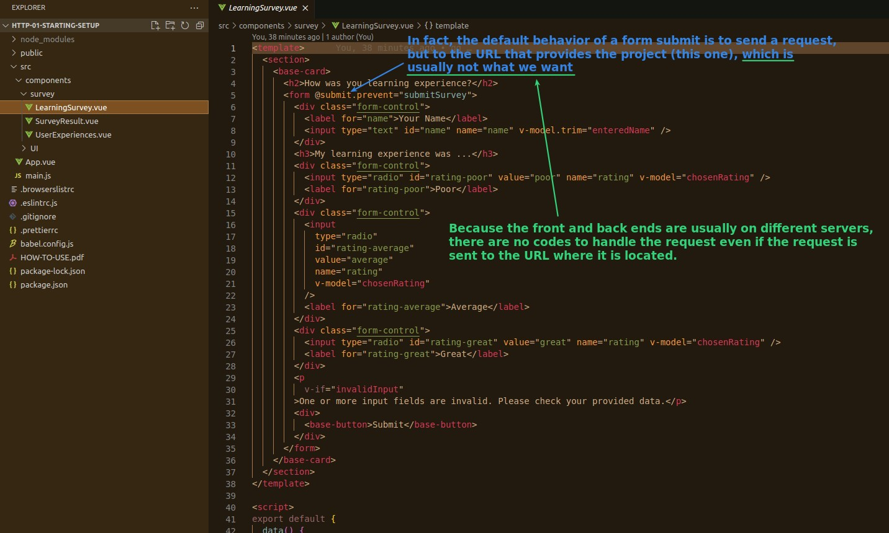
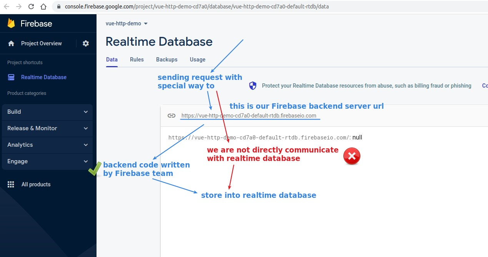
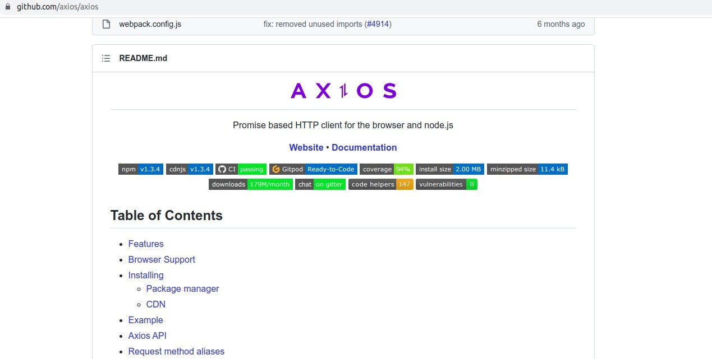
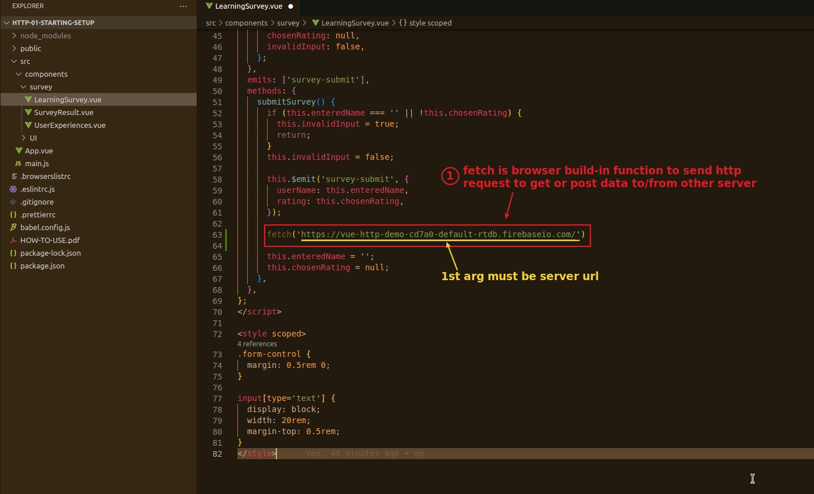

## **Form Submit default behavior**

## **Sending Request to Firebase Realtime dababase**

## **How to send http request?**

### _3rd-party package - AXIOS_

> This is a very powerful and simple tool, you can study it yourself if you are interested.

### _Browser build-in function - fetch_

> We will use this in our lectures.

