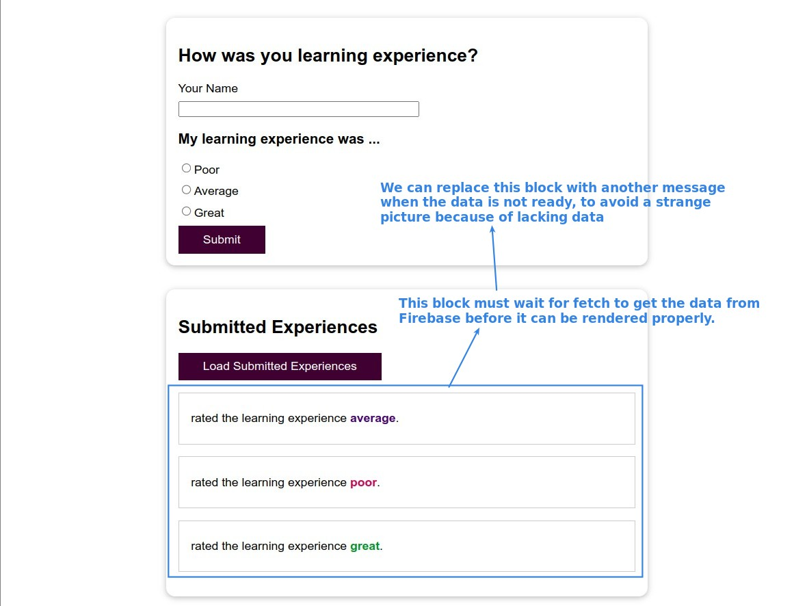
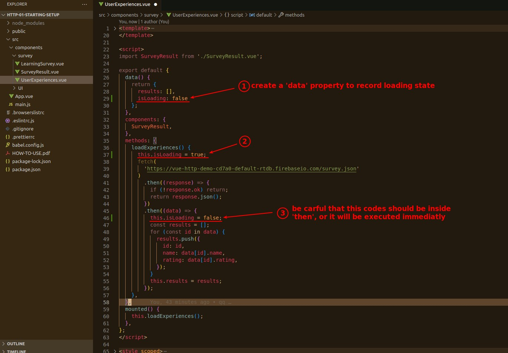
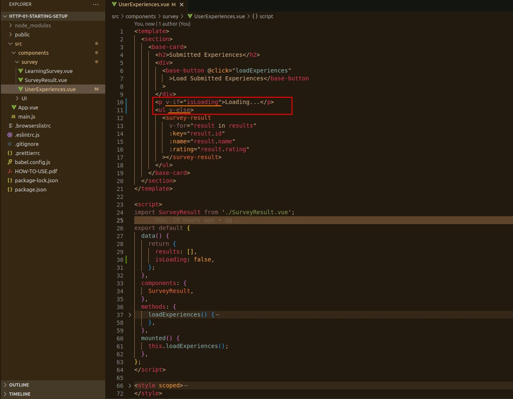

## **Problem: render strange thing because data still loading**

## **Setting data and method**

> When we set loading to a kind of state, it becomes just a simple data processing, things become simple and easy to split work.

## **Conditional rendering**

