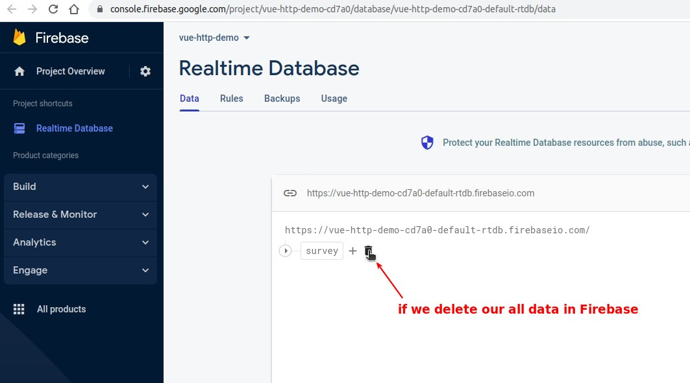
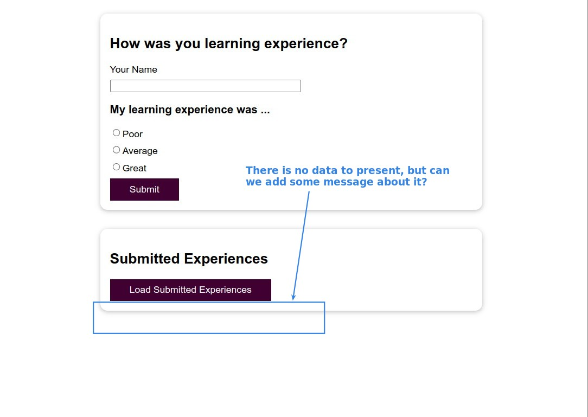
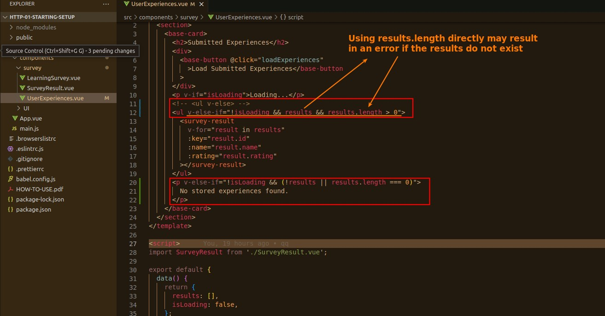
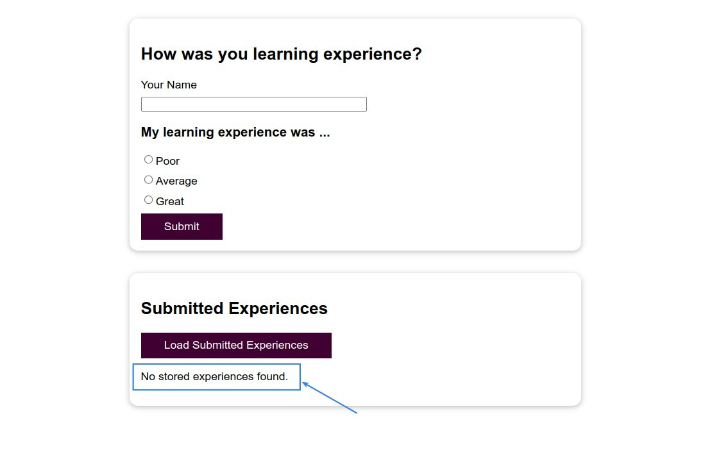

## **Prepare and Requirement for Empty data rendering**

## **More conditional rendering script**

- Sequence && will check one by one from the left to the right, as long as a false is found in the middle, the subsequent ones will not be executed.

- Because of the convenient directives v-if, v-else-if, we can accomplish this requirement in the template only.

