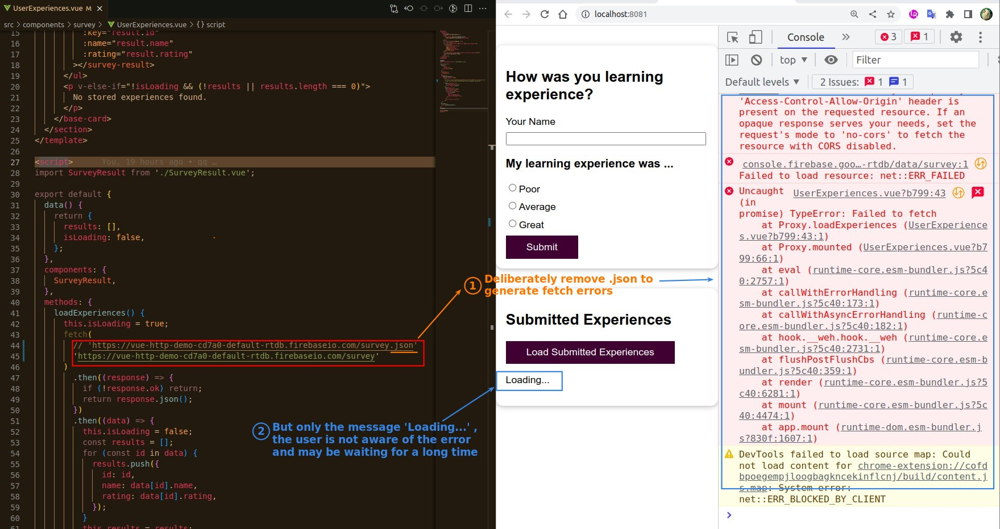
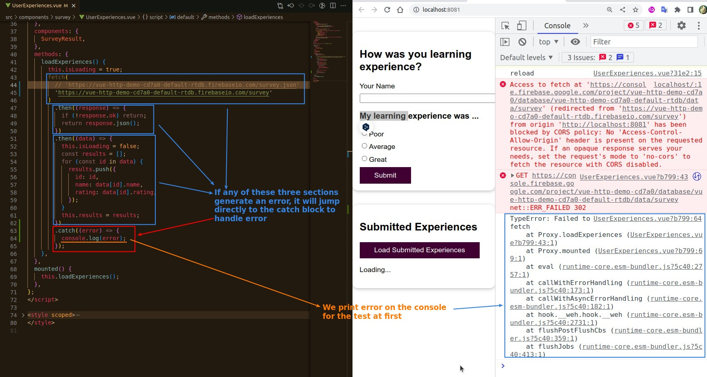
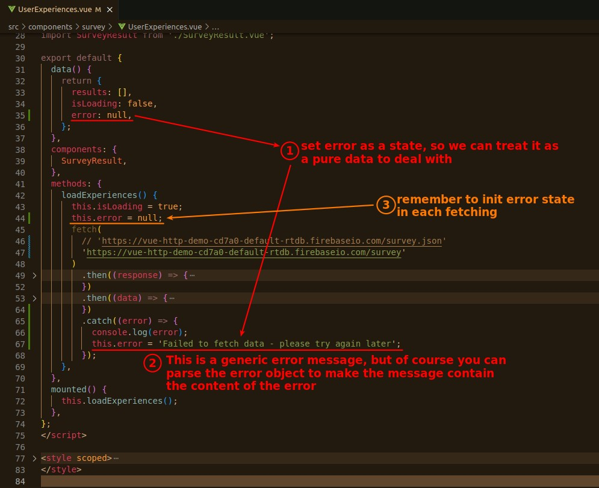
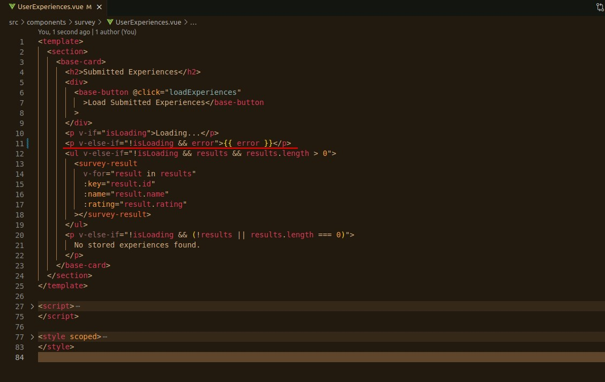
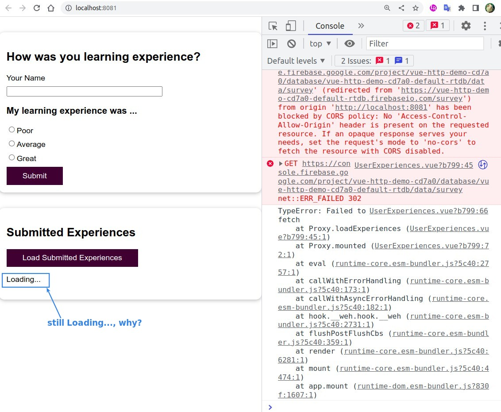
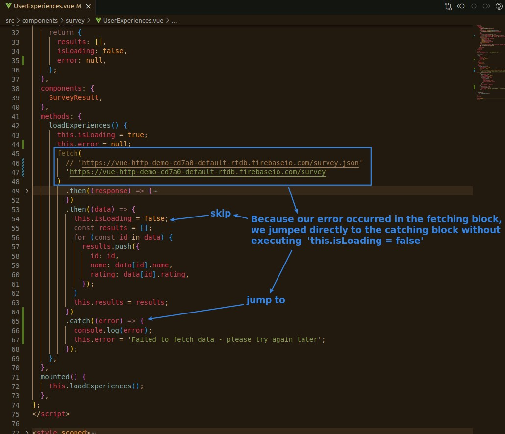
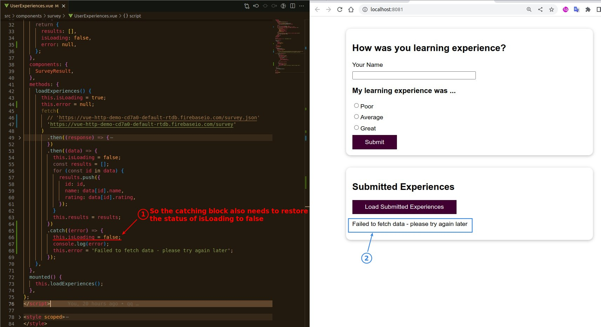
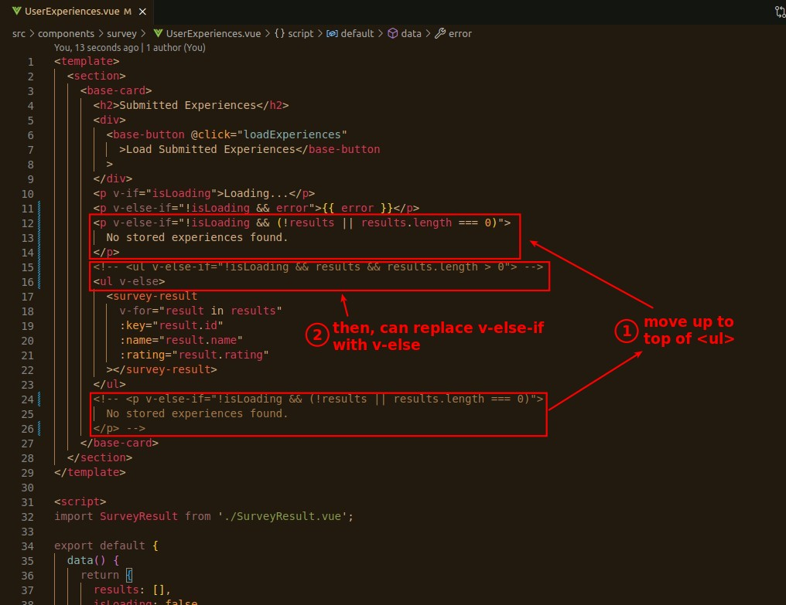

## **Invoke Fetching error and Show off the problem**

## **Catching error**

## **Set Error as a state of Vue**

## **Render Error**

### _Bug: still loading..._

## **Further simplize our conditional rendering script**

> This part is not related to the error message, it is just to make some adjustments to the conditional rendering part to make the codes more concise.

