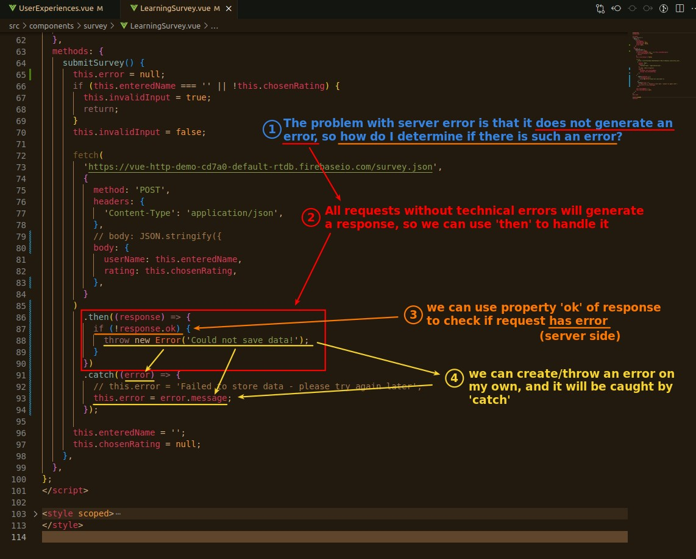

## **Implement Error Msg for technical error on Form component**

> This section is almost exactly the same as the previous lecture.

## **What about Server side error**

> Technical error is an error from browser, while Server side error is generated in Server, so there is no error in Vue app, but some error code like 400, 500 in response as a hint.

### _why 'catch' not to work in this case_

### _Throw/Create Error on my own_

> As mentioned above, Server side errors are not sent to the Vue app, so we have to generate/throw the error ourselves in the Vue app.

- The point is that we can use 'response.ok' to know if there is any error on the server side, so that we can do the following process.

### _Result test_

