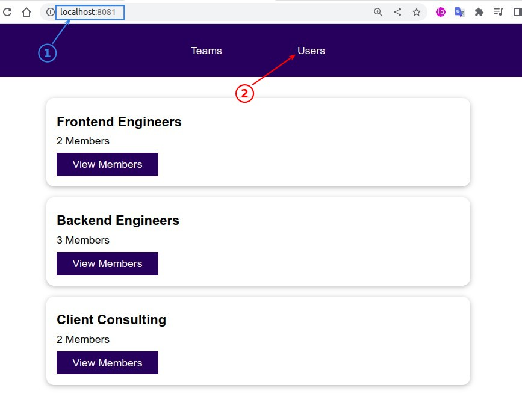
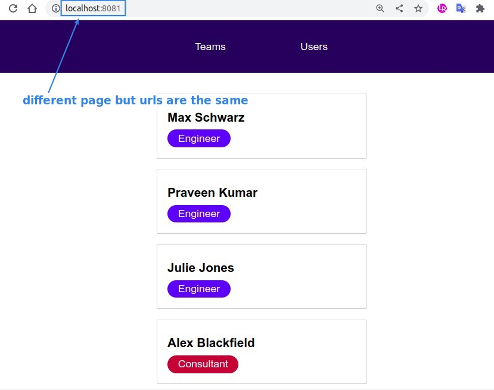

## **Problem of one page web application**

> Vue apps are usually one-page web apps, meaning that there is only one HTML file to load all of our JS scripts, and if we use multiple HTML files to load different JS scripts, the JS scripts will be completely unrelated to each other, which is usually not the result we want.

- The above two pictures look like two pages of HTML but with the same url.
  - Because they actually use the same HTML file, and then use JS to switch the content entirely, but this creates a problem that the url is always the same.

## **Routing**

- We can use the routing package, which it will give different URLs to different content when switching by JavaScript.

- It makes us feel that there are many HTML files to switch between different pages, but in fact there is only one HTML file.

- All page switching is simply a result of JavaScript making the content on the page change.
