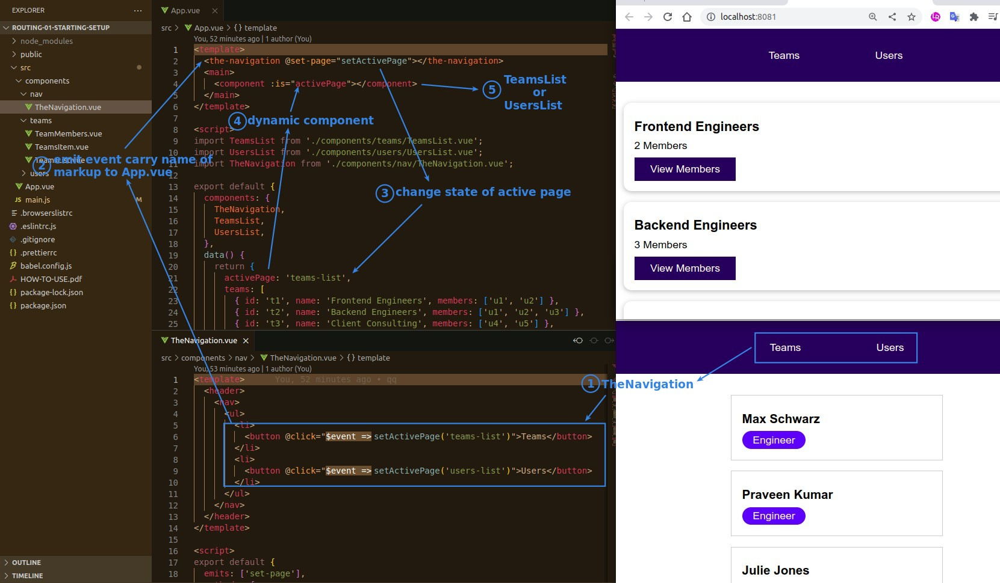
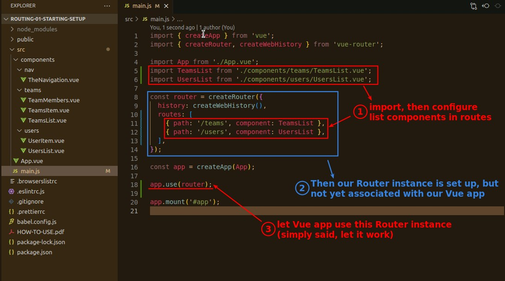
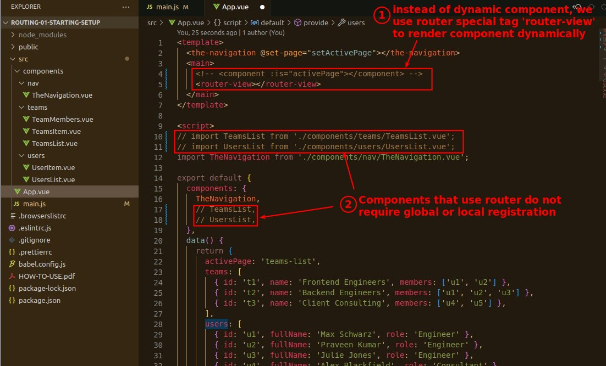
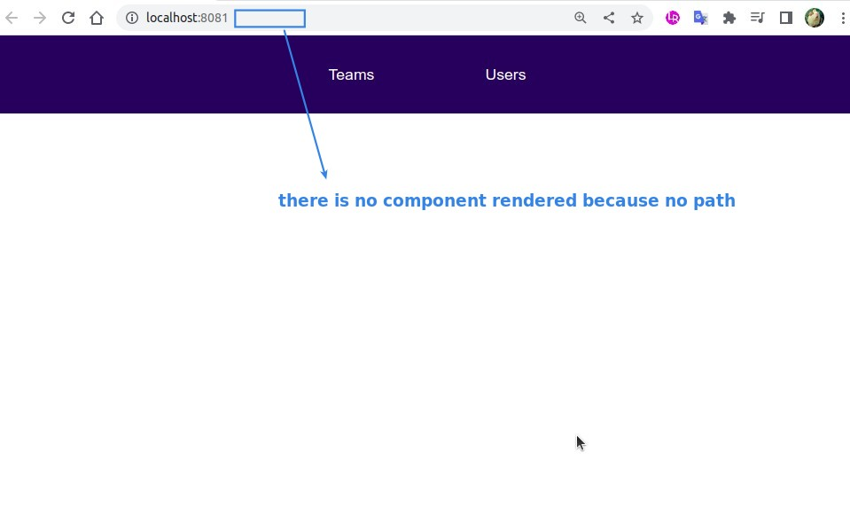
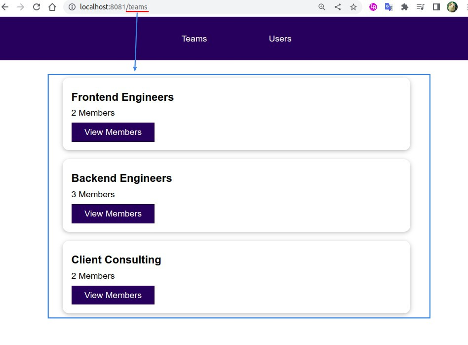
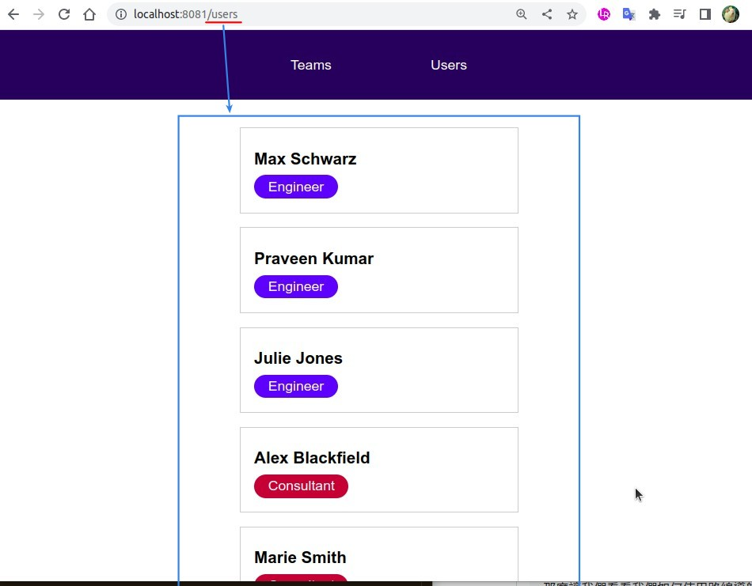
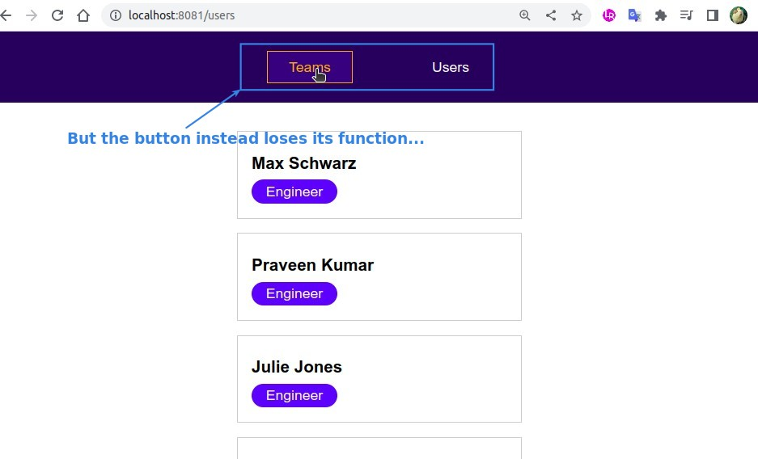

## **Analyze original way: dynamic component**

## **Register List Components in routes**

## **RouterView**

> RouterView is an HTML special element provided by Vue-router package, it is also a dynamic render component but the concept is different from dynamic component.

## **Page Test**

