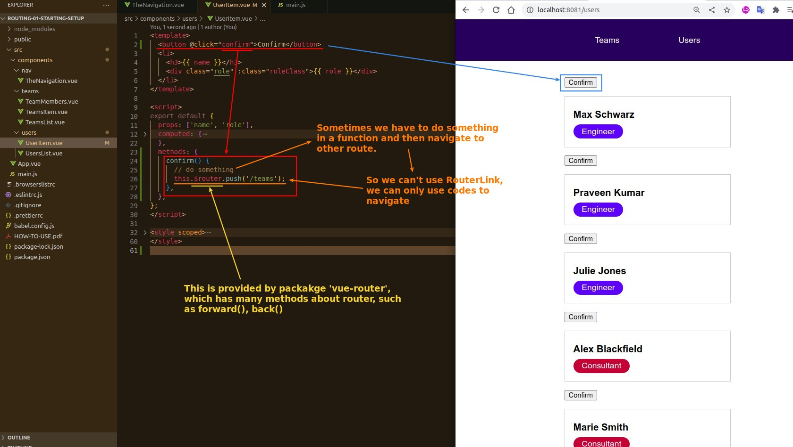

- this.$router.push('/teams') is to add a route record of '/teams' to the history, and navigate to its page.
- forward(), back() is to simulate the browser in the next page, the previous page function.
