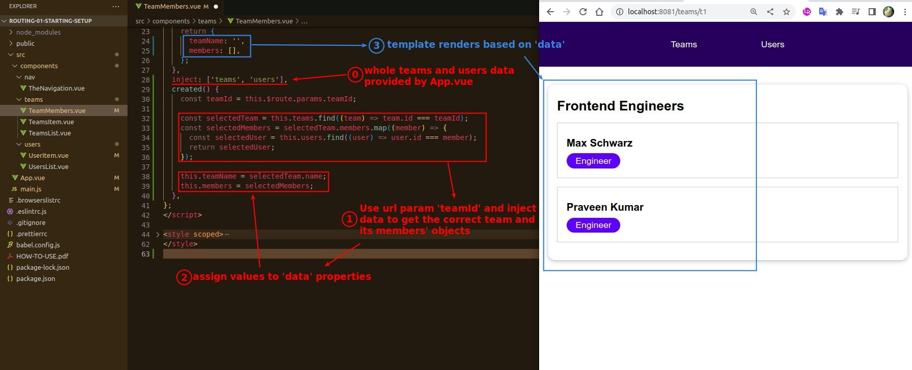

## **Plain How to Get Data by Url Parameter**

## **Create a Dynamic route**

## **Let Component Get Data Through Dynamic route and rendering**

### _$route (not $router)_

### _native JS process to inject data_

