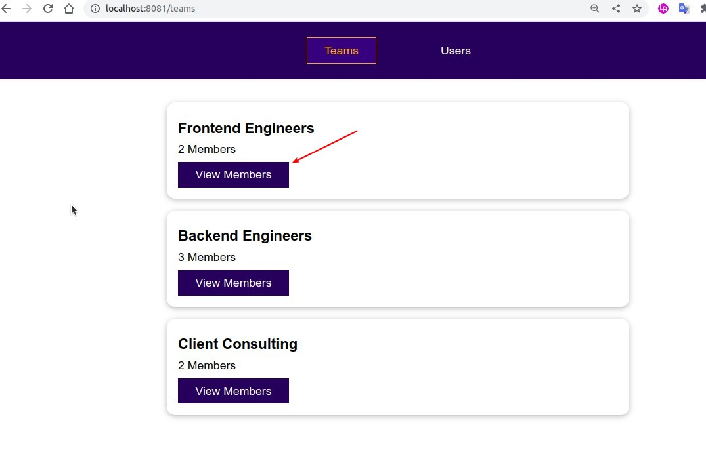
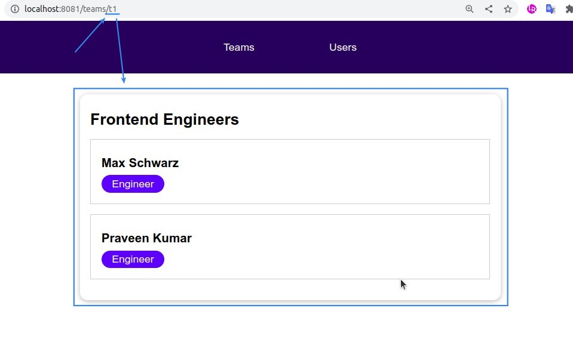

## **Currently Situation and Plan**

> Each TeamItem in the TeamList page has a button (anchor) that should be clicked to switch to the TeamMembers page, but...

## **Dynamic Changing Path**

> Like before we use RouterLink to dynamically render components by path, but this time we even generate the path dynamically.

## **TEST**

