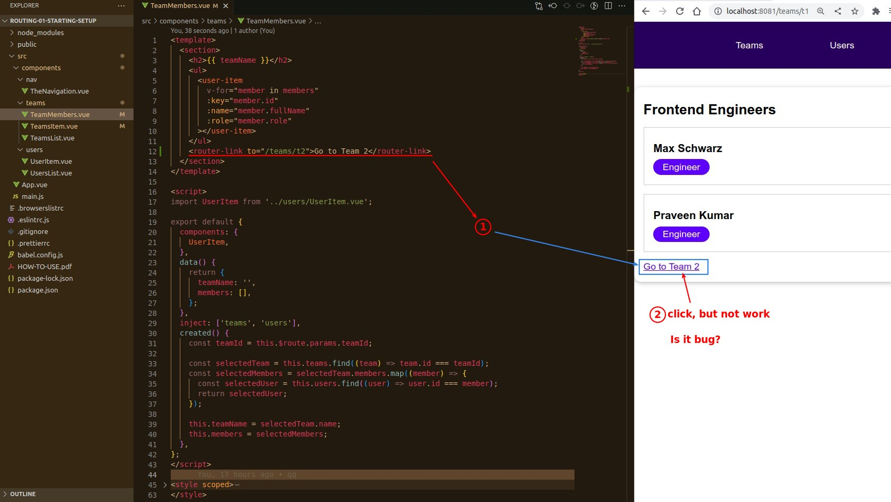
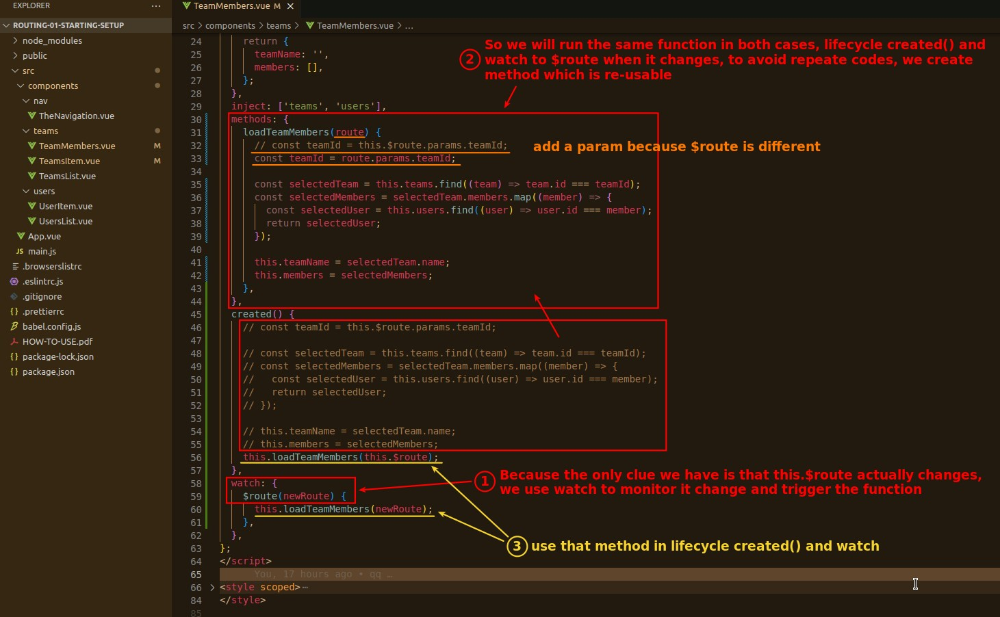

## **Bug: RounterLink not work**

> When we use routes, there are some bugs that occur...

## **Reason: Not Destroy/Re-create But Re-use**

> In fact, it is not a bug, but an intended behavior.

## **Fix it by adding Watcher**

