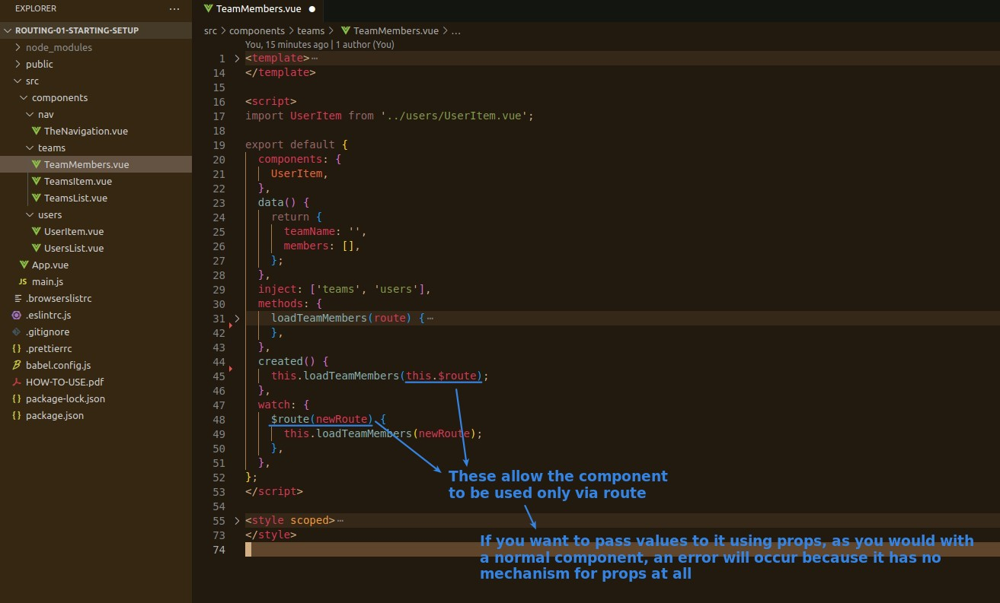
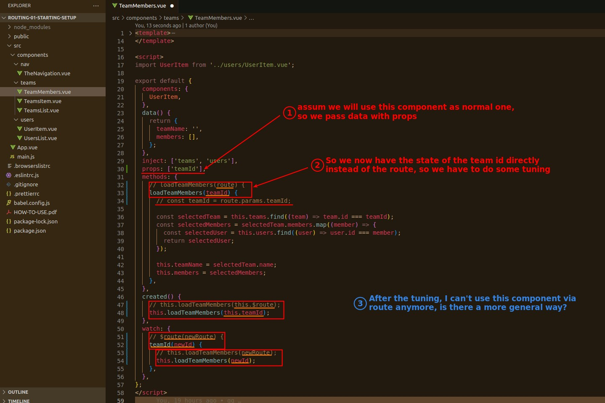
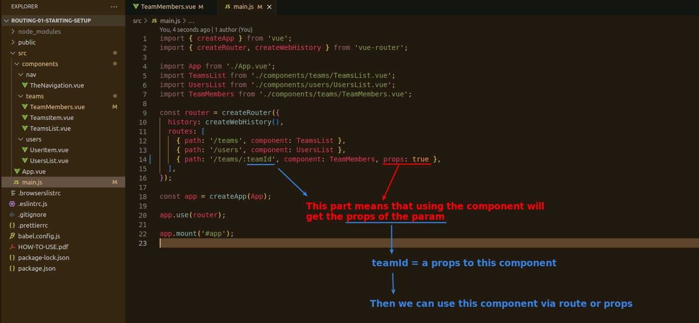

## **Problem**

## **Change to props to pass value from parent**

> Assuming another scenario, we must use props to pass values to this component...

## **Configure route pass params value through props**

> We can configure the route to also pass values to the component via props, so we don't need to use $route specifically to get the values of params, which makes our component more versatile.

