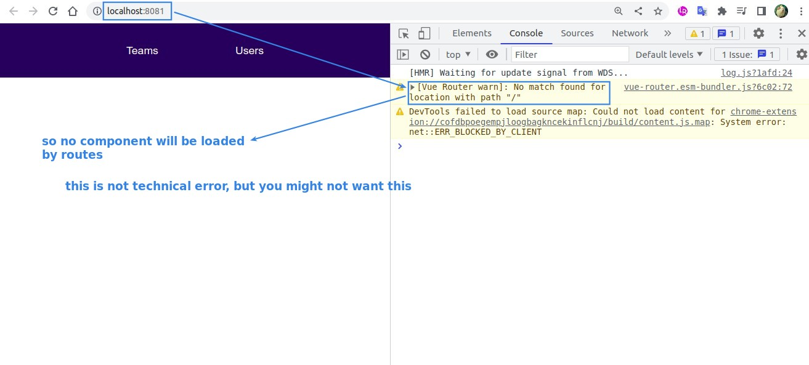
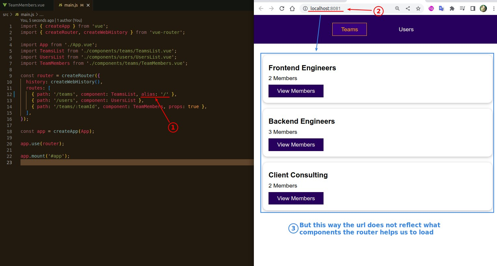
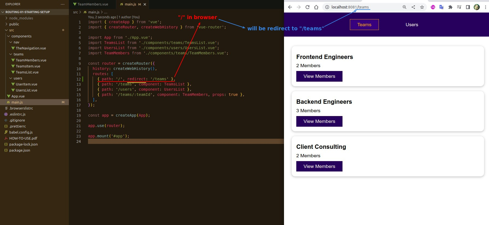
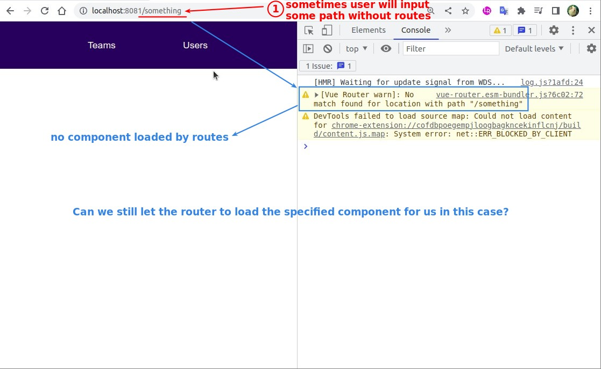
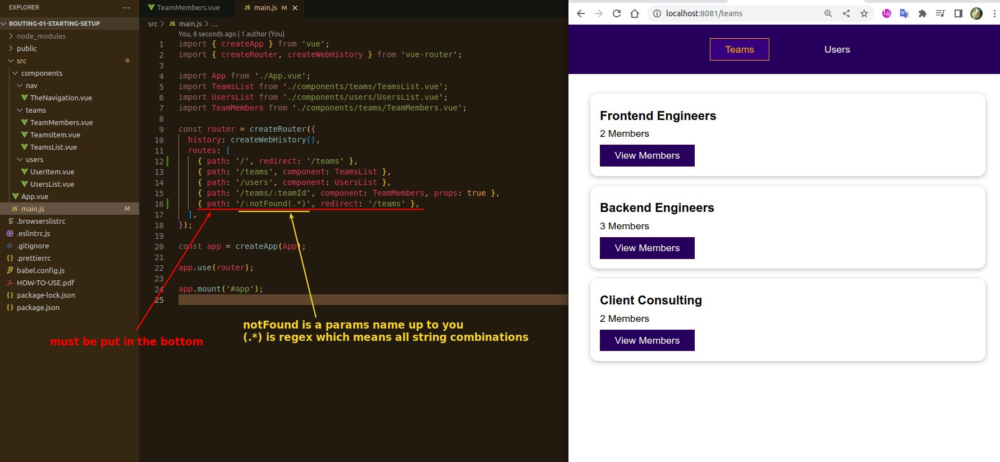
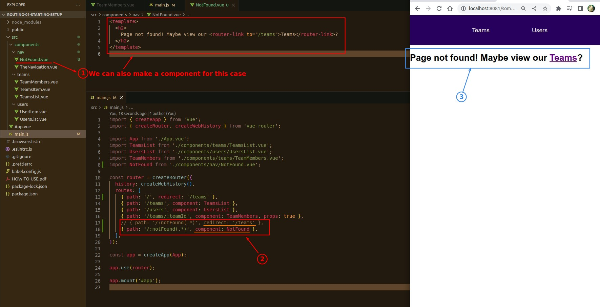

## **About '/'**

- But it's all strange to set a component to '/', because '/' doesn't describe what component the router is going to load, which is not intuitive.

## **Alias**

## **Redirect**

## **If user input random path which not found in our routes...**

- It is impossible to configure routes for every random string path.

