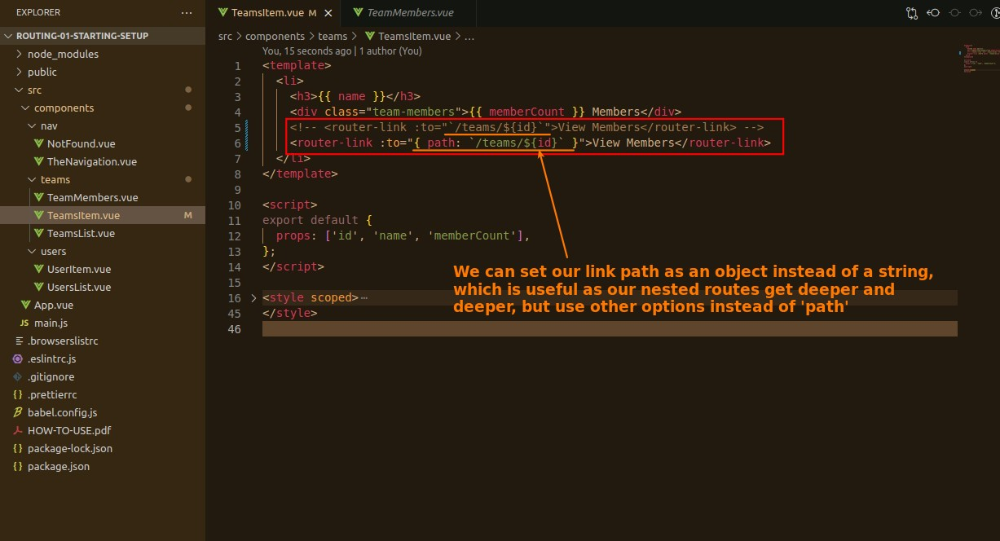
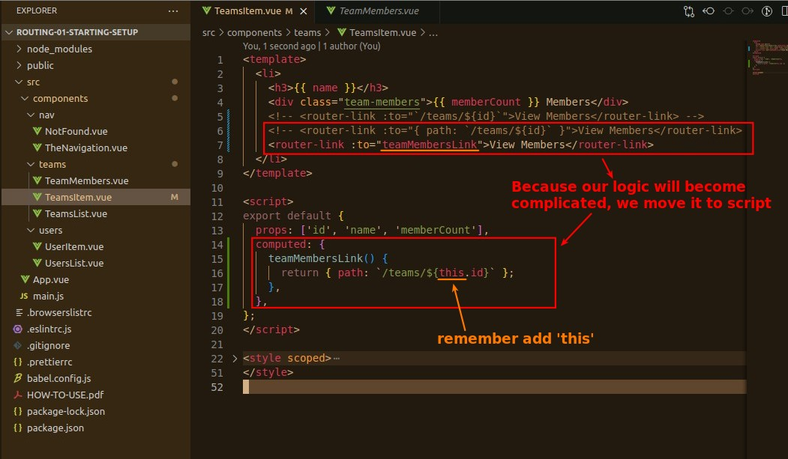
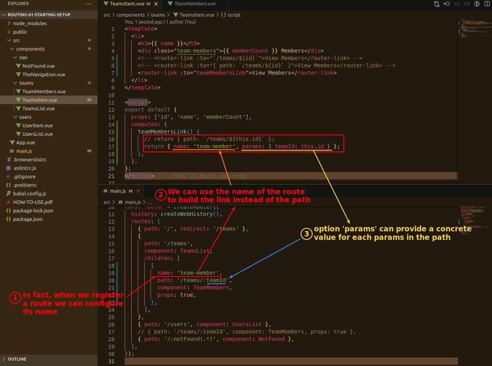
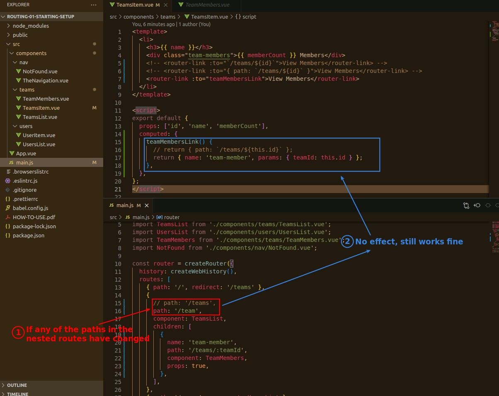

## **Set To Link of RouterLink as a Object instead of String**

- We can use object type to this.$route.puch() as well.

## **Name of Routes**

### _add name to route and use it to RouterLink_

### _Why name > path_

