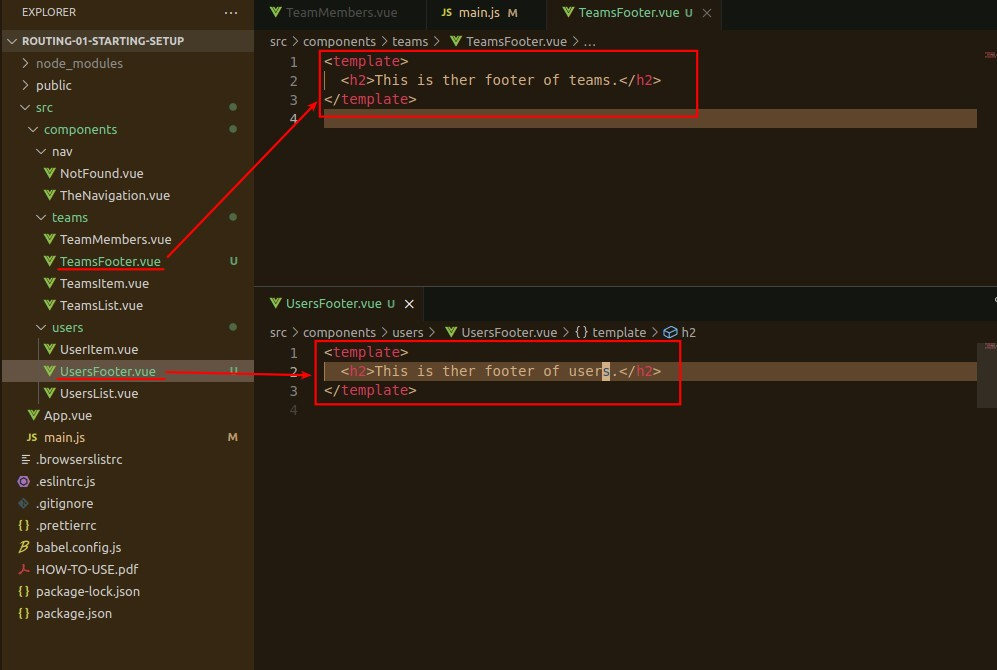
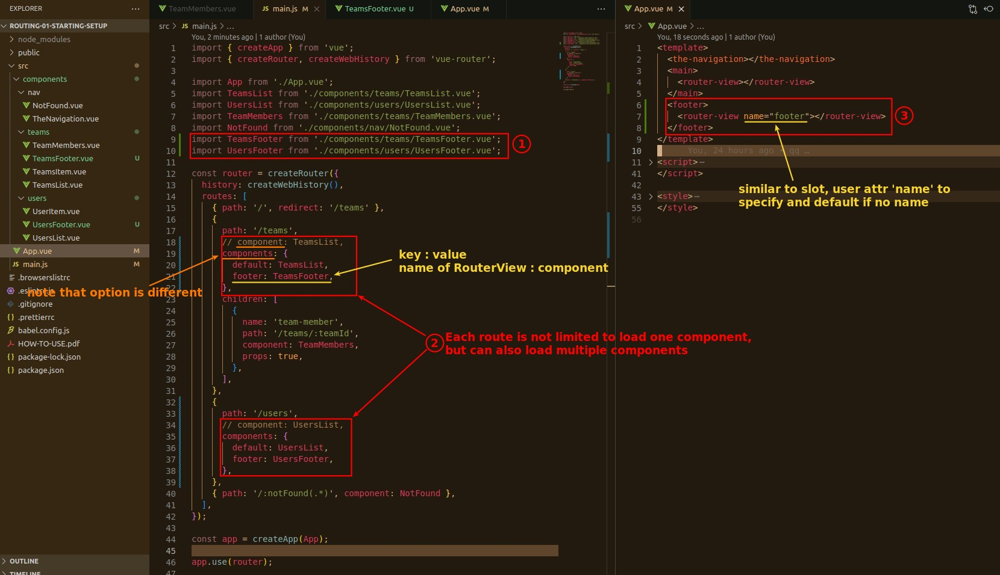
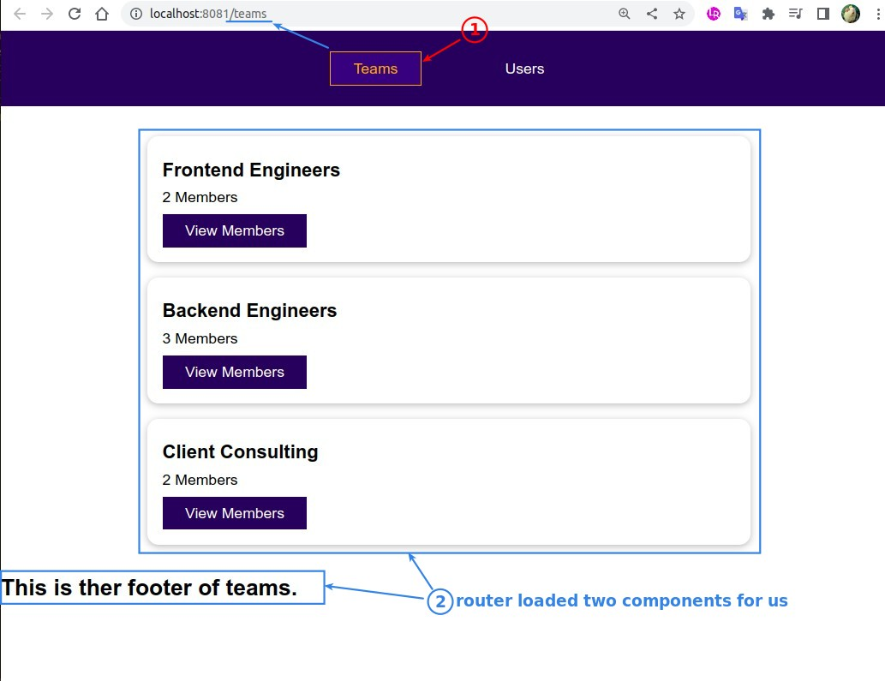
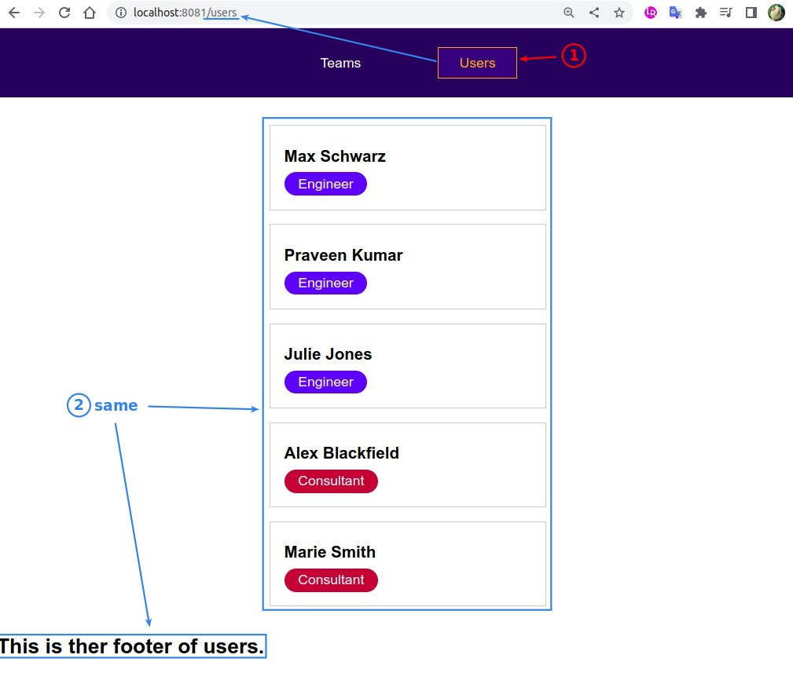

## **Prepare**

> Simply make two footer components for the following test.

## **Configure MULTI-components to SINGLE route**

> Yes, it is allowed.

## **Page results**

### _/teams_

### _/users_

- So router can help us to load multiple components in the same layer.
  qq
