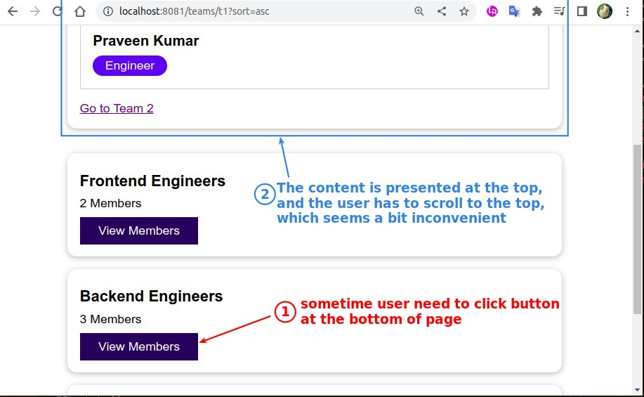
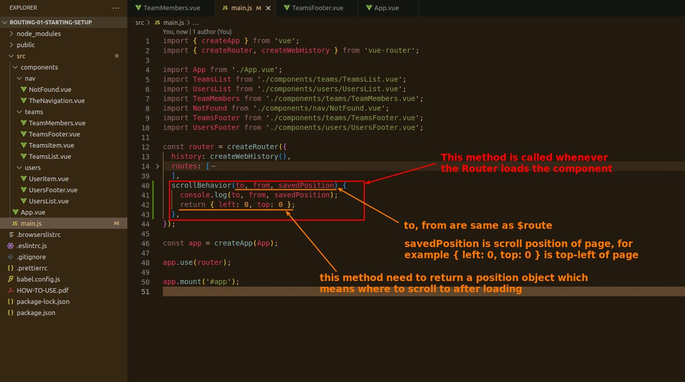
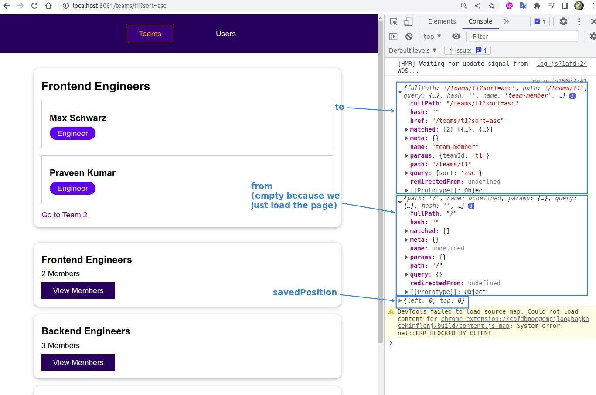
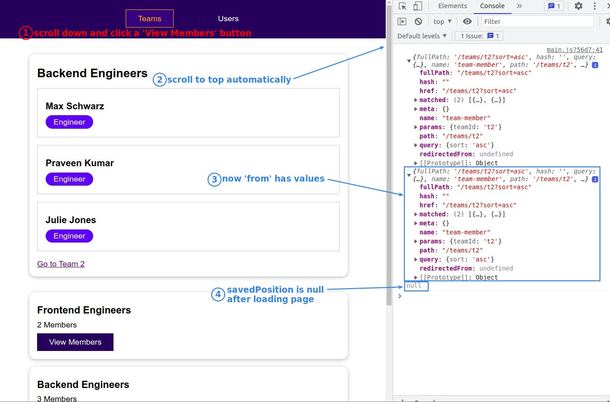
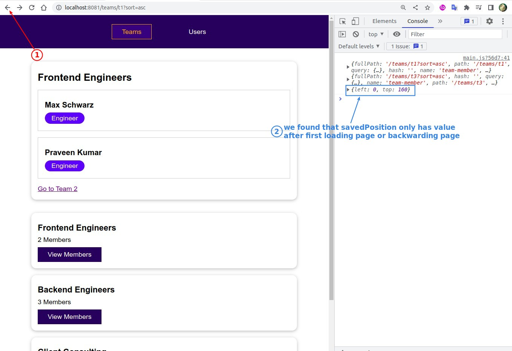
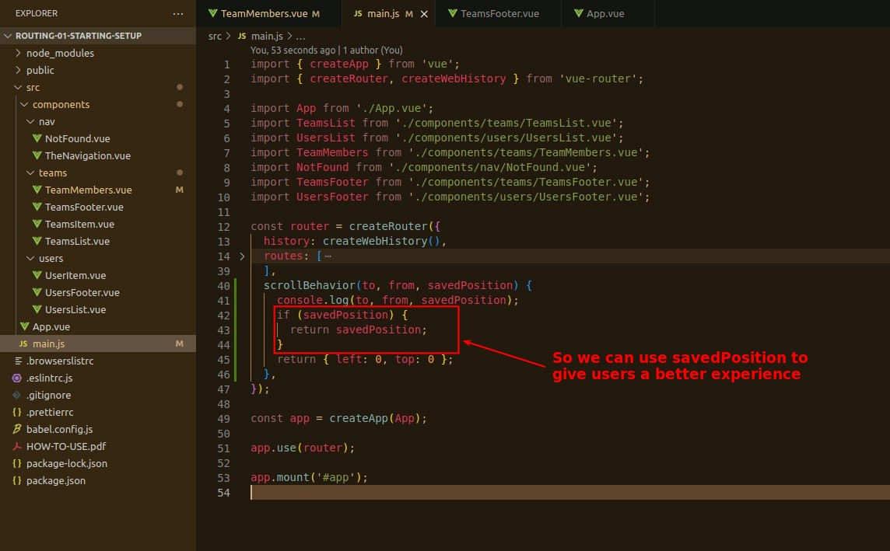
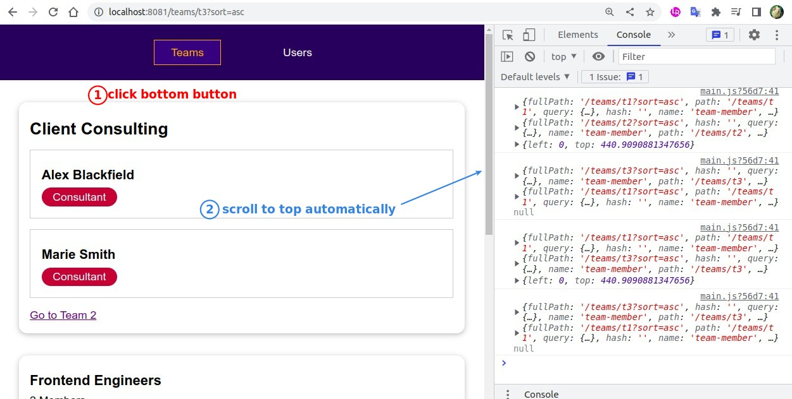
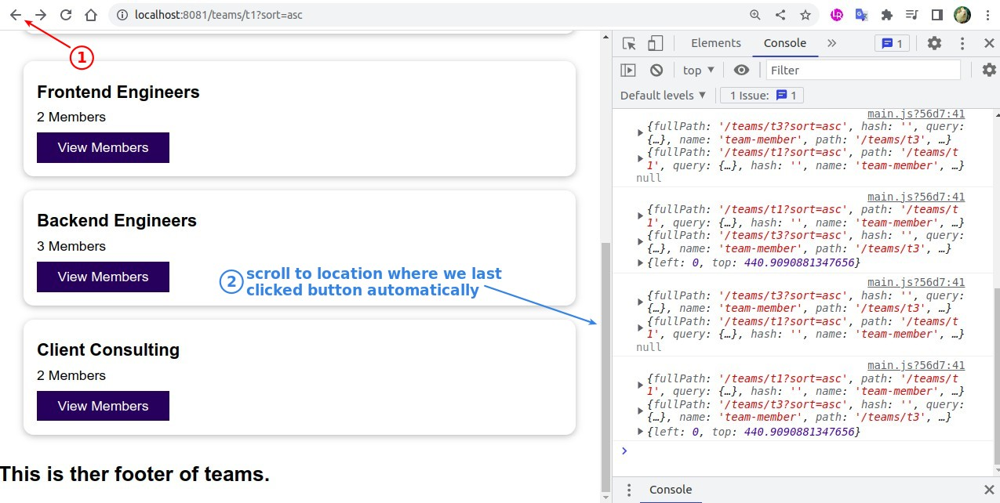

## **Problem: Inconvenient User Experience**

## **scrollBehavior**

> This is one of Router's options, and is actually a method that is called every time Router loads a page.

### _to, from, savedPosition_

## **Leverage savedPosition**

