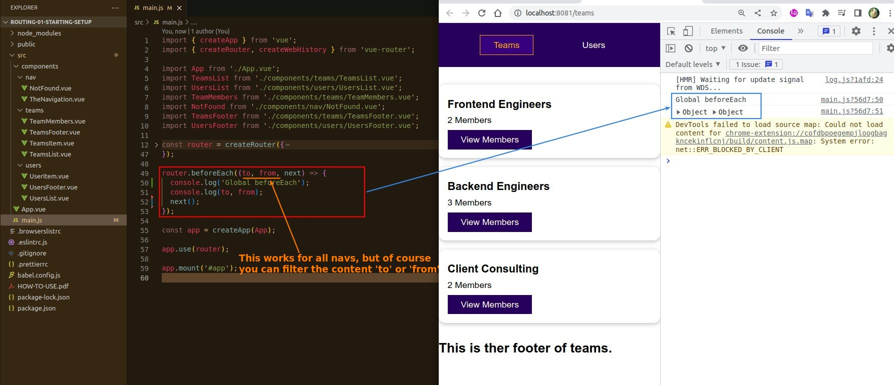
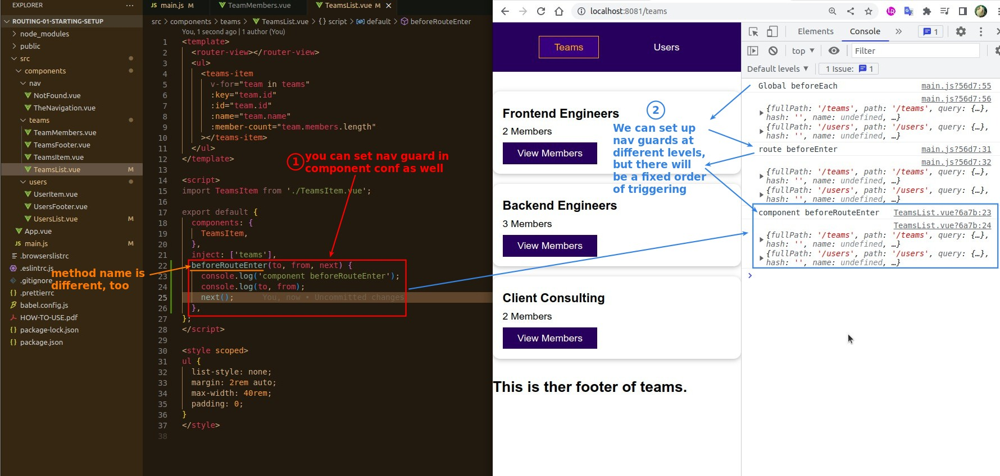
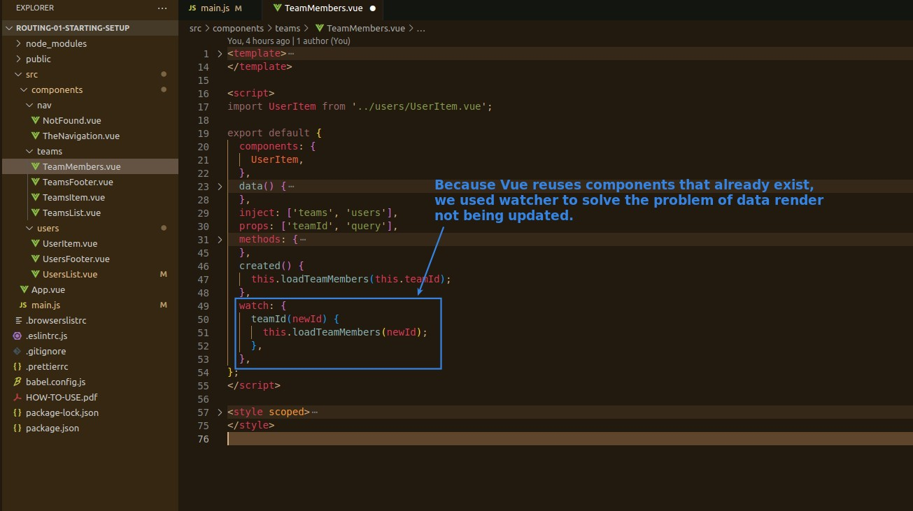
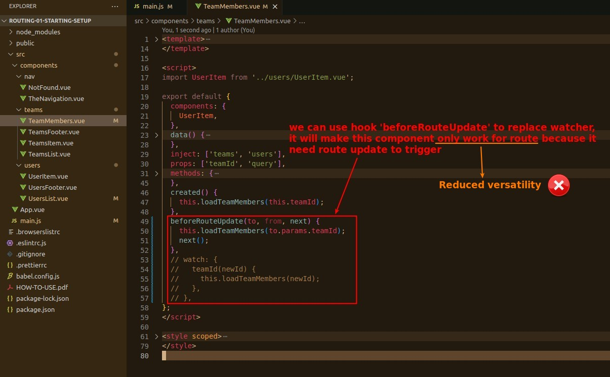

## **Navigation Guard of Different Level**

> Navigation Guard can be implemented not only at the router object level, but also at the route and component level.

### _Global_

### _Route_

### _Component_

## **Replace Watcher with beforeRouteUpdate or not?**

- We can replace the watcher with another hook 'beforeRouteUpdate' that can be implemented in the component.
  - Because 'beforeRouteUpdate' is triggered by route update, so even if the component is reused, it will work if the route has been updated (suitable for this case).
  - Note that 'beforeRouteUpdate' is not the same as 'beforeRouteEnter' that we mentioned earlier, in fact there are lots of various hooks.

- Because over-reliance on route will reduce the versatility of the component, we prefer to use watcher to solve the problem in this case.
