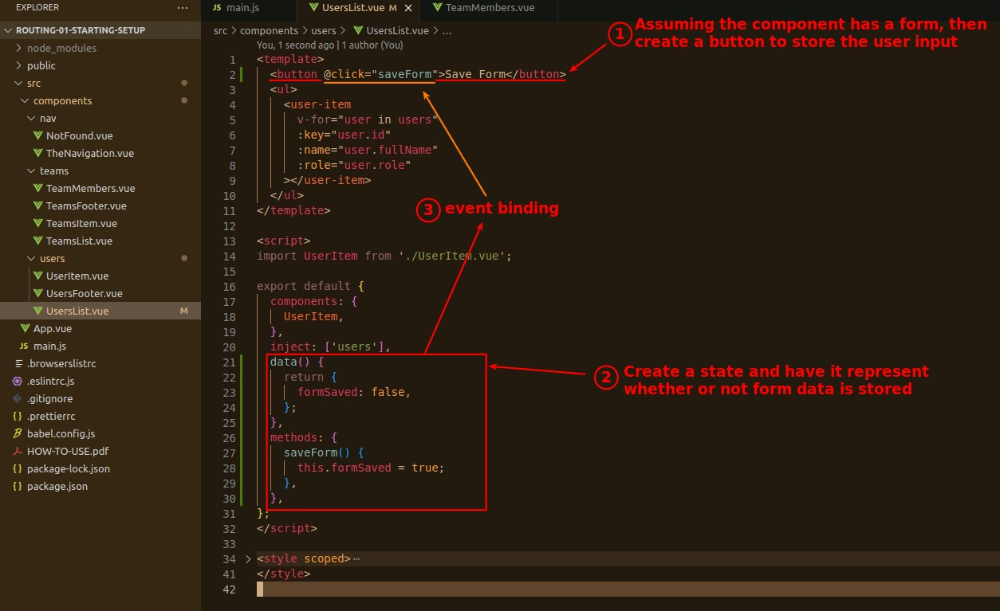
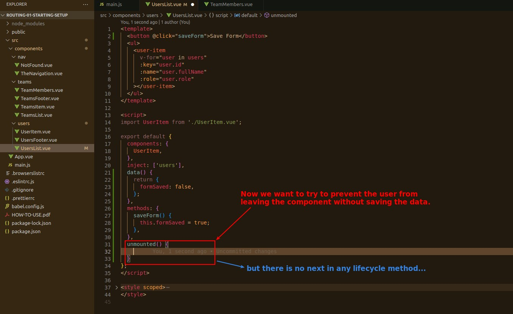
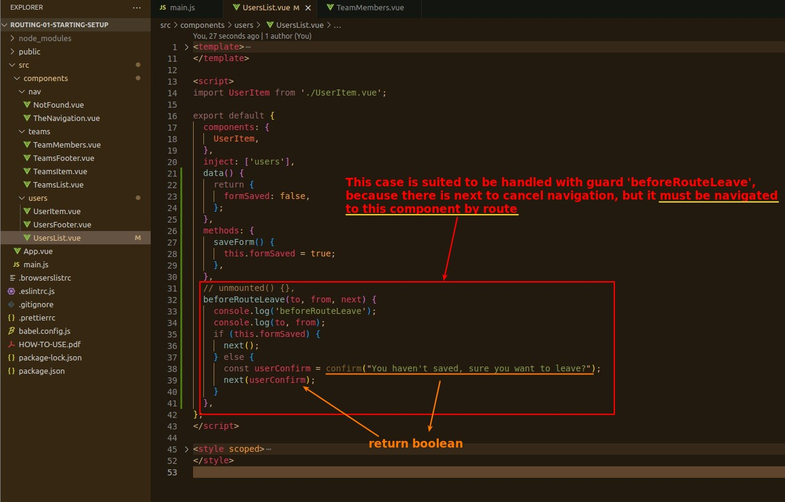
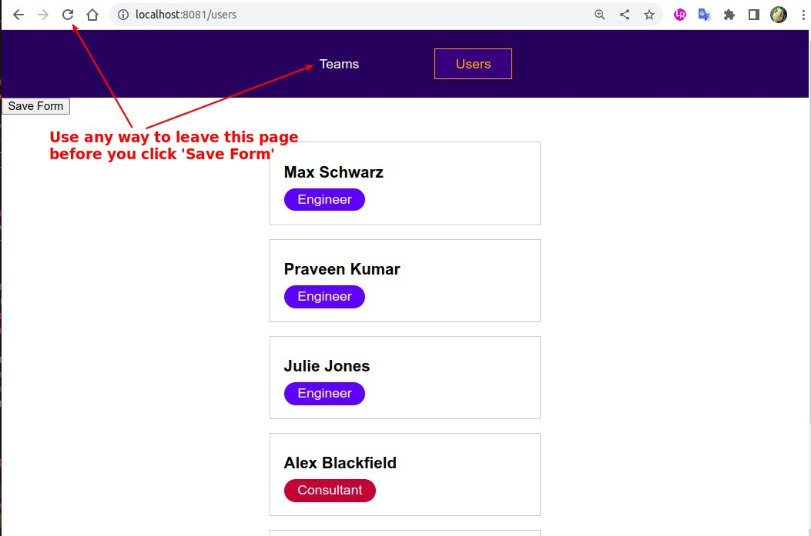
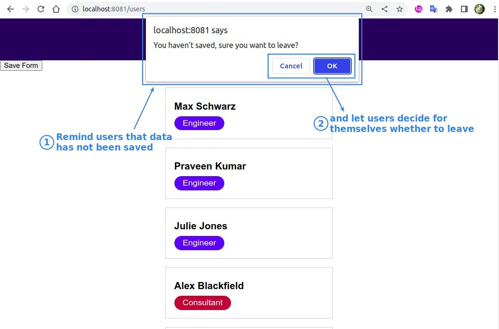

## **Prepare: Dummy button to save form**

> We find a component (page) that uses route, and assume it has a form and create a dummy save button for it.

## **How to Prevent User leave without saving data?**

### _Lifecycle method_

### _Guard_

## **TEST**

