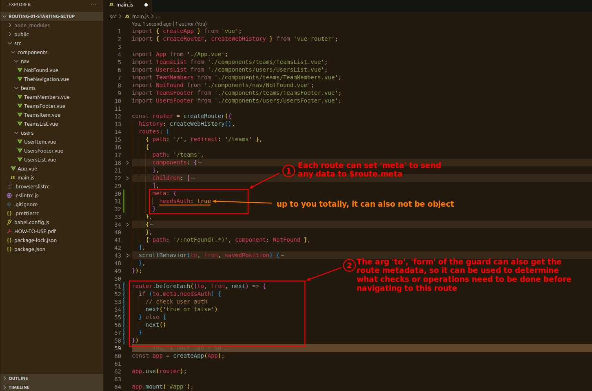

## **Route Configuration 'meta'**

- Using this approach, we can write some generic checks and actions in the global guard, and then use 'meta' in each route configuration to set which ones to enable.
  - This is very advanced and useful.
