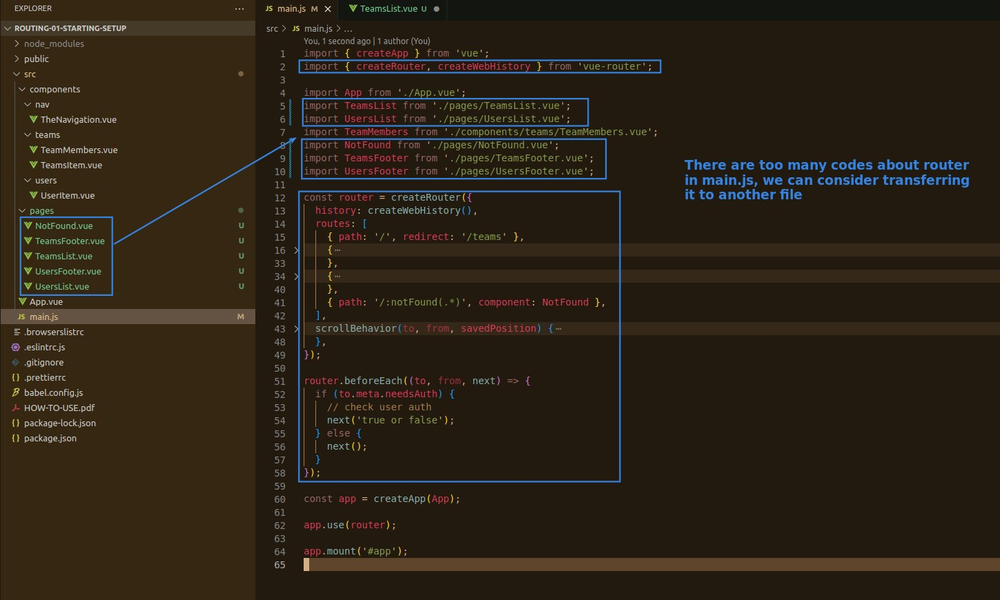

## **Split Page/normal components**

- This is optional.
  - Suitable for large projects.
  - No split is fine, this means that the page component needs to be used as a normal component as well, which is more flexible. but hard to maintain.
    - In this case, make sure that the components of the route are configured props=true.

## **Split router codes from main.js**

> router itself is a complete topic and object, stored in a separate file is very reasonable.

