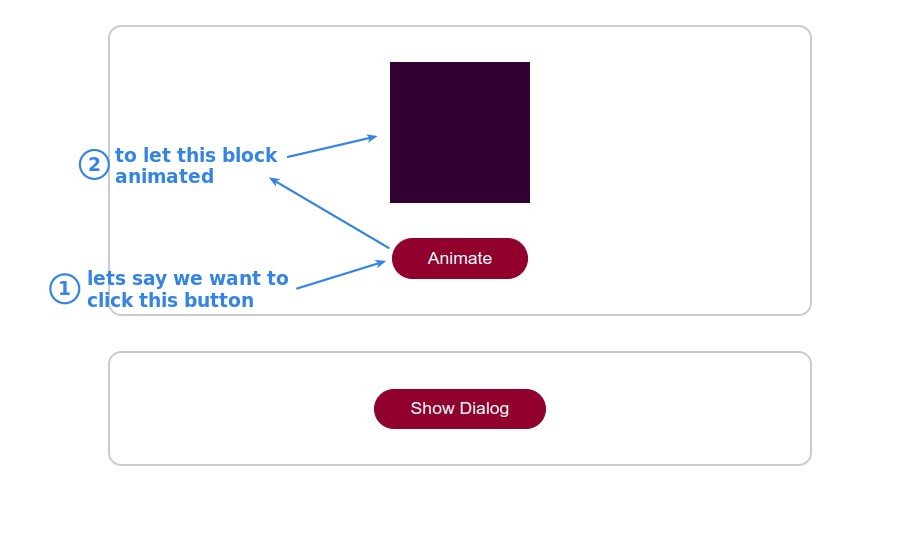
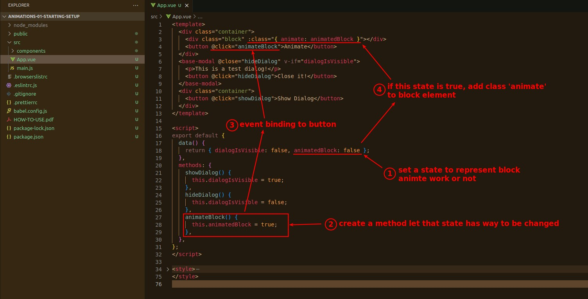
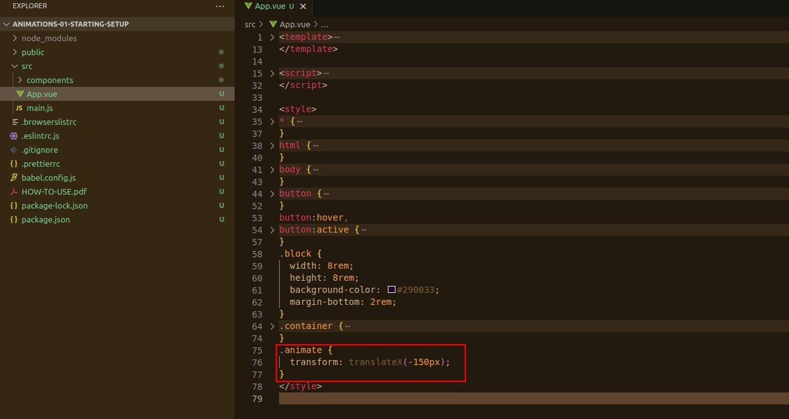
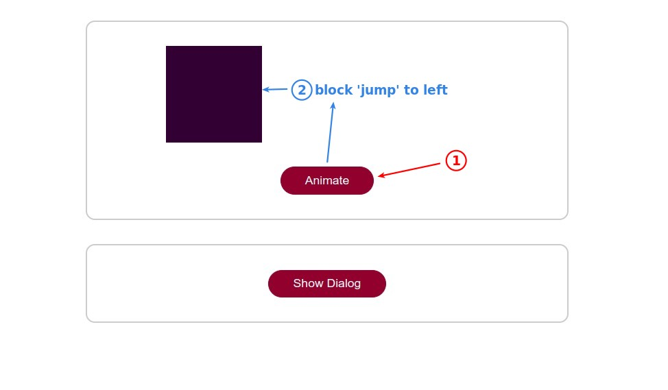
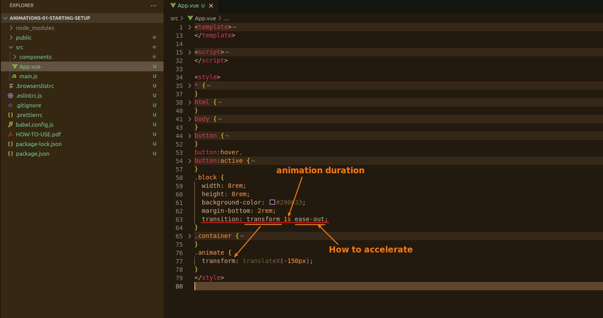
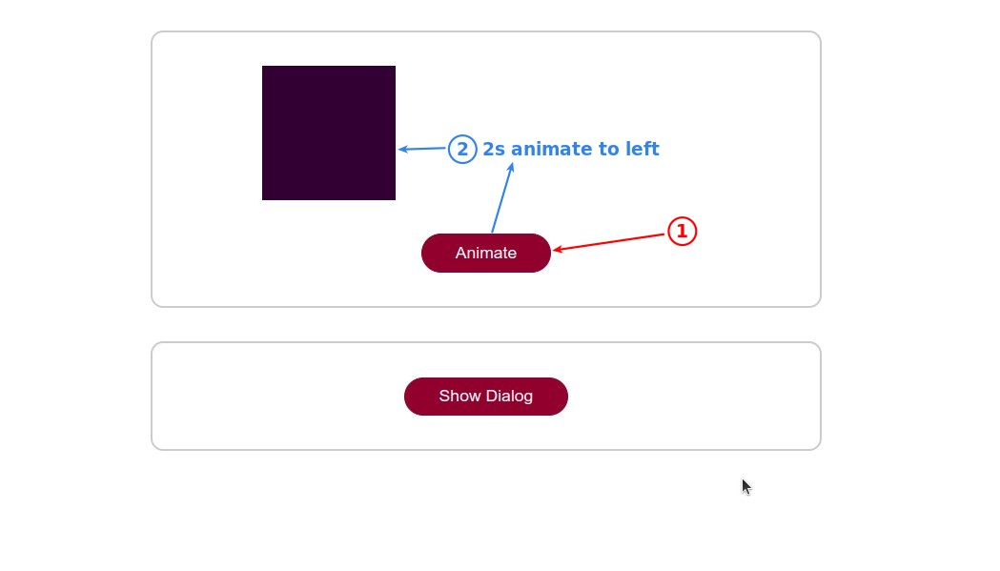

## **Purpose: Use a button to start animation of block**

## **Template and Script**

> The goal is to let the block element dynamically add class.

## **Style**

> CSS can be done by itself for animation, and this is usually recommended way.

### _changed property_

> We put it in the dynamically added class.

### _Transition_

> The property 'transition' must be used in a fixed class to monitor the changing property and thus generate animations.

