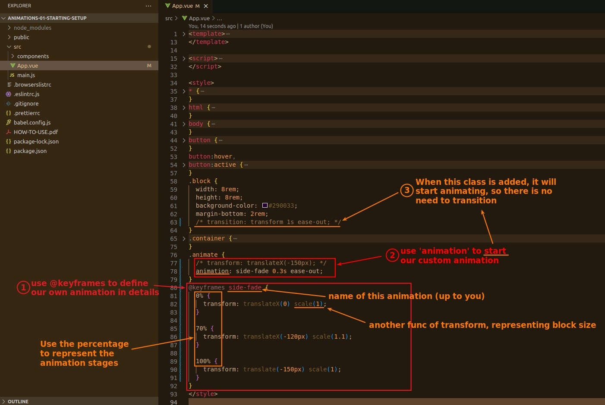
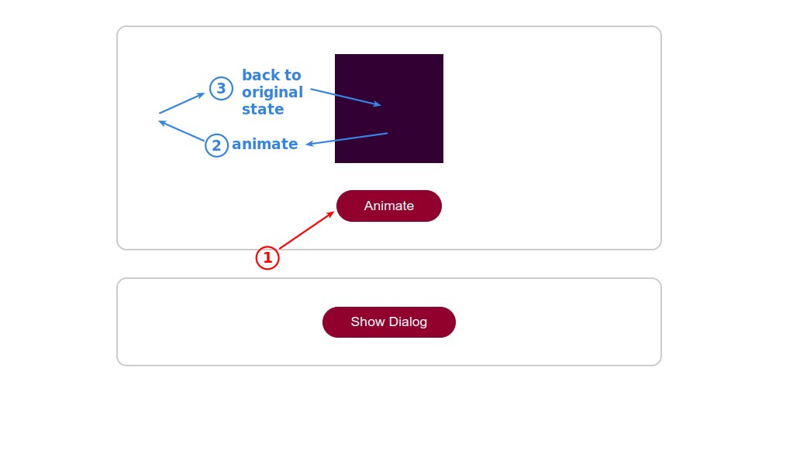
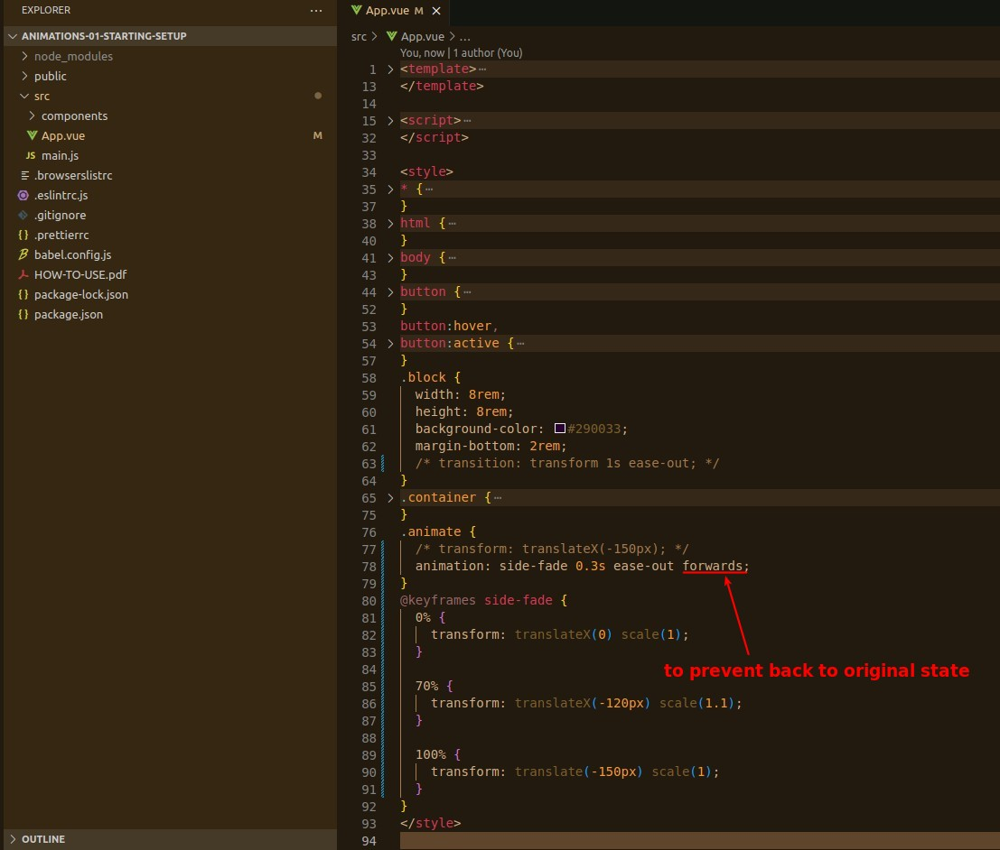
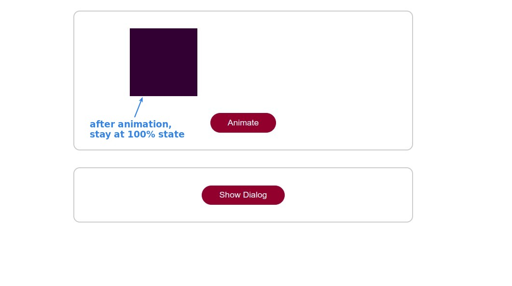

## **Second way of animation: @keyframes**

> Another way of generating animation, with more detailed settings, is to use either a transition or this.

## **Issue: back to original status**

> The animations generated by @keyframes will return to their original state by default, but we don't usually want that.

