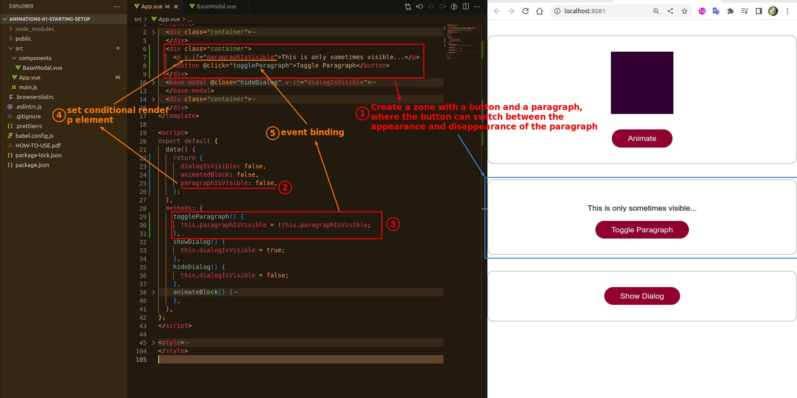
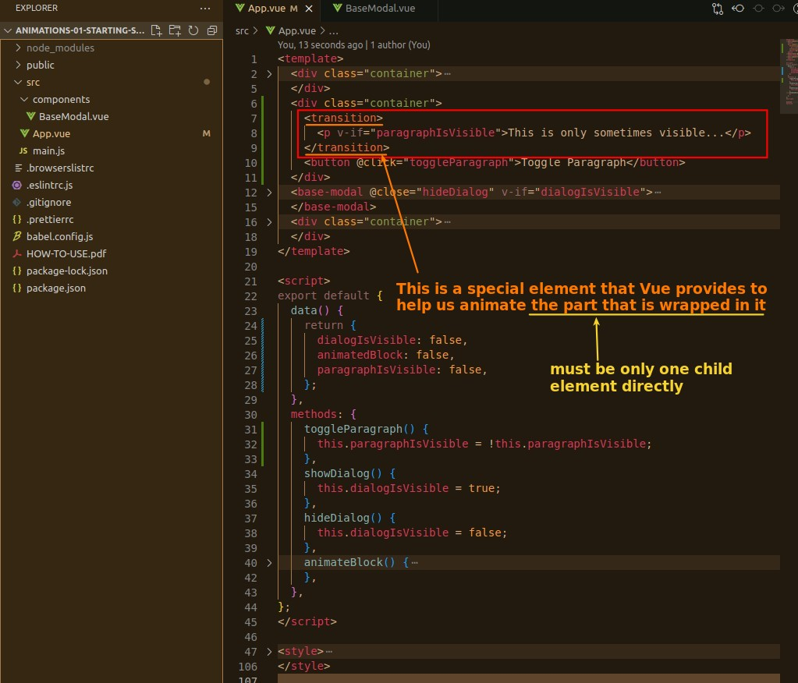
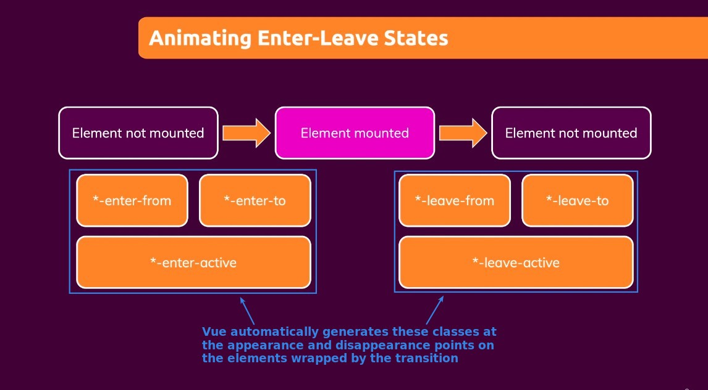

## **Prepare a toggle paragraph**

> Create a simple toggle paragraph element to facilitate the implementation of the animation later.

## **Vue Help: transition**

> Vue provides a special component 'transition' for animating the appearance and disappearance of components.

- So we can generate animations when components appear and disappear by editing the styling content of these classes.
- In particular, when the component disappears, it will wait for the animation to finish before letting the component disappear.
