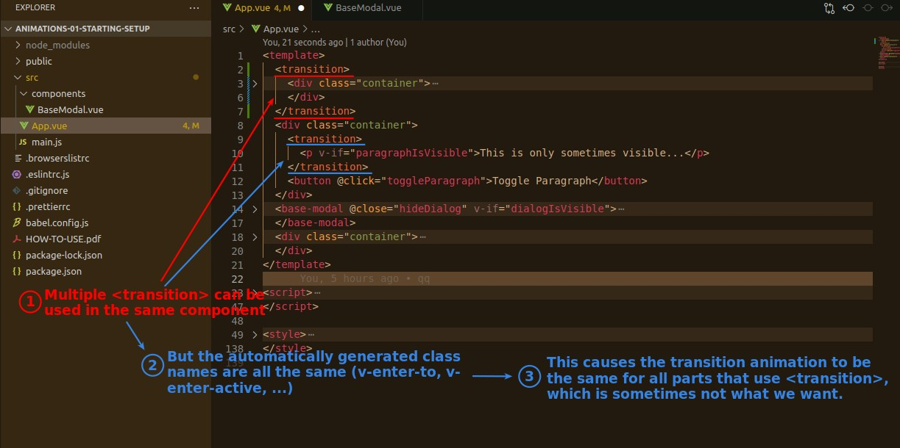
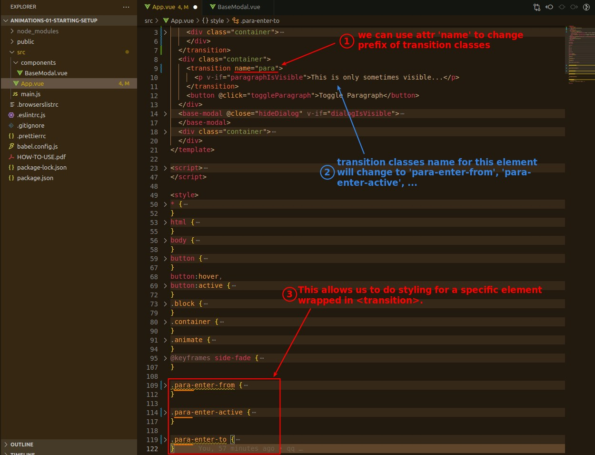
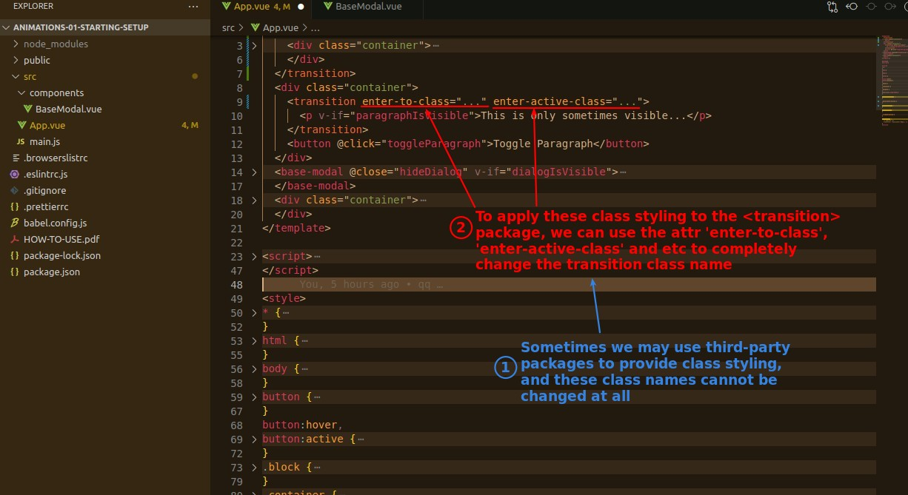

## **Multiple Transition**

> You can use multiple <transition> in the same component, but this raises some concerns.

## **Attribute 'name' to change predix of class name**

## **If we need to change WHOLE name**

> In the previous example, the name of the class automatically generated by the transition is still the main focus, with a few adjustments, but sometimes the name of the class automatically generated by the transition must be completely changed.

