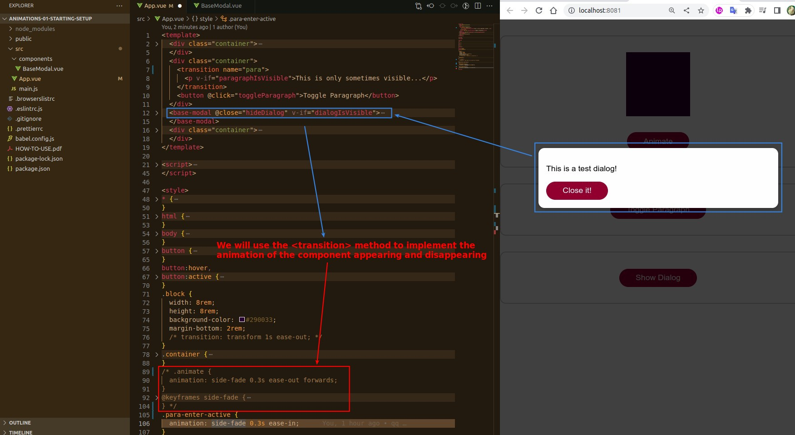
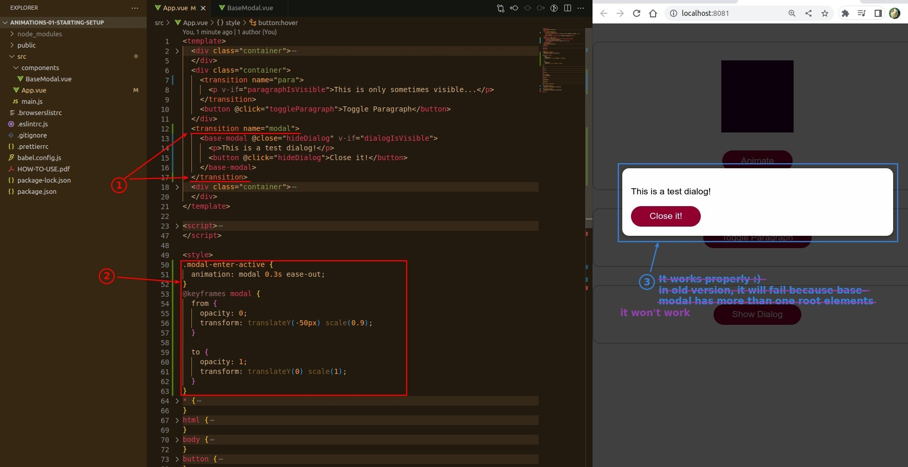
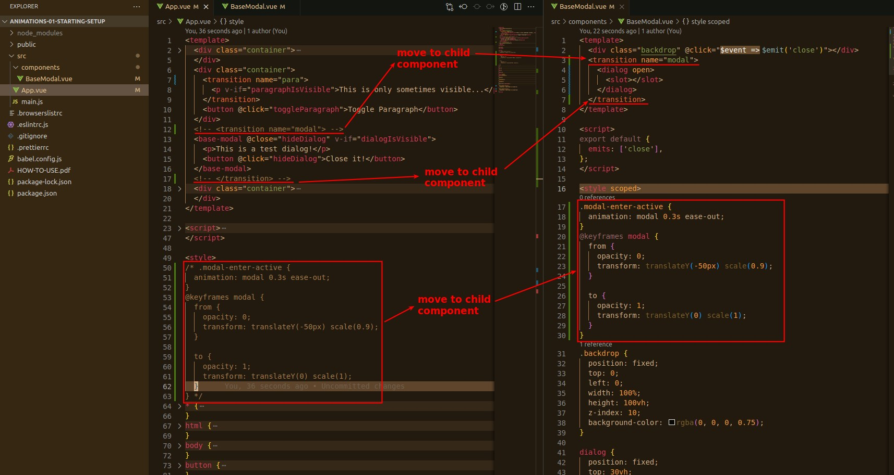
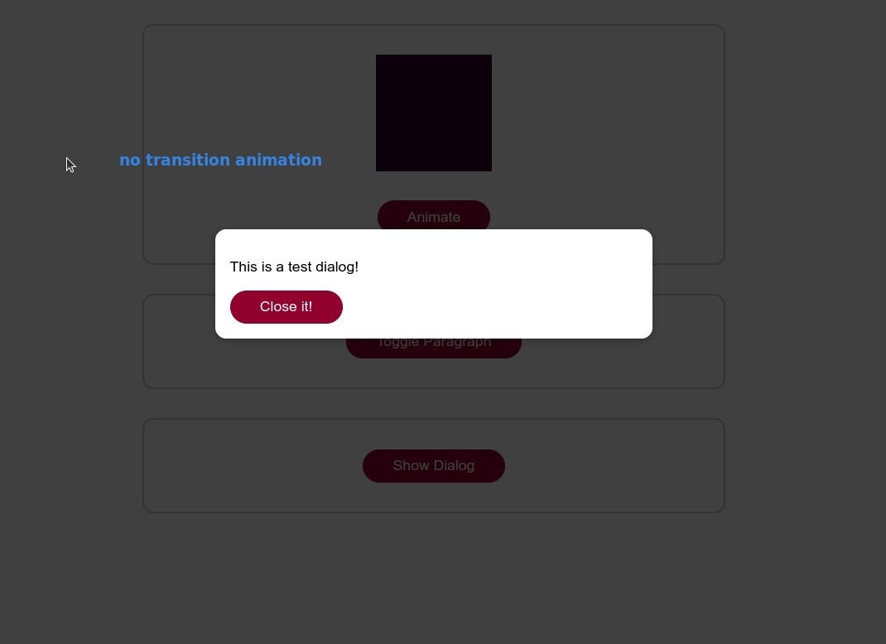
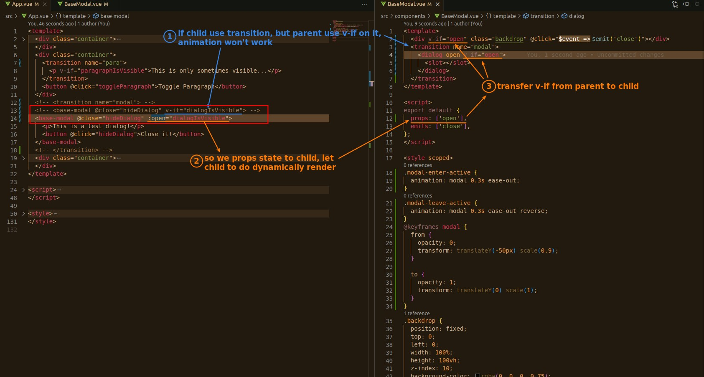
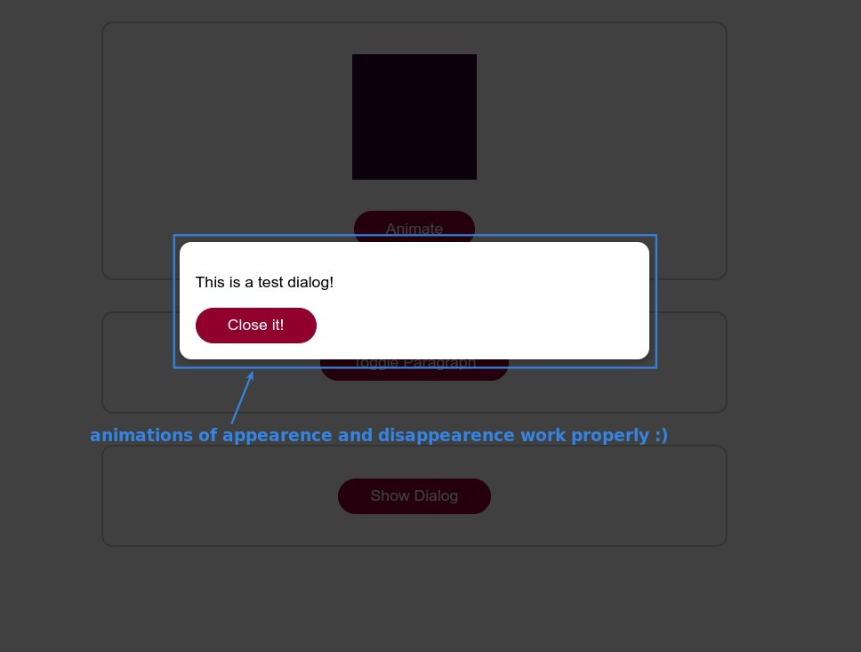

## **Transition custom component**

- The reason is that the custom component has multiple root elements, and <transition> sees them directly, so it violates the principle that there must be only one direct child element.
  - If in other cases, there is only one root element in the custom component, the problem will not occur.

## **Move Transition into custom component**

> There are many ways to solve the above problem, here we choose to move the <transition> to the custom component.

## **Move v-if to child component**

> The reason for the above problem is that if the custom component uses <transition> internally, the custom component cannot be dynamically rendered.

