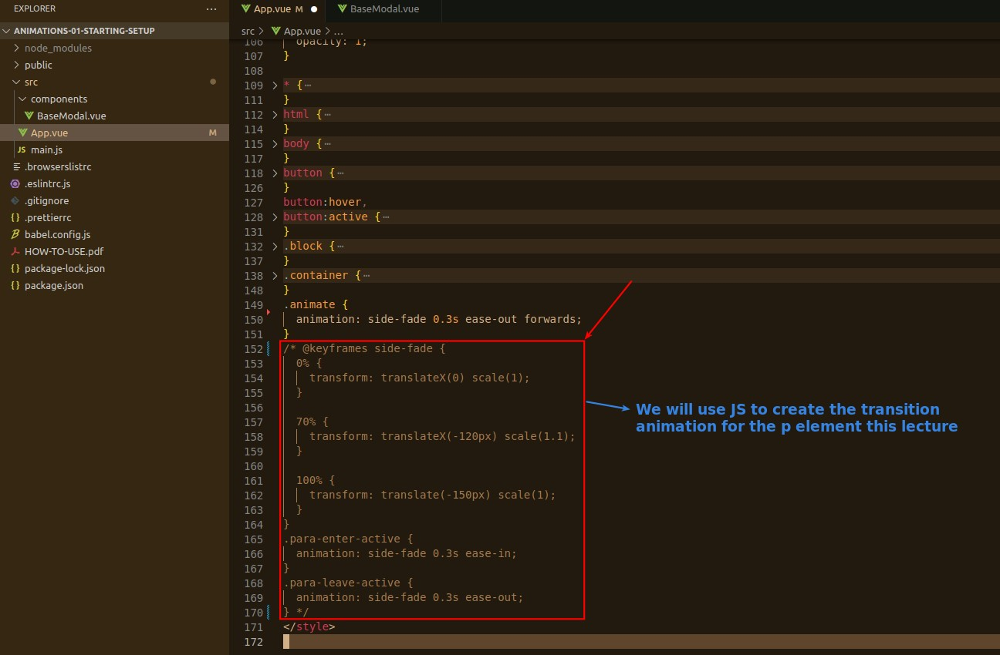
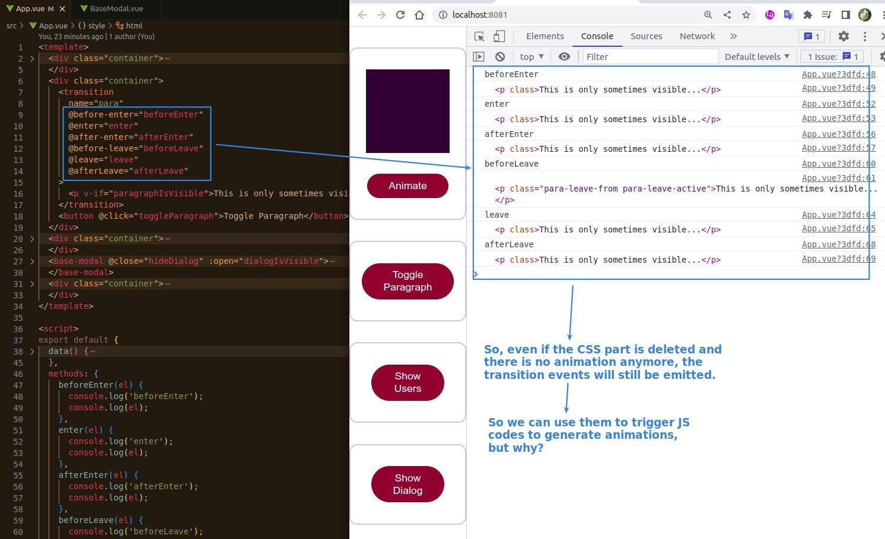
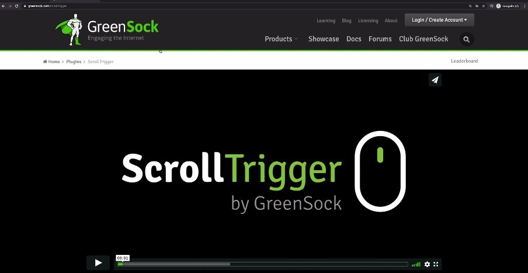
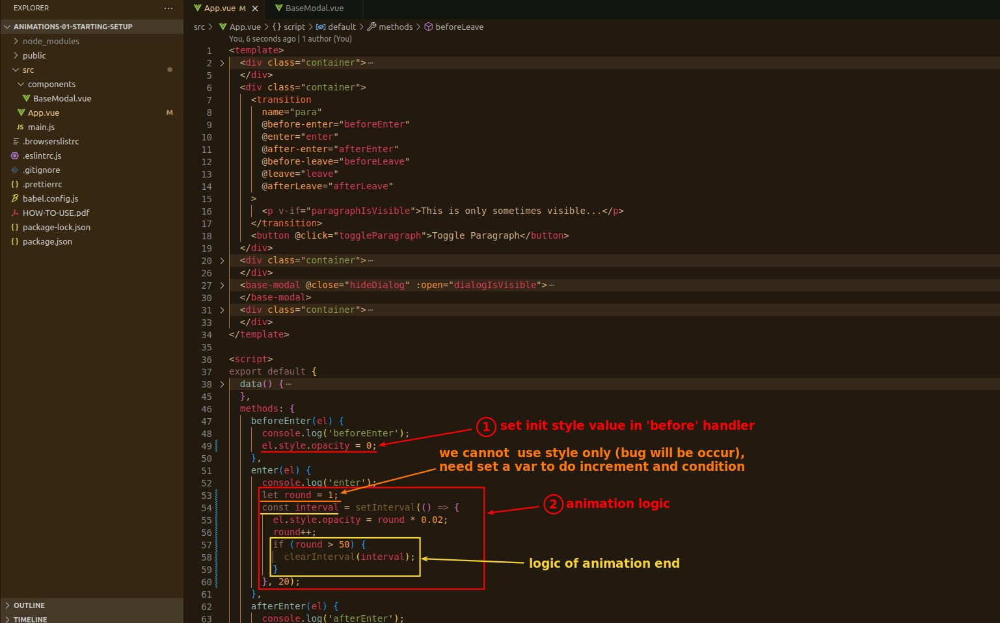
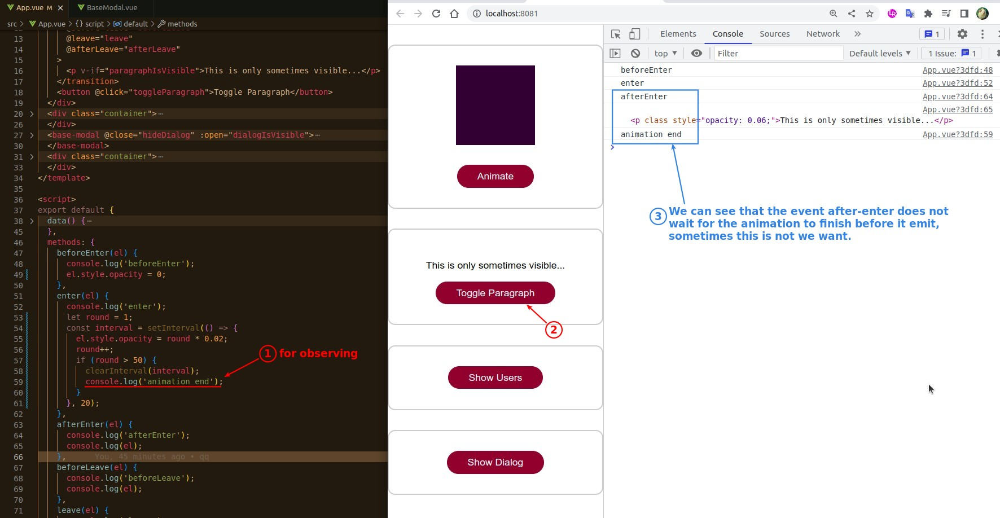
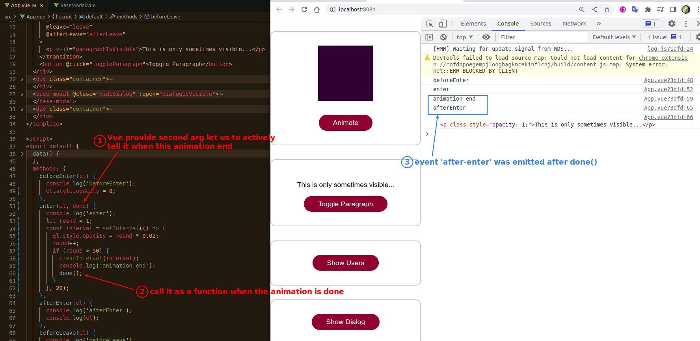
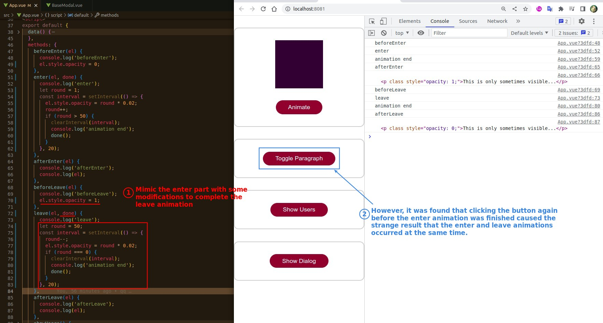
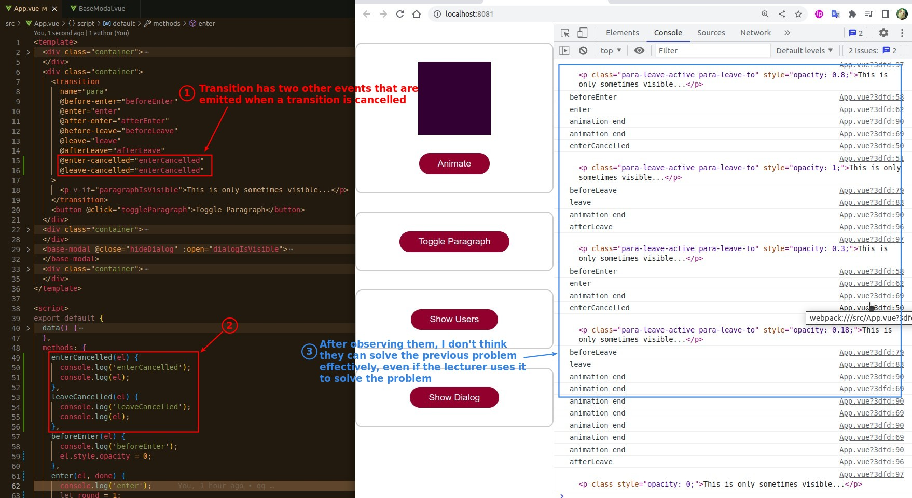
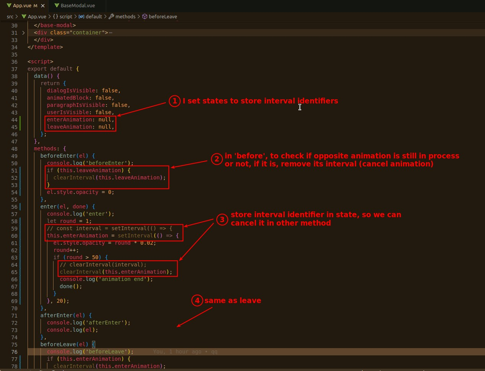
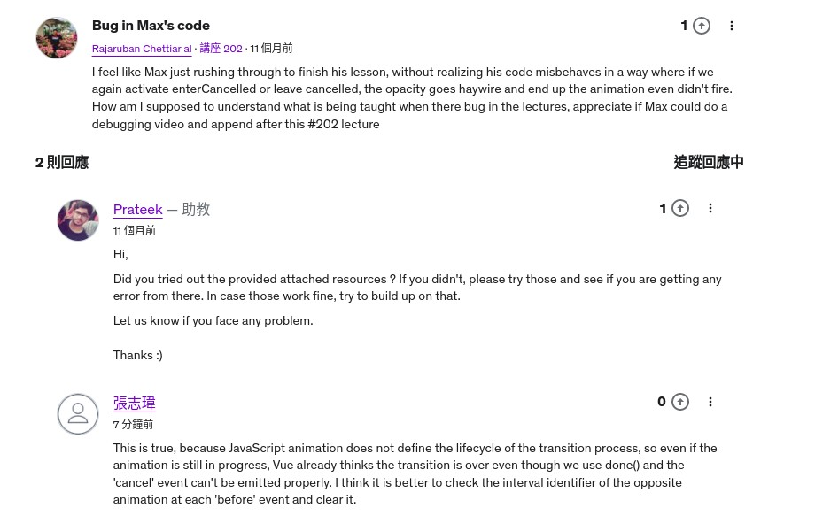

## **Purpose of this lecture and why**

### _Why we use JS animation_

> Most of the time we use CSS animations, which is the recommended way, but sometimes when we use third-party packages that provide complex animations written in JS, we have to use JS approaches to put them in.

- The above is a third-party library that provides JS animations, but we are writing simple animations directly in the following contents.

## **JavaScript Animation**

### _implement codes_

### _problem: 'after' event emitted too early_

### _problem: flicker button_

