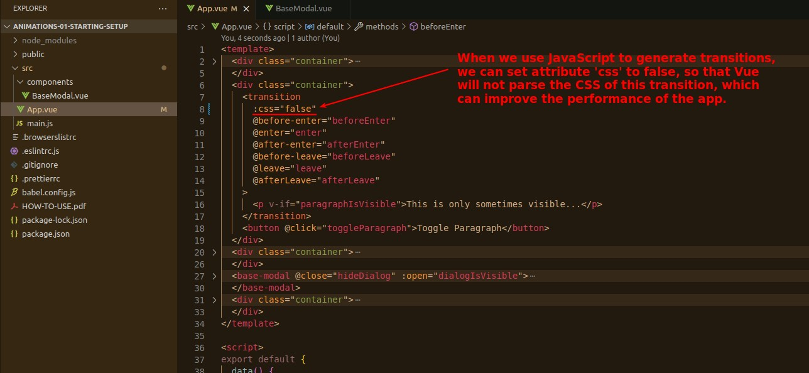

## **Disable CSS of transition**

- The web result is the same, but the performance is slightly better.
- Note that this can only be done if the transition animation is generated entirely by JavaScript.
