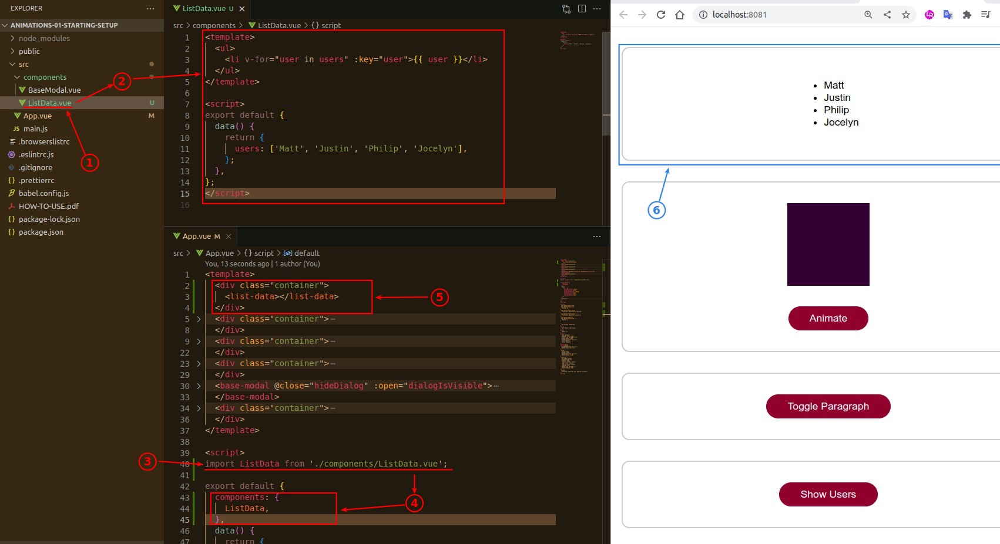
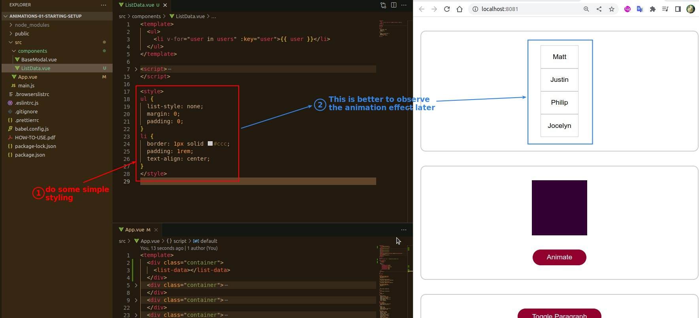
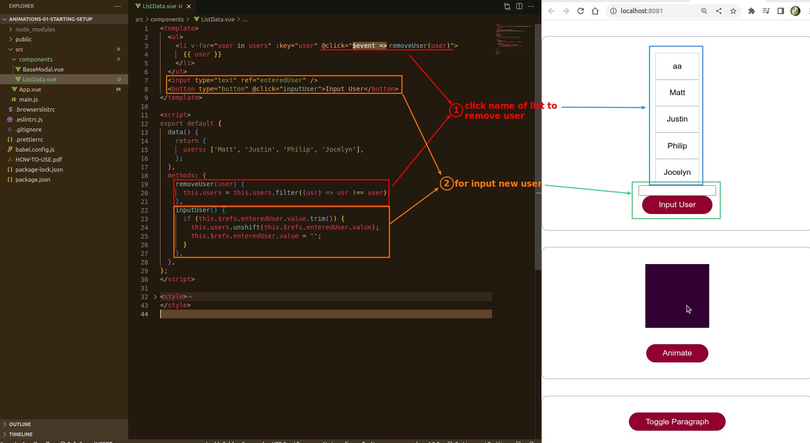

# **_Prepare Functional List_**

> This lecture prepares a simple unordered list with the ability to add and remove members for the later lectures to explain how to add animations to these operations.

## **Create a Simple Unorder List**

> Build the list in a separate component, because the App.vue codes are too much.

## **Simple Styling to it**

## **Add ways to add/remove users**

- The next lecture will add transition animation to these actions.
