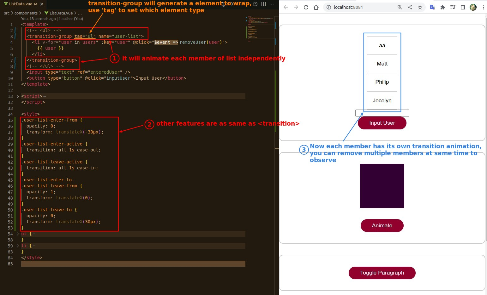

## **TransitionGroup**

- <transition> does not generate any elements, but <transition-group> does, and you have to specify what element to generate with attribute 'tag'.

- Although CSS is set for all list members at once, however, the animation works individually for each member, which is important.
