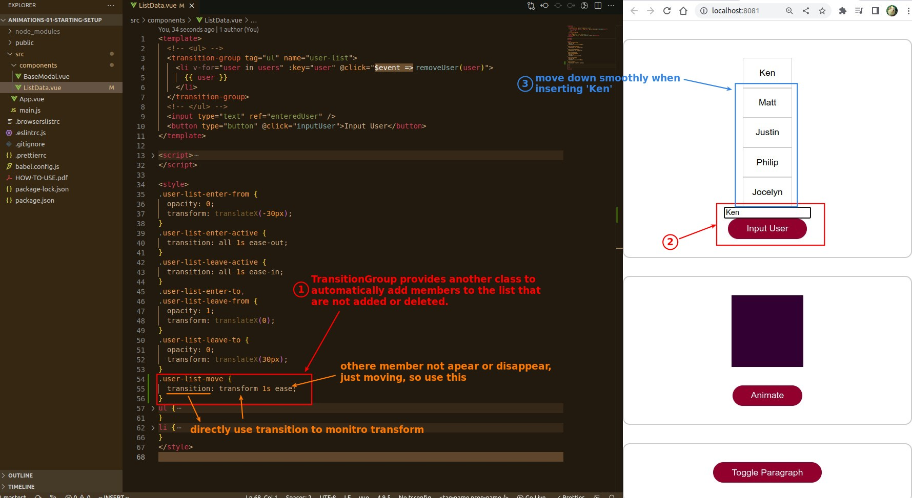
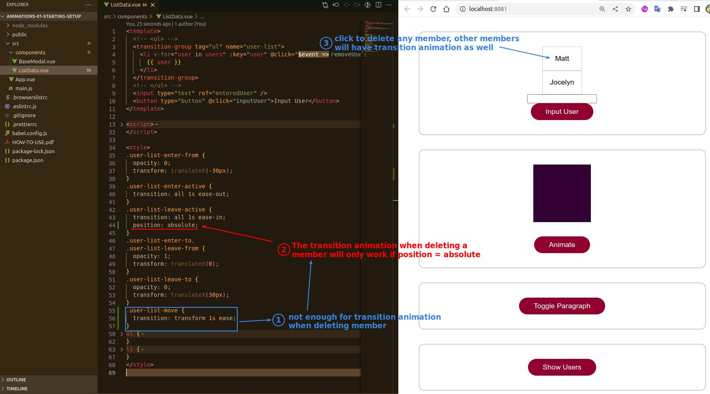

# **_Transition animation for non-removed/added members_**

> When a member in the list is deleted or added, besides the member itself, other members will also move, so there should be a transition animation as well.

## **Adding member**

- TransitionGroup will actually automatically add transform style to each member, so just use transition to monitor transform directly.

## **Removing member**

