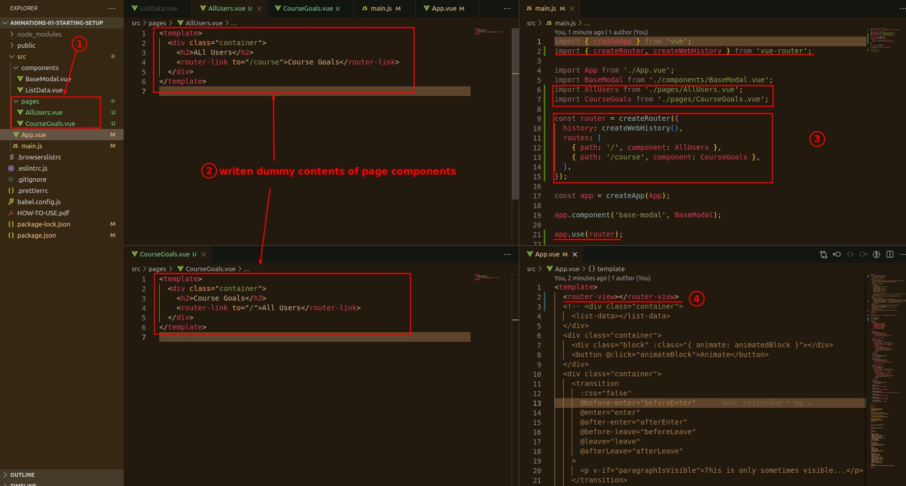
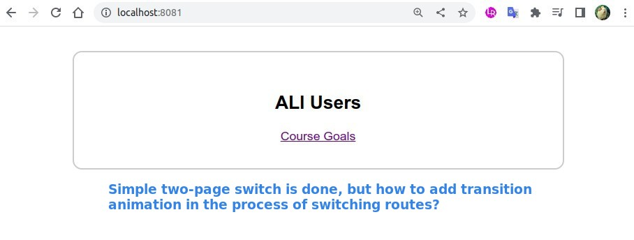
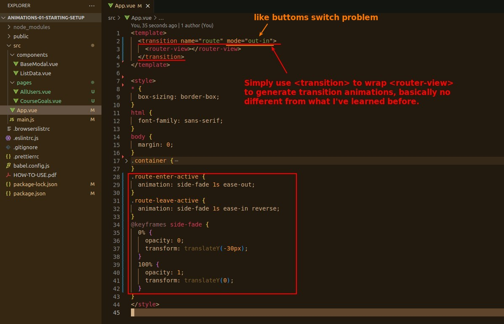
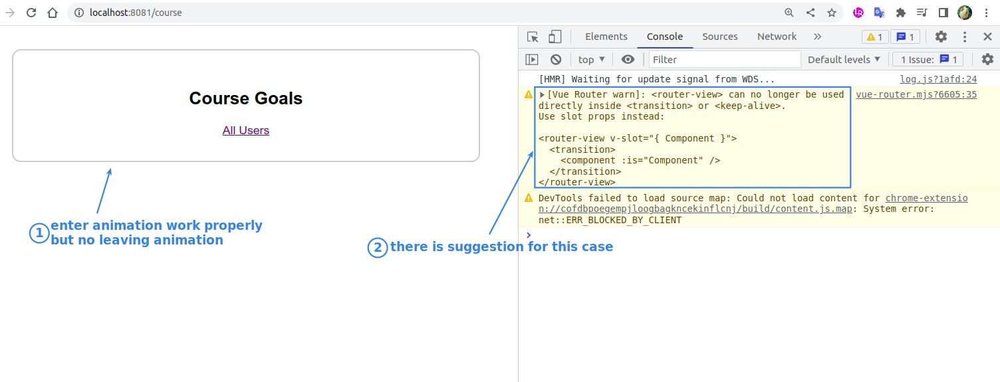
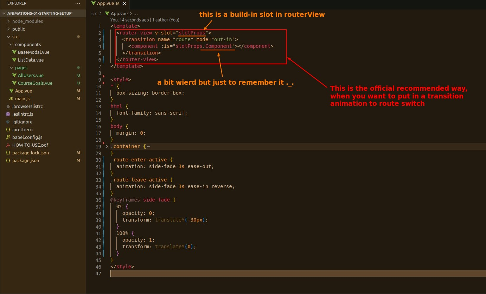
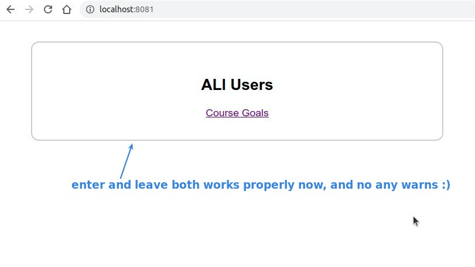
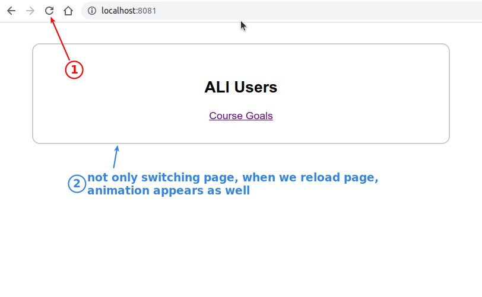

## **Prepare: page routes**

> Simply make a two-page switching routes, including page components.

## **Implement Transition Animation as before**

> At first, we treat the RouterView the same way as a normal element to implement in the transition animation.

## **Refactor by official suggestion**

> The official recommendation seems a bit strange, but as long as you follow it, you can make a perfect result.

## **Problem: Transition Animation when reloading app**

> Lastly, we have another problem, which is that the route transition animation will appear every time we reload the web page.

## **Note: When you use transition to route component, your route component must be only one root element!
