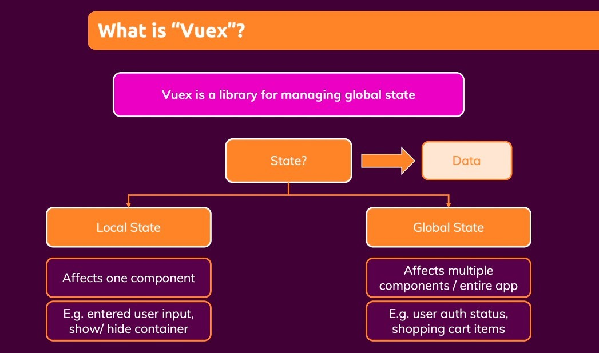
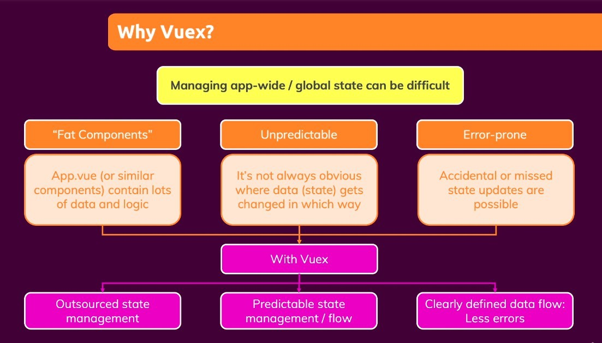

## **What?**

- 'state' represents a variable that will change, and its change will trigger a change in the page.

- The states we used before were all local states, and although they could be passed between components using, for example, props
  - But the larger the project, the more inconvenient and error-prone it became
- The component that stores the main data can easily become fat, because all the methods for this data are written here and must be provided out.

## **Why?**

- Some common errors are human errors, such as editing the data brought by 'inject'.
  - Independent development may not have this problem, but the group development will definitely have idiots.
