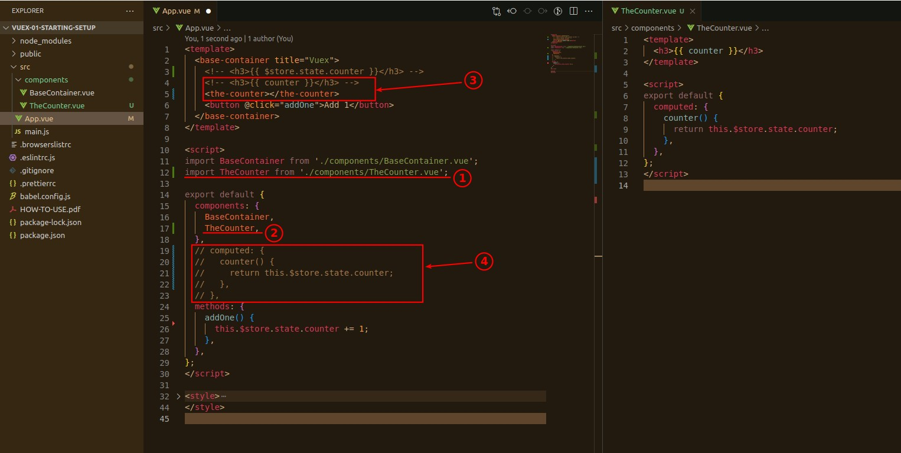

## **Move $store to computed (optional)**

> We can simply transfer the $store part of the template to the computed part of the script to reduce the logic of the template.

## **Split counter to other component (but button stay)**

- We left the button in on purpose, because it would have been a pain if it is local state.

## **Result**

> Handling the state in the Vuex store saves a lot of trouble with events or data propagation.

