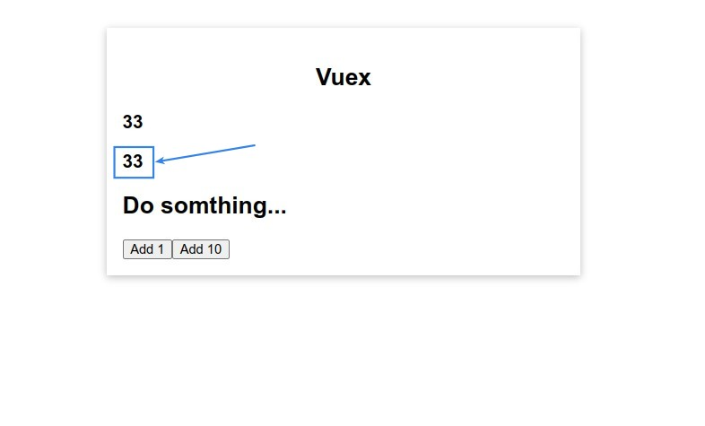

## **Create New Component to Access Global State**

> In addition to TheCounter, make another component to take the value of the global state 'counter'.

## **Problem Happend**

## **Getters**

> In fact, accessing a state in the Vue store directly from a component, while technically possible, is something that shouldn't happen.

## **Multiple Getters to Compute Result**

> The methods in Getters often use each other's results for processing to get results.

