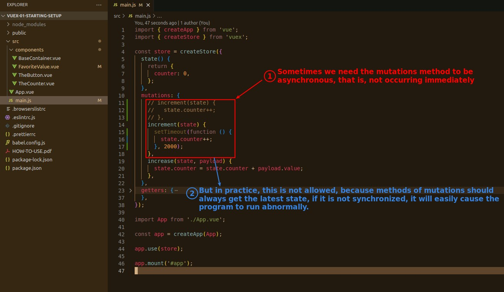
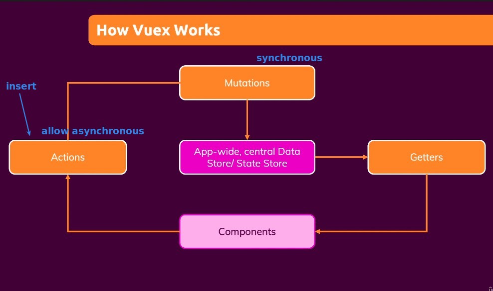
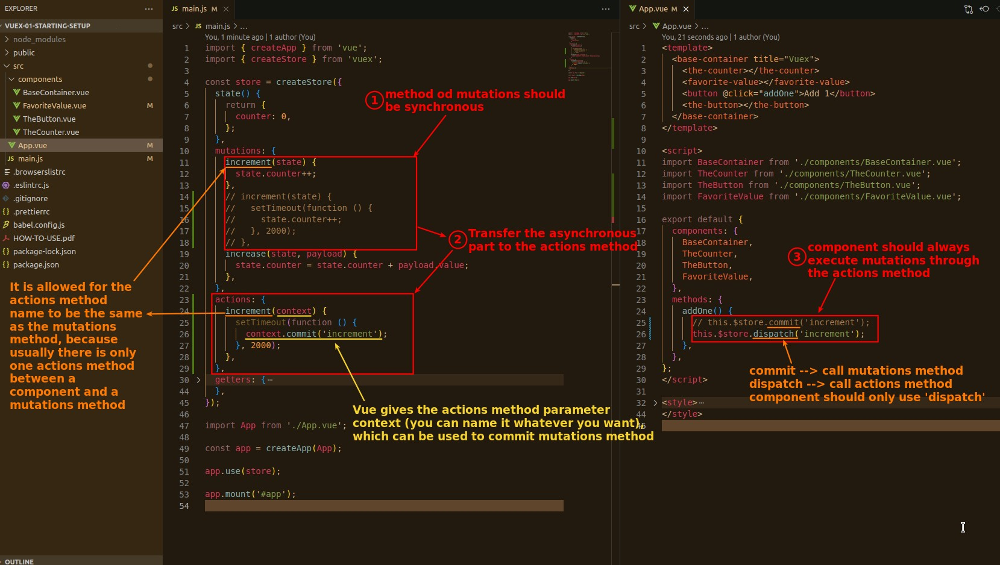
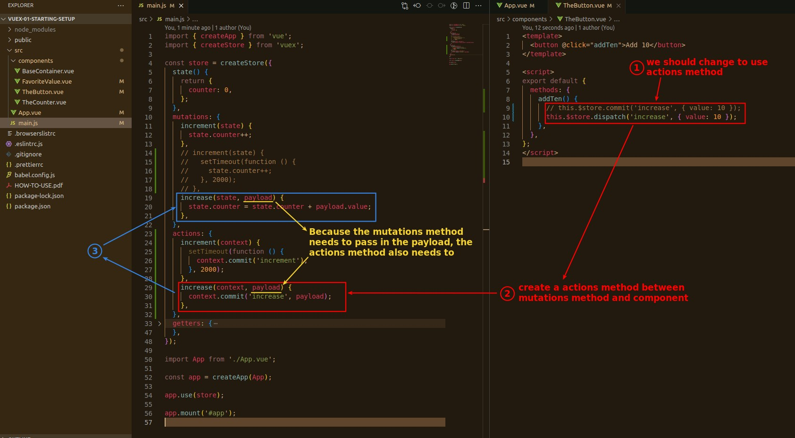

## **If the method of mutations requires a delay in execution**

> Sometimes the method of mutations must be delayed, that is, asynchronous, the following is a very simple setTimeout example, the actual case is usually waiting for the HTTP response and so on.

## **Concept of Actions**

## **Practice of Actions**

### _to keep mutations synchronous_

### _every mutations need actions_

