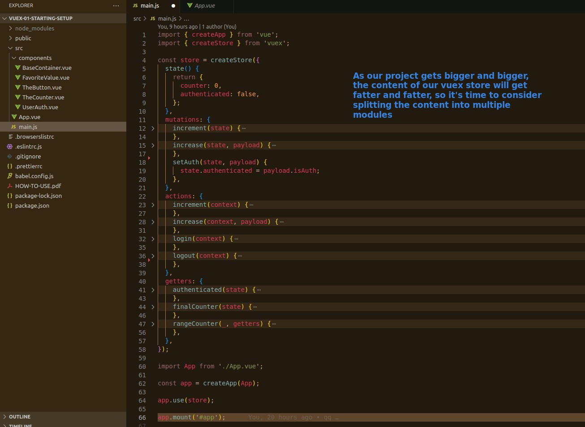
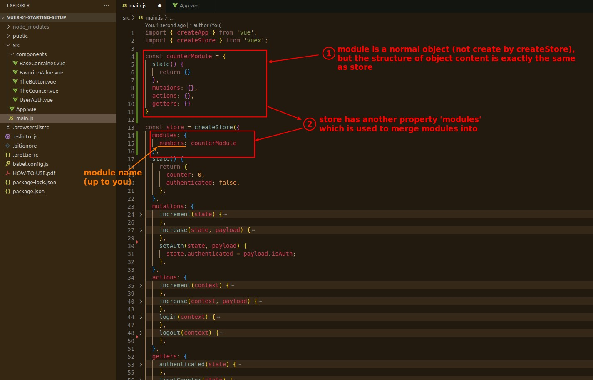
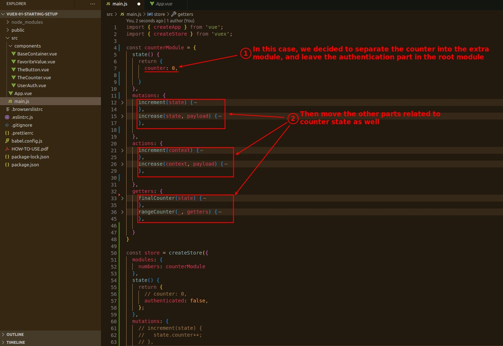
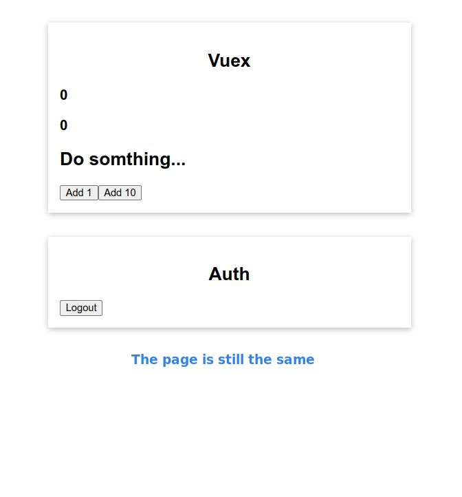

## **Problem: Vue Store getting fat**

## **Vue Module**

### _Structure_

### _Split contents from store to module_

> This part is up to personal preference, you can even let the root module be used to merge extra modules without any content, there are no mandatory rules.

## **Page Result**

