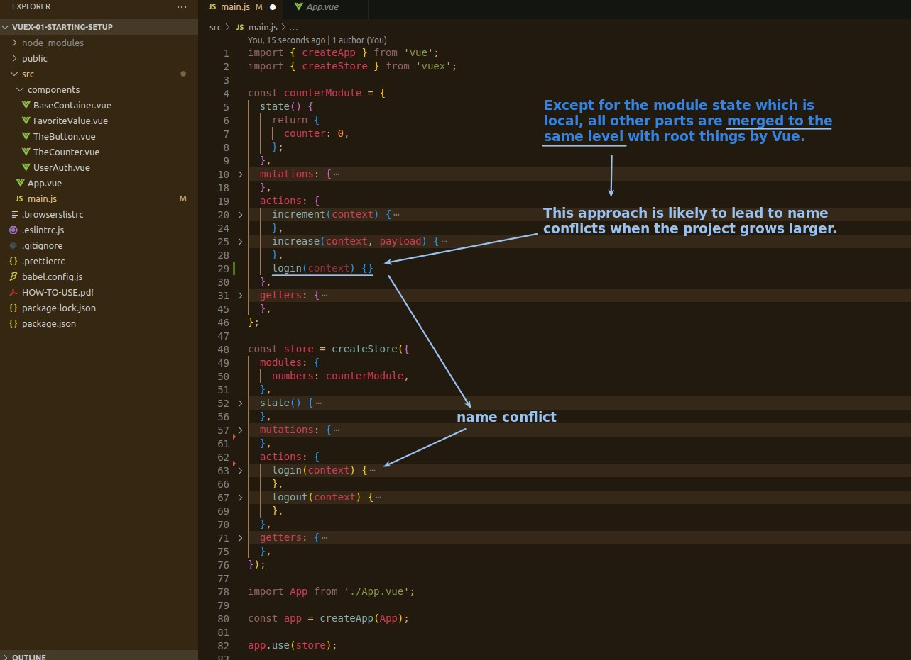
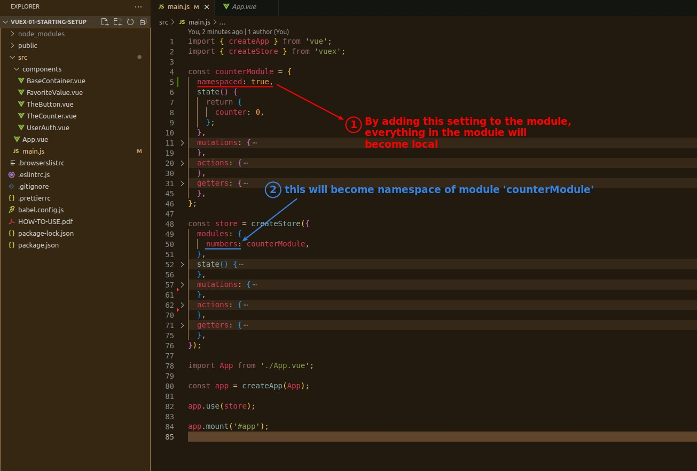
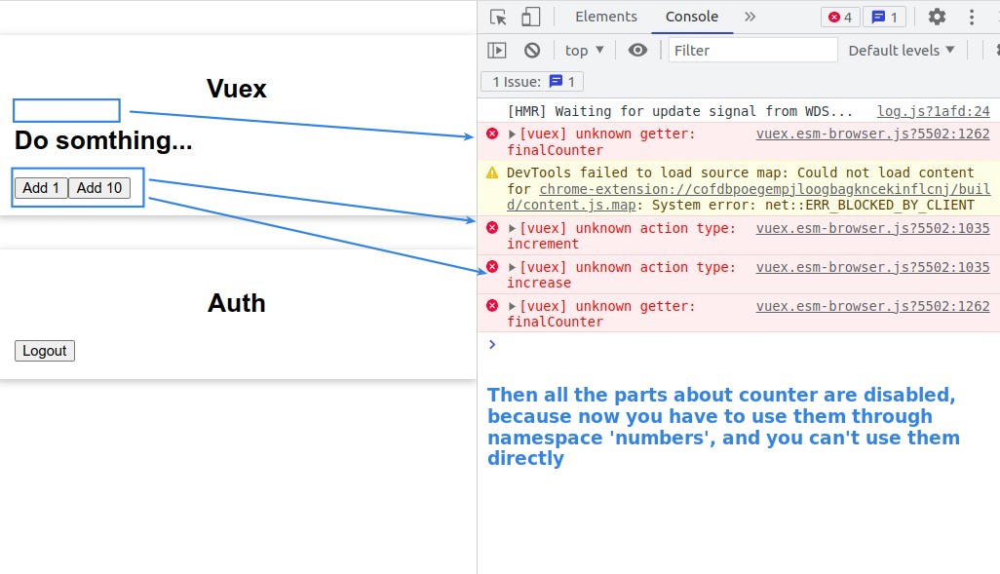
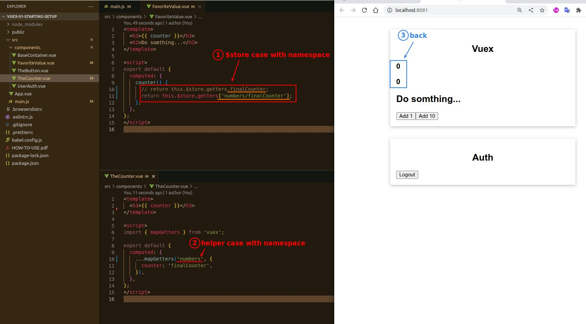

## **Problem: Name conflict**

> The previous lecture explains that the argument state in the module becomes local, but the other parts do not.

## **Enable namespace of module**

> We can completely separate everything in the module from the other modules by enable namespace.

## **Use module things via namespace**

> Because with namespace, things in the module are not merged to the same level, so you can see that the counter part of the site is no longer available, and we must fix it.

