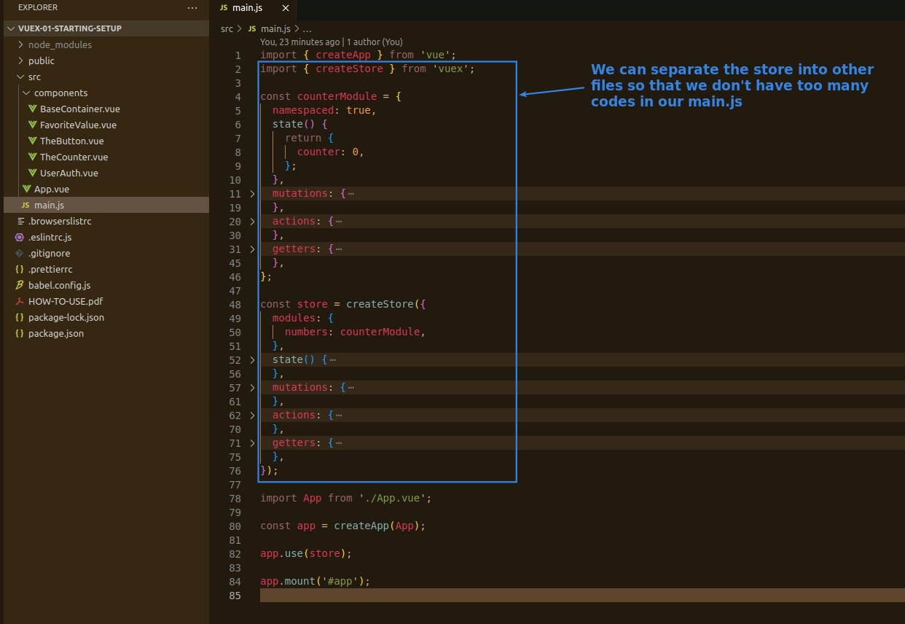
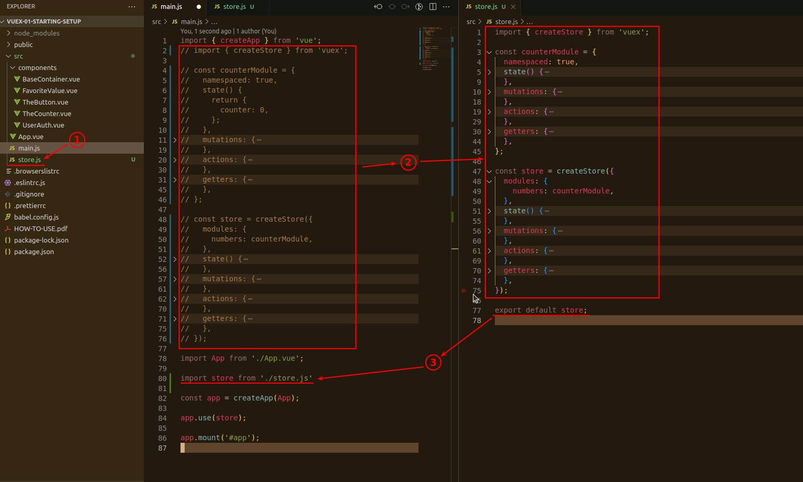
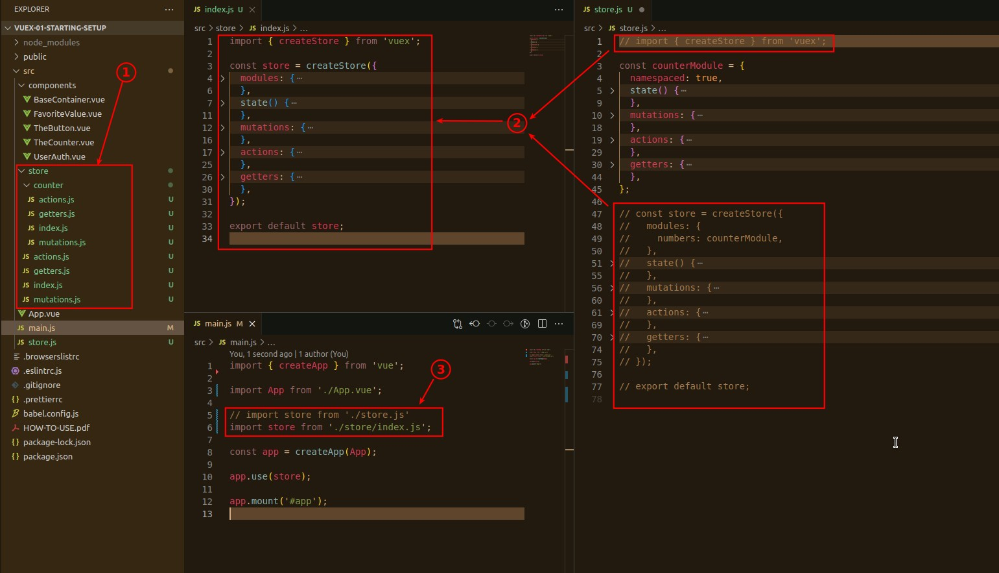
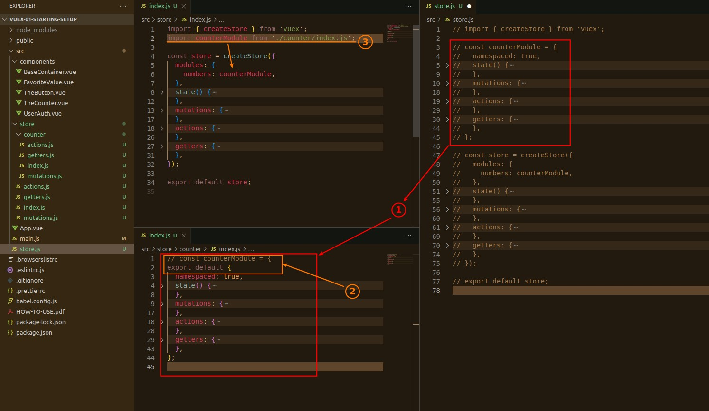
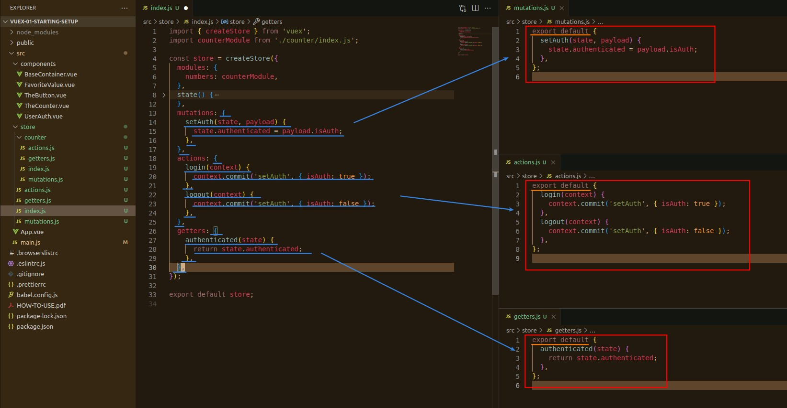
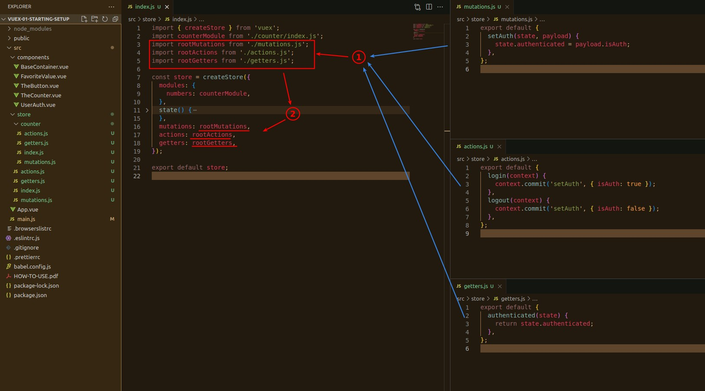

## **main.js too fat because of store growing**

- The following describes the various levels of separation structures.

## **Separate store**

## **Separate module**

## **Separate features**

> it means that mutations, actions, and getters are also separated into their own files.

- A module can also separate out features (mutations, actions, getters) as above, but not necessarily meaningfully.

- The degree of separation depends on the size of the project and the needs, and it is entirely reasonable to separate to store.js only.
